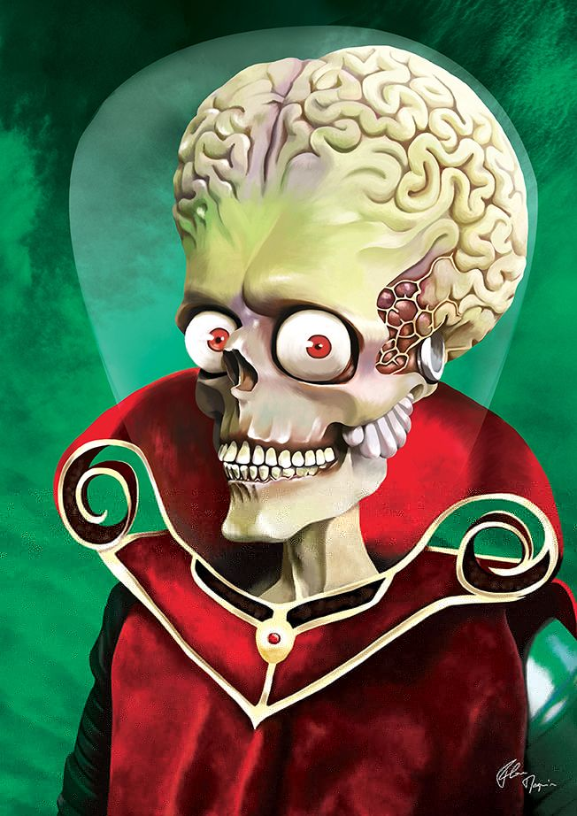

# Write-up : AckAckAck

Catégorie :

```
Crypto-Stegano
```

Consignes :

```
Trouvez le flag de validation dans l'image ci-jointe : <br>
```

Pièce jointe : 

```
challenge.jpg
```

Serveur :

```
CTFD
```

Points attribués :

```
20
```

Flag :

```
MARS{St3g1sb0r1ng}
```


Un challenge de stéganographie relativement simple, il suffit d'utiliser les techniques de base.

Pièce jointe : 




```
strings challenge.jpg

[sip]
\x2c\x22\x39\x32\x18\x38\x15\x50\x0c\x50\x10\x09\x51\x11\x5a\x0f\x04\x16
```

Nous avons une chaîne en hexadécimal, regardons les metadata avec exiftool.

Installation sous linux de exiftool : `apt install libimage-exiftool-perl`

Puis :

```
exiftool challenge.jpg 

ExifTool Version Number         : 11.16
File Name                       : challenge.jpg
Directory                       : .
File Size                       : 100 kB
File Modification Date/Time     : 2019:01:17 14:04:38+01:00
File Access Date/Time           : 2019:01:21 13:30:36+01:00
File Inode Change Date/Time     : 2019:01:17 14:04:38+01:00
File Permissions                : rwxrwxrwx
File Type                       : JPEG
File Type Extension             : jpg
MIME Type                       : image/jpeg
JFIF Version                    : 1.01
Resolution Unit                 : inches
X Resolution                    : 72
Y Resolution                    : 72
Comment                         : key: ackackack     <=========   un indice !!!
Image Width                     : 652
Image Height                    : 922
Encoding Process                : Progressive DCT, Huffman coding
Bits Per Sample                 : 8
Color Components                : 3
Y Cb Cr Sub Sampling            : YCbCr4:2:0 (2 2)
Image Size                      : 652x922
Megapixels                      : 0.601

```


```
Comment                         : key: ackackack
```

Nous avons trouvé une clef, essayons de nous en servir comme clef xor pour la chaine hexa.

ack  devient 0x61,0x63,0x6B

Script python :

```
#!/usr/bin/env python
# -*- coding: utf-8 -*-

# python 2.x

# key
#           a    c    k    a    c    k    a    c    k    a    c    k    a    c    k    a    c    k
tab01 = [0x61,0x63,0x6b,0x61,0x63,0x6b,0x61,0x63,0x6b,0x61,0x63,0x6b,0x61,0x63,0x6b,0x61,0x63,0x6b]

# texte encode
tab02 = [0x2c,0x22,0x39,0x32,0x18,0x38,0x15,0x50,0x0c,0x50,0x10,0x09,0x51,0x11,0x5a,0x0f,0x04,0x16]

print "".join([chr(tab01[index] ^ tab02[index]) for index in range(18)])

```

Résultat : MARS{St3g1sb0r1ng}

```
Le flag est MARS{St3g1sb0r1ng}
```

