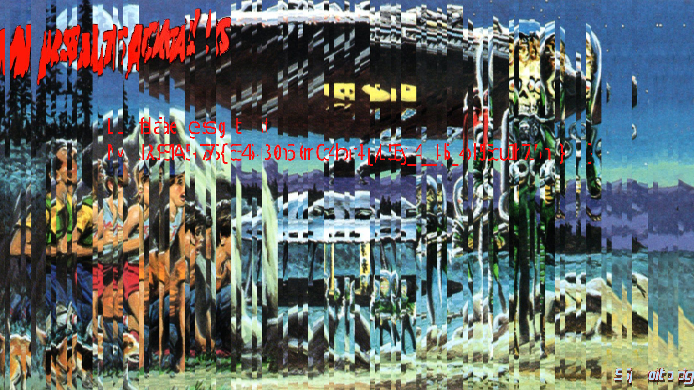
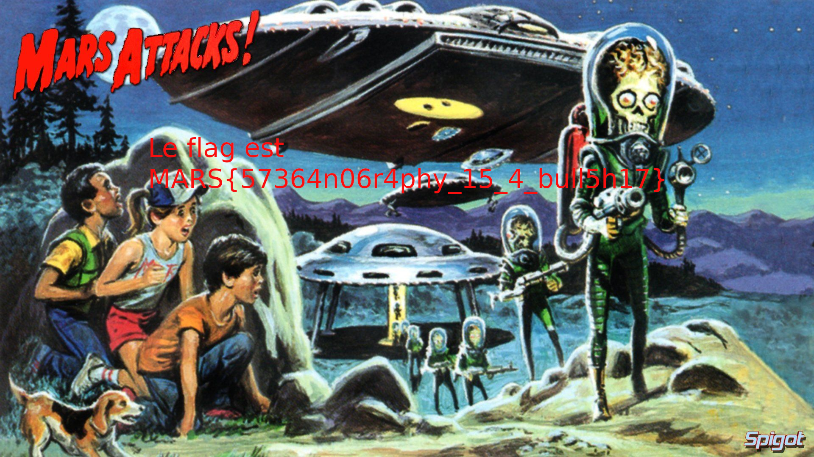

# Write-up : Scrambled image

Catégorie :

```
Crypto-Stegano
```

Consigne  :  

```
Tentez de reconstruire l'image.<p>
```

Pieces jointes :

```
flag.png
scrambled.py
```

Serveur :

```
CTFD
```

Points attribués :

```
20
```

Flag :   

```
MARS{57364n06r4phy_15_4_bull5h17}
```


En ouvrant l'image qui contient le flag, on constate que l'image est illisible.




Le script qui a modifié l'image est toujours présent. Il a été obfusqué, rendant le code illisible,. Il est nécessaire de renommer toutes les variables pour faciliter la compréhension du code et créer un script qui inverse la modification de l'image.

scrambled.py

```
#!/usr/bin/python3

from __future__ import print_function
import os
from sys import argv
from PIL import Image
import random
from collections import defaultdict

r = {}
if len(argv) == 2:
  b = Image.open(argv[1])
  x, y = b.size
  i = 0
  a = 0
  n = x/135
  c = x/135
  while i != 135:
    r[i] = b.crop((a, 0, c, y))
    i += 1
    a = c
    c += n
  p = "MARS@HACK"
  i = 0
  u = {}
  for i in range(len(p)):
    u[i] = ord(p[i])
  i = 0
  j = 0
  h = 0
  q = defaultdict(int)
  w = 0
  while(j != len(p)):
    while(i < len(u)):
      if(h == 0 and q[i] == 0):
        h = u[i]
        w = i
      elif(u[i] < h and q[i] == 0 and i != 4):
        h = u[i]
        w = i
      i += 1
    q[w] = j
    h = 100
    i = 0
    j = j + 1
  j = 0
  m = {}
  s = 0
  while(j < 15):
    s = 9 * j
    w = 0
    k = (j + 1) * 9
    while(s < k):
      v = (q[w]) + (j * len(q))
      m[v] = r[s]
      w += 1
      s += 1
    w = 0
    j += 1
  e = Image.new('RGB', (x,y))
  x_offset = 0
  i = 0
  for i in range(len(m)):
    e.paste(m[i], (x_offset, 0))
    x_offset += m[i].size[0]
  e.save('flag.png')
else:
  print("Usage: ./test.py exemple.png"
```


Une fois les variables renommées, on peut voir que le mélange est fait via une séquence générée via le seed "MARS@HACK".
On peut donc se servir du code pour recréer l'image en inversant l'ordre du mélange.

script_ori.py :

```
#!/usr/bin/python3

from __future__ import print_function
import os
from sys import argv
from PIL import Image
import random
from collections import defaultdict

tab = {}
if len(argv) == 2:
  img = Image.open(argv[1])
  x, y = img.size
  i = 0
  a = 0
  n = x/135
  c = x/135
  while i != 135:
    tab[i] = img.crop((a, 0, c, y))
    i += 1
    a = c
    c += n
  seed = "MARS@HACK"
  i = 0
  num_seed = {}
  for i in range(len(seed)):
    num_seed[i] = ord(seed[i])
  i = 0
  passe = 0
  tampon_num = 0
  order = defaultdict(int)
  index = 0
  while(passe != len(seed)):
    while(i < len(num_seed)):
      if(tampon_num == 0 and order[i] == 0):
        tampon_num = num_seed[i]
        index = i
      elif(num_seed[i] < tampon_num and order[i] == 0 and i != 4):
        tampon_num = num_seed[i]
        index = i
      i += 1
    order[index] = passe
    tampon_num = 100
    i = 0
    passe = passe + 1
  passe = 0
  m = {}
  count = 0
  while(passe < 15):
    count = 9 * passe
    index = 0
    coeff = (passe + 1) * 9
    while(count < coeff):
      place = (order[index]) + (passe * len(order))
      m[place] = tab[count]
      index += 1
      count += 1
    index = 0
    passe += 1
  scrambled_image = Image.new('RGB', (x,y))
  x_offset = 0
  i = 0
  for i in range(len(m)):
    scrambled_image.paste(m[i], (x_offset, 0))
    x_offset += m[i].size[0]
  scrambled_image.save('flag.png')
else:
  print("Usage: ./test.py exemple.png")
```


Le script ci-joint permet d'inverser les changements (reverse.py)

**Attention : ne fonctionne pas sous Python 2, utiliser Python 3.**

```
#!/usr/bin/python3

from __future__ import print_function
import os
from sys import argv
from PIL import Image
import random
from collections import defaultdict

tab = {}
if len(argv) == 2:
  img = Image.open(argv[1])
  x, y = img.size
  i = 0
  a = 0
  n = x/135
  c = x/135
  while i != 135:
    tab[i] = img.crop((a, 0, c, y))
    i += 1
    a = c
    c += n
  seed = "MARS@HACK"
  i = 0
  num_seed = {}
  for i in range(len(seed)):
    num_seed[i] = ord(seed[i])
  i = 0
  passe = 0
  tampon_num = 0
  order = defaultdict(int)
  index = 0
  while(passe != len(seed)):
    while(i < len(num_seed)):
      if(tampon_num == 0 and order[i] == 0):
        tampon_num = num_seed[i]
        index = i
      elif(num_seed[i] < tampon_num and order[i] == 0 and i != 4):
        tampon_num = num_seed[i]
        index = i
      i += 1
    order[index] = passe
    tampon_num = 100
    i = 0
    passe = passe + 1
  passe = 0
  m = {}
  count = 0
  while(passe < 15):
    count = 9 * passe
    index = 0
    coeff = (passe + 1) * 9
    while(count < coeff):
      place = (order[index]) + (passe * len(order))
      m[count] = tab[place]
      index += 1
      count += 1
    index = 0
    passe += 1
  scrambled_image = Image.new('RGB', (x,y))
  x_offset = 0
  i = 0
  for i in range(len(m)):
    scrambled_image.paste(m[i], (x_offset, 0))
    x_offset += m[i].size[0]
  scrambled_image.save('flag.png')
else:
  print("Usage: ./test.py exemple.png")
```


Image reconstruite


Image originale




Résultat : MARS{57364n06r4phy_15_4_bull5h17}