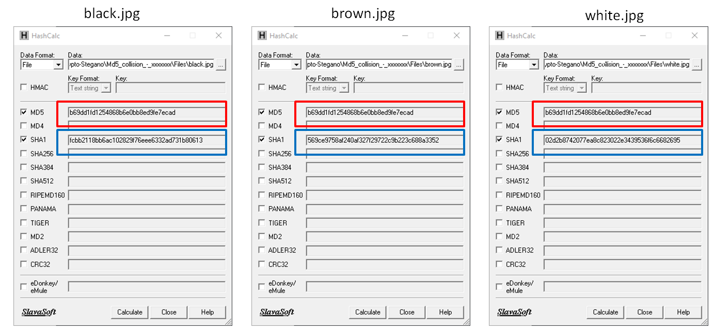

# Write-up : Special picture

Catégorie :

```
Crypto-Stegano
```

Consigne :

    Hormis la couleur, l'extension et l'auteur,
    quel point commun singulier partagent ces trois images ?
    
    Le flag a la forme suivante : MARS{POINT_COMMUN}
    
    Exemple : si les images ont la même taille, indiquez : <br>
    MARS{taille}

Pièces jointes :

```
black.jpg
brown.jpg
white.jpg
```

Serveur : 

```
CTFD
```

Points attribués :

```
20
```

Flag :

```
MARS{MD5} ou MARS{md5}   (insensible à la casse)
```

## Présentation

Les 3 pièces jointes sont des images


### Solution 1

Une solution possible est d'importer l'image sur le site : https://images.google.com/ pour voir ce que renvoie Google.


On obtient le résultat suivant :


### Solution 2

Autre solution : calculer le md5 et le sha1

- Pour le md5 : on obtient 3 fois le mème md5

- Pour le sha1 : on obtient des hash différents, ce qui indique que les images ne sont pas identiques



Ces images font donc allusion aux collisions MD5.

Nous pouvons donc répondre à la question de la consigne : le point commun entre ces images est le <u>MD5</u>.

Résultat : MARS{MD5}


