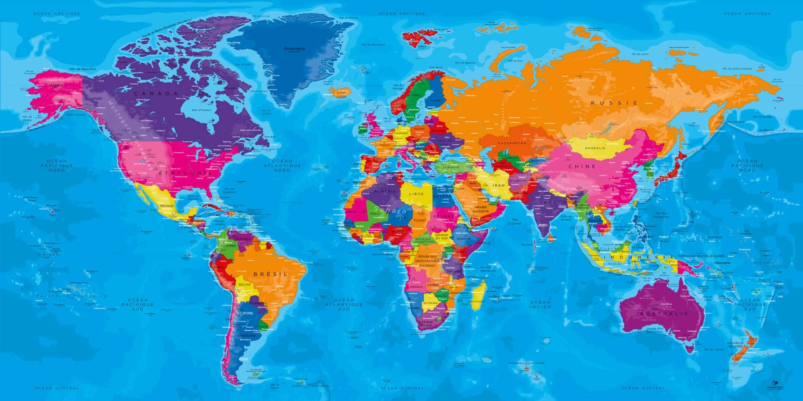
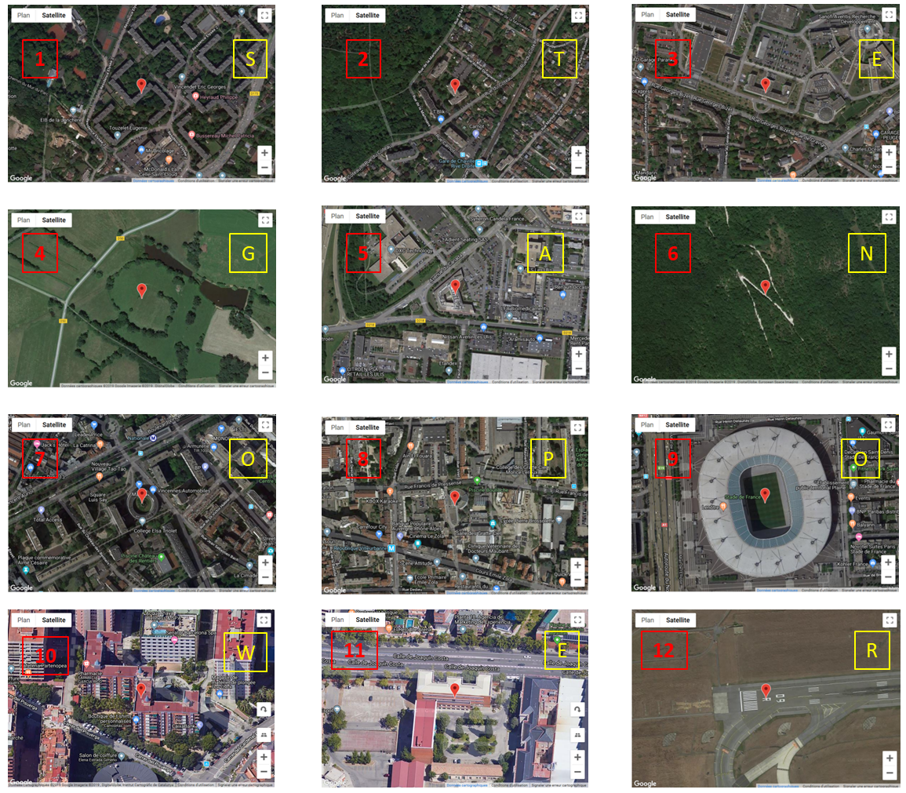

# Write up :  Avion

Catégorie :

```
Suite à l' arrestation d'un terroriste, nous avons découvert en pièce jointe dans sa boite mail cette photo avec comme intitulé "Rassembler les cibles". <p>

Le Flag de validation doit avoir la forme suivante et en majuscules : 
MARS{CLEF}
```

Pièce jointe :

```
map.jpeg
```

Serveur :

```
CTFD
```

Points attribués :

```
50
```

Flag :

```
MARS{STEGANOPOWER}
```

## Solution



Contrôle du fichier map.jpeg

```bash
$ file map.jpeg
$ mapfinal.jpeg: JPEG image data, Exif standard: [TIFF image data, big-endian, direntries=6, xresolution=86, yresolution=94, resolutionunit=2, datetime=2018:09:19 07:46:47], baseline, precision 8, 1920x960, frames 3

$ binwalk map.jpeg
DECIMAL       HEXADECIMAL     DESCRIPTION
--------------------------------------------------------------------------------
0             0x0             JPEG image data, EXIF standard
12            0xC             TIFF image data, big-endian, offset of first image directory: 8
242           0xF2            JPEG image data, EXIF standard
254           0xFE            TIFF image data, big-endian, offset of first image directory: 8
610           0x262           JPEG image data, EXIF standard
622           0x26E           TIFF image data, big-endian, offset of first image directory: 8
978           0x3D2           JPEG image data, EXIF standard
990           0x3DE           TIFF image data, big-endian, offset of first image directory: 8
1346          0x542           JPEG image data, EXIF standard
1358          0x54E           TIFF image data, big-endian, offset of first image directory: 8
1714          0x6B2           JPEG image data, EXIF standard
1726          0x6BE           TIFF image data, big-endian, offset of first image directory: 8
2082          0x822           JPEG image data, EXIF standard
2094          0x82E           TIFF image data, big-endian, offset of first image directory: 8
2450          0x992           JPEG image data, EXIF standard
2462          0x99E           TIFF image data, big-endian, offset of first image directory: 8
2818          0xB02           JPEG image data, EXIF standard
2830          0xB0E           TIFF image data, big-endian, offset of first image directory: 8
3186          0xC72           JPEG image data, EXIF standard
3198          0xC7E           TIFF image data, big-endian, offset of first image directory: 8
3554          0xDE2           JPEG image data, EXIF standard
3566          0xDEE           TIFF image data, big-endian, offset of first image directory: 8
3922          0xF52           JPEG image data, EXIF standard
3934          0xF5E           TIFF image data, big-endian, offset of first image directory: 8
4290          0x10C2          JPEG image data, EXIF standard
4302          0x10CE          TIFF image data, big-endian, offset of first image directory: 8

```

On peut voir qu'il y a plusieurs miniatures.

Chaque miniature comporte elle-même une minature (à la manière d'une poupée russe).

Utiliser la commande `exif` afin d'extraire chaque minature tout en conservant l'ordre des minatures.

```bash
$ exif -e map.jpeg
```

Répéter l'opération sur chaque fichier de sortie. Renommer les fichiers suivant leur ordre de sortie.

Puis on va regarder chaque minature.

Installation sous linux de exiftool  : `apt install libimage-exiftool-perl`

```bash
$ exiftool 1.jpeg
ExifTool Version Number         : 11.10
File Name                       : 1.jpeg
Directory                       : .
File Size                       : 16 kB
File Modification Date/Time     : 2018:10:09 07:30:44-04:00
File Access Date/Time           : 2018:10:09 07:44:42-04:00
File Inode Change Date/Time     : 2018:10:09 07:44:04-04:00
File Permissions                : rw-r--r--
File Type                       : JPEG
File Type Extension             : jpg
MIME Type                       : image/jpeg
Exif Byte Order                 : Big-endian (Motorola, MM)
X Resolution                    : 72
Y Resolution                    : 72
Resolution Unit                 : inches
Modify Date                     : 2018:09:19 07:17:57
Y Cb Cr Positioning             : Centered
Exif Version                    : 0210
Components Configuration        : Y, Cb, Cr, -
Flashpix Version                : 0100
Color Space                     : Uncalibrated
Exif Image Width                : 0
Exif Image Height               : 0
GPS Version ID                  : 2.3.0.0
GPS Latitude Ref                : North
GPS Longitude Ref               : East
Thumbnail Offset                : 368
Thumbnail Length                : 14761
JFIF Version                    : 1.01
Image Width                     : 50
Image Height                    : 28
Encoding Process                : Baseline DCT, Huffman coding
Bits Per Sample                 : 8
Color Components                : 3
Y Cb Cr Sub Sampling            : YCbCr4:2:0 (2 2)
GPS Latitude                    : 48 deg 51' 39.80" N
GPS Longitude                   : 2 deg 8' 52.30" E
GPS Position                    : 48 deg 51' 39.80" N, 2 deg 8' 52.30" E
Image Size                      : 50x28
Megapixels                      : 0.001
Thumbnail Image                 : (Binary data 14761 bytes, use -b option to extract)

```

```bash
$ exiftool 2.jpeg
ExifTool Version Number         : 11.10
File Name                       : 2.jpeg
Directory                       : .
File Size                       : 14 kB
File Modification Date/Time     : 2018:10:09 07:33:49-04:00
File Access Date/Time           : 2018:10:09 07:44:42-04:00
File Inode Change Date/Time     : 2018:10:09 07:44:04-04:00
File Permissions                : rw-r--r--
File Type                       : JPEG
File Type Extension             : jpg
MIME Type                       : image/jpeg
Exif Byte Order                 : Big-endian (Motorola, MM)
X Resolution                    : 72
Y Resolution                    : 72
Resolution Unit                 : inches
Modify Date                     : 2018:09:19 07:17:57
Y Cb Cr Positioning             : Centered
Exif Version                    : 0210
Components Configuration        : Y, Cb, Cr, -
Flashpix Version                : 0100
Color Space                     : Uncalibrated
Exif Image Width                : 0
Exif Image Height               : 0
GPS Version ID                  : 2.3.0.0
GPS Latitude Ref                : North
GPS Longitude Ref               : East
Thumbnail Offset                : 368
Thumbnail Length                : 13402
JFIF Version                    : 1.01
Image Width                     : 50
Image Height                    : 50
Encoding Process                : Baseline DCT, Huffman coding
Bits Per Sample                 : 8
Color Components                : 3
Y Cb Cr Sub Sampling            : YCbCr4:2:0 (2 2)
GPS Latitude                    : 48 deg 48' 48.70" N
GPS Longitude                   : 2 deg 11' 13.70" E
GPS Position                    : 48 deg 48' 48.70" N, 2 deg 11' 13.70" E
Image Size                      : 50x50
Megapixels                      : 0.003
Thumbnail Image                 : (Binary data 13402 bytes, use -b option to extract)

```

On peut voir qu'elles contiennent des coordonnées GPS différentes. Extrayons-les dans un fichier.

```bash
$ exiftool -filename -gpslatitude -gpslongitude -T photo/ > result.txt
$ cat result.txt | sort
01.jpeg	48 deg 51' 39.80" N	2 deg 8' 52.30" E
02.jpeg	48 deg 48' 48.70" N	2 deg 11' 13.70" E
03.jpeg	48 deg 41' 58.00" N	2 deg 18' 1.10" E
04.jpeg	46 deg 9' 39.00" N	2 deg 7' 29.40" E
05.jpeg	48 deg 41' 6.90" N	2 deg 11' 37.70" E
06.jpeg	43 deg 7' 28.40" N	12 deg 53' 17.00" E
07.jpeg	48 deg 49' 54.80" N	2 deg 21' 45.00" E
08.jpeg	45 deg 46' 17.40" N	4 deg 52' 31.70" E
09.jpeg	48 deg 55' 28.00" N	2 deg 21' 36.60" E
10.jpeg	41 deg 22' 38.20" N	2 deg 6' 48.10" E
11.jpeg	40 deg 26' 44.90" N	3 deg 41' 19.90" W     <====    attention piège  W : ouest
12.jpeg	49 deg 1' 14.40" N	2 deg 30' 49.80" E


```

Aller sur https://www.coordonnees-gps.fr/, passer en mode satellite et zoomer sur le bâtiment.

Chaque bâtiment forme une lettre.



Résultat : STEGANOPOWER
