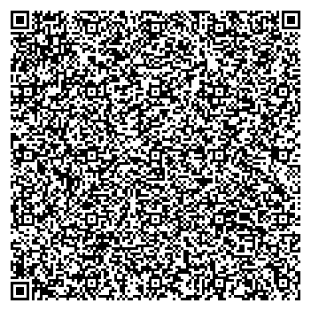
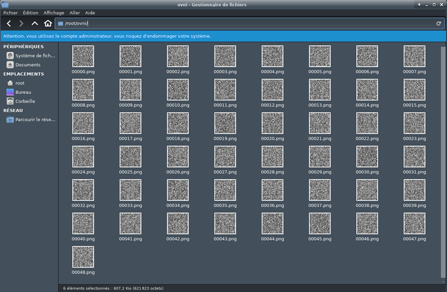
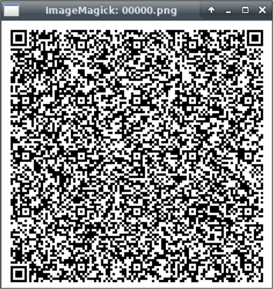

# Write up : Ovni

Catégorie :

```
Crypto-Stegano
```

Consigne : 

```
Retrouvez le flag dans ce gif.
```

Pièce jointe :

```
ovni.gif
```

Serveur :

```
CTFD
```

Points attribués :

```
40
```

Flag :

```
MARS{invaders_must_die}
```

## Solution



Récupérer des informations sur le fichier

```bash
$file ovni.gif 
mars.gif: GIF image data, version 89a, 351 x 351
```

Décomposer le GIF en images PNG

```bash
$convert ovni.gif %05d.png
```




On obtient 48 QRcode au format .png.



## Decodage des QR codes

Utiliser l'outil zbar-tools

Installation de zbar-tools : `$apt-get install zbar-tools`

Puis :

```
for i in `find ./ -name '*.png'` ; do zbarimg $i  ; done > result.txt
```

On obtient le résultat suivant (extrait) :

```
QR-Code:part8:oJ2TTKL5Vw6EmuqX1bSzP8AnXGZw1AxXcl8KWcNbb+ZxU2nTbSf9bzfttKroX03Dp99vyp5Kyo5TxSPTYgdXQoypmDy28kFgM8zGqLRl24VdHhRicSG2qgFUZJCdabNo3VjDOzTSXmoo2rUj1hpwaKG9V/t/ot+VPLeaRD8PpzgXOHOS81LVDaWJgxP3w8xNWJ4hDmWoda0dh6chWxri91ZEAZzsVxGIaq3X6r/AG/0W/KvV299J6fTBzJAFtuqZDT2LTQulnWZUxhoaus2AIaixOWXKVPqimWJrT8dyvhqaFBltuvm1h07ziLdbNQMS3uSwMPRf7f6LflTyxyaRPqBEEMJ6W2ZjajBo0L8nfbNhVhrBnXI6Czw+oMxwKujAGe8U5l1jO0HWHzyYaXXiMRijKfKWlZVdn0X+377vkTz+6jPq/QPK1sn9wqDEUkvaqIbszdgrN7d68tII2zpRFZhYRLLNFYwwvq9Vo6VbYG3VaxQ69Cxcoabed/t/ot+VfcfNE+k+1c4sbSpOIM8wdIShnOkBcAintpYkEZVjF6BhGZHGnfbtiHBcaX/AFPEMbqqIXP+fSrBsxaGINTrKbNXK/2/fb8ieT5p8fSPEfXY6UAQjDQzhkybLcw2ib0ptOnB1FFYKHyvfWoKS3ufOAfJfTMknn5n/wA1MqqOIBjabKKhqfkUUmX+377fkTyfNPj6V8ap1z4h90aFtIroLtoUVivcZwKwMo371dLMKGtGBapY3LGdmhyYq5Mx1xPJx1C5daUYNQ9b0ON/0X+3+i35U9x80+PqCzGOR6Dlnu4eoS24a6y1rIq1q/fMEJ7qUvraO2qNgtzMzPJz0VWaA4axIcLZvgReK1Pagd/1zv8AZ99nzL7j5pHQD8IjNieZc3ZD4QZclrYCoiLoQmIvTuritXLwomSR+v0gzCRGIMEXocwd9UpIMagZWmtVaitoqYijA53+z77fkTyfNHj6P1AOlhy3mGVjIRf9DNpDZw5Ecawr4h83
QR-Code:part36:nwfZ9kXcnqM3jltnIzThEDC8EzxDppwDDQcZwmiXhaCQNPG9P8AnGYSfLXV5k41z7ZJ58H29kN9SR1CVTJ4BJ6NnFiJpZx1pybGcgTqzuT0L0GDu7TZwoNbZbLqLCZ0JOZva+2TO729RwZdkeLNhhR2/rJdsfpML0vA4Ee2Iz+tsYxrpxr0tnS/OO2YEcdte3CdUnq0dl89s7WDwZ+DH63lbz2W9tm09ODEpsZF7Jva74gTLVb8lBxh9tjJylNGPrDYPaEcgmoQjHUAbDrSPRjokYshjzINsALwft0XRuuL3Nq5N8vTw8+DeyCjuyxupeMFbzkAzYmdQbYAk0yOQapd3B+0MAtgghazseCDszx7hveGTPIuGyaRx59sk84m9kRK8ZY9LrGU2Tsj0geGAndgYI9CAdxtl07hMWZk/SEdRDW1ZsekabAHyz0WO1ukJOewGFg+ruRgbpye2Z5xMNSPid22Hep9CV5aOWBsJQnRLPYb1YzBw3iRHu1kPJadkRrdoW3yychf+oa4ShyQ7b4TqyS7bfsjDZPXPtv1eUTN0g9yawy8vBIdYpms68jht0Vv1vLnsY2xu3kZhsXoz4RAmu57/kUnQ22QQddvBvb+WddeyOGyf8upMwH1wdN6TPOJvRFdG/t3dmwF3bBmMnhxNO7ZTyMsurJXUtdtEA6nK24Nu7NnbZYP9kDIAyQZO2woAsTLoyA74J6v+WbPKJgOQ9ZR/wDIBU1T8P8AYFHZv+iif91XZwhKaWer5xMTTZL3tv6lO9s/dn7v+7/uz92fuz939bP3H92fuz92fuz92fuP1kPt/wB2fuz92fuz92fuT939ZP1Z+7P3Y/t/S/pZ+rP3f1n0jefBh92T/wCGH6vrvwoT/wCP/wBVULkn/CqYMiyyyyyyyyyyxssbLLLLLLGyxsssbGyyyyyxsbLGxssssbIv/8QAJhABAAICAgIBBAMBAQAAAAAAAQARITFBUWFxgZGhsfAQwdHh8f/aAAgBAQAB
QR-Code:part41:UY2MRyJEefmL5qfiFrRyXBhpgNZYALuYtKASWtx1Mxp350SVPWqRiACrV2F8kt2eK1b5ipsFKEqFocOpWRKWClDI+KTfMZg4QKAU0XjliWMiIoFXZLoBgMqzH4uMO56Q8T5gyNGqEnEpgjKCdmW4JfIKVDkcX2SpPQuXqJH5BgkhVqnJ1BhWwwvmUEO45gAOl5XUbpk2sw9y4YWEbzxAwoAoweYq/ZqV090fJAKLWvjMq+pr1BoWDM+4T4z8RHZqPmJxUO6CGXQVrH08UvtExRXrATz85vHdSosGnDZGjWgvnkiQgSPhL+2m+Z67ie4Mox3hX0SZU1Gwa8+nUKmnexuqcedxGqNYFXn4jreE4f3NuJl7fZZC9epgCL4UFRUVAGgdsw5ofJVjolO4ZXiLs/E0Gi4nOeFi/SWDGwWn7j1klgq/pAVpW3B8VxCJYOjTFqLWXUuyzTDGbjFGPd1uJ2UzP1+Zgt5NfjcQ7KLfkmbxtMPGEqiuIKRmE/ciweD8RxgGJa+u5ZXbDBBTymJlveXK6HiXhbcAf9lykGbKHqCFTa++y0p4mPJCgCU3kTqZ4B51fSFYjxrDrxLW0ByFy/OiVYH+y0VuOg0p7iKnIL19Y6C4bwDE5VOW8U8VCNFHc7OcxKasnIcVfcI28oRGBAKVtsN4Fi9Y2sY/2GaQS7PuYAyufBLesqonzcF33ZZ8Q00XK0/HMxf3D6s/McDg6ldJVghDBd8EbRSo+YhTzkjqa/7iCwXaXvEpQ4rb8Tq0WZ62n4l/W/mfECUiXEszUZRX1BqW2Ltu4PyCqwSMVaxIBaioMU5+Yy+fsYZYGyO30m6DrJM4/kZXudbSXj0YTBuq3Qw/ZPpFo99nghE6GAWkM26dMJ3+vDCccn4CyZ/12cFtiytfB6TqN86cuT8oEQEtU/CE2ocDyICBxX2YYPmxoBe2D+IhUpL68uW1vMvN4L+bJS/mWRBeZ7f4eNUvVErL93F4P+Ibbf6SM5ZQ+0DhzT8T8v8

[...]
```

On remarque que l'on a affaire à du base64 et que chaque ligne est indicée : `QR-Code:partxx`

On réalise un tri ascendant sur chaque ligne et on concatène le base64.

```bash
sed -e 's/^QR-Code:part//' < result.txt | sort -n > result1.txt
sed -e 's/^.://' -e 's/^..://' < result1.txt | tr -d '\n' > result2.txt
```

Decodage du base 64 et visualisation du resultat.

```bash
cat result2.txt | base64 -d > resultat
```

```bash
hexeditor resultat
```

On remarque que ce fichier est un jpg, il faut donc rajouter l'extension en renommant le fihier en .jpg.

```bash
mv resultat ovni.jpg
```

Le flag s'affiche dans l'image


Résultat : MARS{invaders_must_die}