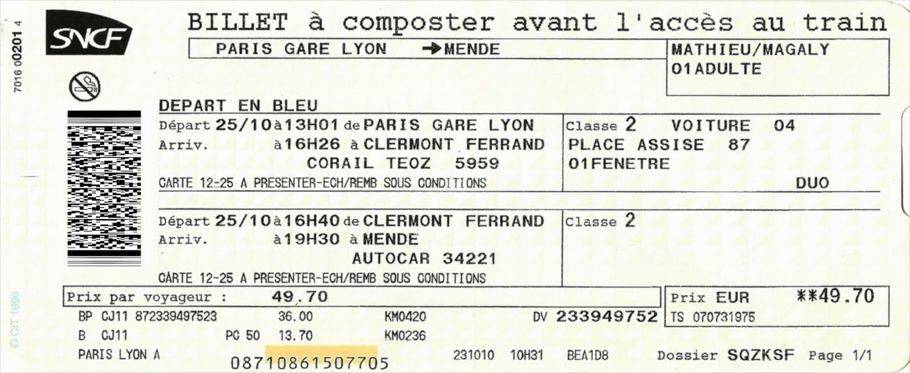
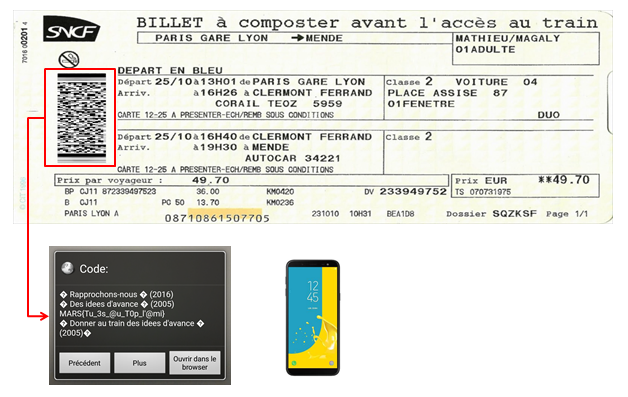

# Write up :  Voyage

Catégorie :

```
Crypto-Stegano
```

Consigne : 

```
Seuls les contrôleurs peuvent le voir.
```

Pièce jointe : 

```
voyage.jpg
```

Serveur :

```
CTFD
```

Points attribués :

```
10
```

Flag :

```
 MARS{Tu_3s_@u_T0p_l'@mi}
```


Les billets de la SNCF sont pourvu d'un code barres en 2 dimensions. Le format de ce code barre est le **PDF417**.



Il faut télécharger un lecteur de code barres connaissant la norme PDF417 et de scanner le code barre pour retrouver le flag.

Exemple d'application disponible : pdf417 sur le Play Store.



Résultat : MARS{Tu_3s_@u_T0p_l'@mi}