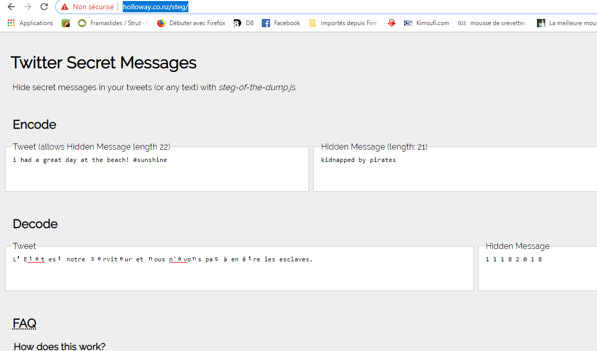

# Write up : disengage

Catégorie :

```
Divers
```

Consigne :

```
La police vous demande d'enquêter sur le créateur d'un site contenant un puissant ransomware. 
Pour stopper la diffusion de celui-ci vous devrez taper le code de désactivation. 
Les seules informations que nous connaissons sont : 
Le frère du créateur a comme identifiant Facebook **claudy.focan.73113**
A vous de retrouver les codes de désactivation.

Accès :
<http://game2.marshack.fr:32001>
```

Pièce jointe :

```
Aucune
```

Serveur :

```
game2 
```

Points attribués :

```
30 
```

Flag :

```
MARS{S0C14L_3NG1N33r1NG}
```

## Solution

Le lien mène vers la page suivante : 


En tapant dans la barre d'adresse l'id du profil facebook on tombe sur le profil d'une personne.

https://www.facebook.com/claudy.focan.73113


Nous savons que ce profil correspond au frère de la cible, cherchons dans sa liste d'amis quelqu'un susceptible d'être un parent.


Le profil de Natasha Focan correspond.

En cherchant un peu dans le profil de Natasha, on peut voir qu'elle possède un compte Twitter.


Le lien Twitter mène à la page suivante :


On peut remarquer que le dernier post possède une écriture particulière. Il s'agit d'un *twitter secret message*.

Le site http://holloway.co.nz/steg/ permet de décoder le message.



On obtient le code de désactivation : 11182018

Saisie du code de désactivation sur la page du compte à rebours.


Résultat :  MARS{S0C14L_3NG1N33r1NG}

