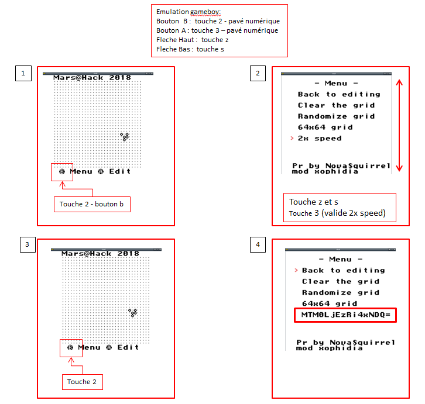

# Write up : Les années 80 #


Catégorie :

```
Divers
```

Consignes : 

```
Retrouvez la nostalgie des années 80 dans cette épreuve. Bon jeu :)

Le flag trouvé devra être intégré dans MARS{} afin de pouvoir le soumettre.

```

Piece jointe :

```
challenge_annee80.gb
```

Serveur :

```
CTFD
```

Points attribués :

```
30
```

Flag :  

```
MARS{gbpowa}
```

Dans le cas présent, il s'agit d'un jeu gameboy. L'idée est que ce type de support est présent et emmené partout. La possibilité d'avoir une porte dérobée sur une 3DS n'est pas nulle pour les personnes utilisant des cartes type R4.

Le programme de base est un *homebrew* donc pas de souci de licence dans le cadre de ce challenge. Il s'agit du jeu de la vie de Conway.

Une fois que l'on a compris que le fichier est une ROM GameBoy, il faut télécharger un émulateur.

Dans les menus, il y a possibilité de changer la vitesse. Une fois cela fait (1) il faut retourner dans les menus et un code base64 (2) apparait.

Sur kali , installer l'emulateur mednafen

```
 apt-get install mednafen
```

Puis exécuter la rom

```
/usr/games/mednafen <chemin_de_chall.gb>
```



Dans la ROM se cache le code suivant :

MTM0LjEzRi4xNDQ=

Il s'agit du premier indice :

````bash
echo "MTM0LjEzRi4xNDQ=" | base64 -d
134.13F.144
````

Cela correspond aux offset dans le header des données du jeu. J'ai modifié l'entête afin d'inclure le mot de passe.

134, 13F et 144 correspondent à des offsets particuliers dans une ROM GameBoy.

Descriptif d'un header ROM GameBoy disponible sur ce site : http://gbdev.gg8.se/wiki/articles/The_Cartridge_Header

Dans une console, on affiche le header.

````bash
hexeditor challenge_annee80.gb 

00000000  c9 00 00 00 00 00 00 00  c9 00 00 00 00 00 00 00  |................|
*
00000040  c3 6c 06 00 00 00 00 00  c3 89 06 00 00 00 00 00  |.l..............|
00000050  c3 89 06 00 00 00 00 00  c3 89 06 00 00 00 00 00  |................|
00000060  c3 89 06 00 00 00 00 00  00 00 00 00 00 00 00 00  |................|
00000070  00 00 00 00 00 00 00 00  00 00 00 00 00 00 00 00  |................|
*
00000100  00 c3 4f 01 ce ed 66 66  cc 0d 00 0b 03 73 00 83  |..O...ff.....s..|
00000110  00 0c 00 0d 00 08 11 1f  88 89 00 0e dc cc 6e e6  |..............n.|
00000120  dd dd d9 99 bb bb 67 63  6e 0e ec cc dd dc 99 9f  |......gcn.......|
00000130  bb b9 33 3e 36 38 00 00  00 00 00 00 00 00 00 50  |..3>68.........P|
00000140  00 4f 57 80 34 00 00 00  00 01 33 00 ff 9c 49 ec  |.OW.4.....3...I.|
00000150  e0 91 31 00 e0 cd d9 05  f0 91 fe 11 cc a3 05 3e  |..1............>|
00000160  1c e0 48 3e 6c e0 49 e0  47 af e0 43 e0 42 e0 26  |..H>l.I.G..C.B.&|
````

Voici les modifications pour le mot de passe 68POW4, soit **gbpowa** en leetspeak.

````bash
; $0134 - $013E: The title, in upper-case letters, followed by zeroes.
DB $36,$38
DS 9 ; padding

; $013F - $0142: The manufacturer code. 
DB $50
DS 1
DB $4F,$57

; $0144 - $0145: "New" Licensee Code, a two character name.
DB $34
````

Il s'agit des valeurs 0x36 0x38 0x50 0x4F 0x57 0x34 soit 68POW4 et donc **gbpowa**.

La commande file ne donnera que peu d'information.

````
file challenge_annee80.gb
game.gb: Game Boy ROM image: "68" (Rev.255) [ROM ONLY], ROM: 256Kbit, RAM: 16Kbit
````

**flag: gbpowa**