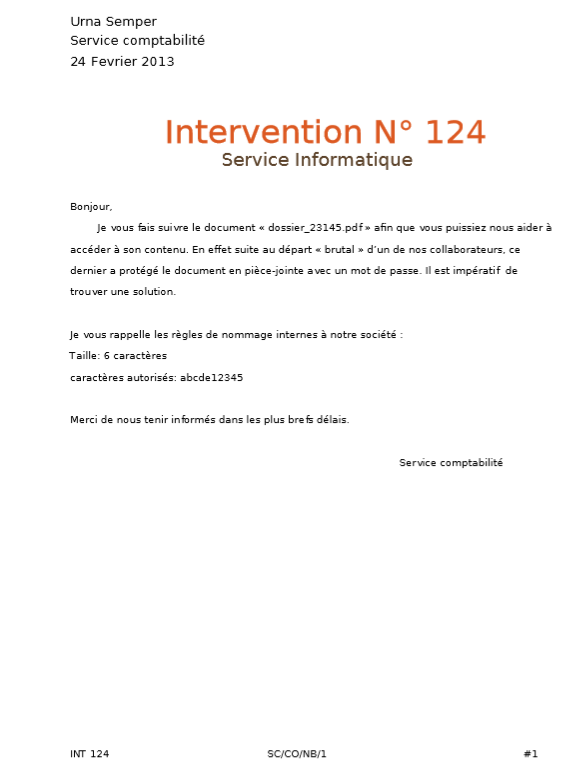
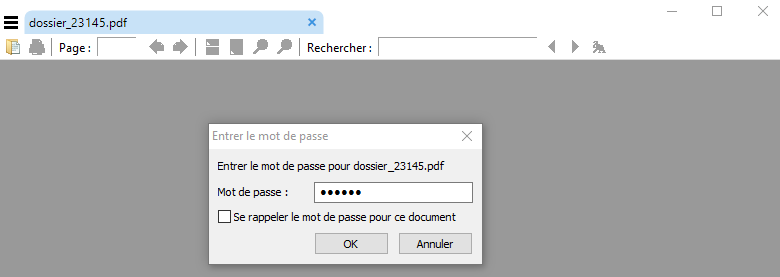
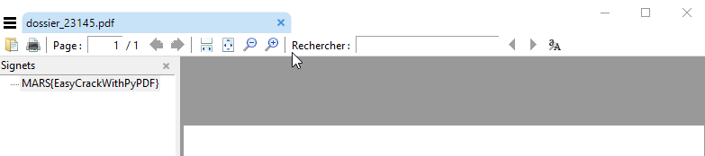

## Write up : Ouvre moi ##

Catégorie :

```
Divers
```

Consigne :

```
Vous recevez par mail l’énoncé du challenge (pièce-jointe).
```

Pièces jointes :

```
Enonce.pdf
Dossier23145.pdf
```

Serveur :

```
CTFD
```

Points attribués :

```
10
```

Flag :

```
MARS{EasyCrackWithPyPDF}
```


Enonce.pdf



## Solution

Le principe de cette épreuve est de proposer deux documents pdf.

- Un contenant des indices
- L'autre protégé par un mot de passe

Ci-après le code permettant d'insérer le mot de passe et le flag dans le fichier protégé.

Il y a également une méthode createDict() et exploit() qui genère le dictionnaire selon les indications présentes dans le premier pdf et exploit qui présente le bruteforce.

Le temps de l'exploit dépend du mot de passe, s'il faut un délai plus court, il suffit de le modifier.

A titre de test, le mot de passe **adc123** a été craqué en :

````bash
time python main.py
Correct password: adc123
python main.py  474,41s user 1,74s system 97% cpu 8:08,65 total
````

Le code suivant nécessite la librairie **pyPDF2**.

````python
from PyPDF2 import PdfFileReader, PdfFileWriter
import itertools

def createPdf():
    with open("indices.pdf", "rb") as in_file:
        input_pdf = PdfFileReader(in_file)
        output_pdf = PdfFileWriter()
        output_pdf.appendPagesFromReader(input_pdf)
        output_pdf.addBookmark('flag: EasyCrackWithPyPDF',1)
        output_pdf.encrypt("adc123")

    with open("output.pdf", "wb") as out_file:
        output_pdf.write(out_file)


def createDict():
    char = {'a', 'b', 'c', 'd', 'e', '1', '2', '3', '4', '5'}
    f = open ('dict.txt','w')
    for x in itertools.product(char, repeat=6):
        f.write(''.join(x) + '\n')
    f.close()


def exploit():
    cracked = False

    with open("dict.txt") as f:
        lines = f.readlines()

    with open('dossier_23145.pdf', 'rb') as input_file:
        reader = PdfFileReader(input_file)
        for password in lines:
            password = password.replace('\n','')
            try:
                status = reader.decrypt(password)
                if status == 1:
                    correct_password = 'Correct password: %s' % password
                    cracked = True
                    break
            except:
                pass

    if cracked:
        print correct_password
    else:
        print "Not cracked"


if __name__ == '__main__':
    createDict()
    exploit()

````

Le tout a été vérifié avec le player par defaut de Firefox pour éviter les caprices de certains logiciels.



Une fois le mot de passe validé, il faut aller dans les signets.



Résultat : MARS{EasyCrackWithPyPDF}