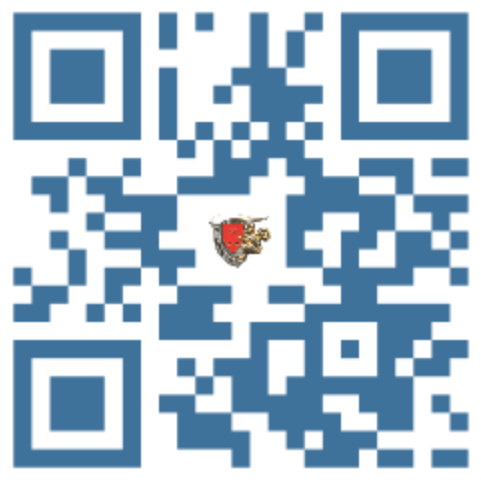

# Write up : EasyNetwork


Catégorie :

```
forensic
```

Consigne :

```
Vous trouvez sur votre bureau une clé usb déposée par votre collègue qui se trouve bloqué dans son processus d'analyse. Il demande votre aide afin de l'aider à comprendre les échanges réseaux capturés.
```

Pièce jointe :

```
challenge.pcapng
```

Serveur :

```
CTFD
```

Points attribués :

```
40
```

Flag :

```
MARS{qrc0d3}
```


## Analyse Wireshark

Le fichier est une capture réseau au format pcap.
Elle présente une navigation sur internet ainsi que l'exécution d'une suite de ping.
Les ping ont été forgés via scapy et contiennent le flag.

Une fois le pcap compris, il faut extraire les données présentes dans tous les ping via la commande :

```
tshark -r challenge.pcapng -Y "ip.src==10.10.10.1" -Tfields -e data.data | xxd -r -p > extract
```

Une fois cela fait, on comprend que le fichier contient du base64.

```
more extract | base64 -d > extract2
```

La commande `file` permet de savoir qu'il s'agit d'une image.

Il s'agit de celle-ci.


Il manque les yeux pour cela plusieurs possibilités, gimp avec un calque, python via PIL pour dessiner les blocs ...

Une fois les yeux dessinés 




Nous scannons le tout pour avoir le flag.

## Création du challenge 

```
#Script pour générer les trames
from scapy.all import *

monfichier = open ('image64.txt','rb')

for i in monfichier.read().replace('\n',''):
    icmp = IP(src='10.10.10.'1, dst='192.168.1.2')/ICMP()/i
    send(icmp)xxxxxxxxxx #Script pour générer les tramesfrom scapy.all import *monfichier = open ('image64.txt','rb')​for i in monfichier.read().replace('\n',''):    icmp = IP(src='10.10.10.'1, dst='192.168.1.2')/ICMP()/i    send(icmp)a
```


```
Le champ data est composé d'une lettre à chaque fois.
Il y a également une navigation sur des sites internet pour brouiller le tout.
```


Résultat : MARS{qrc0d3}


