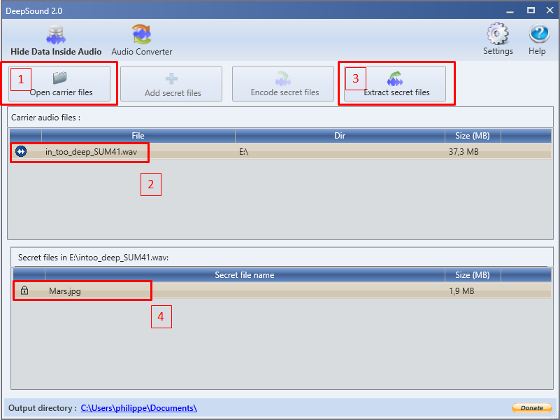
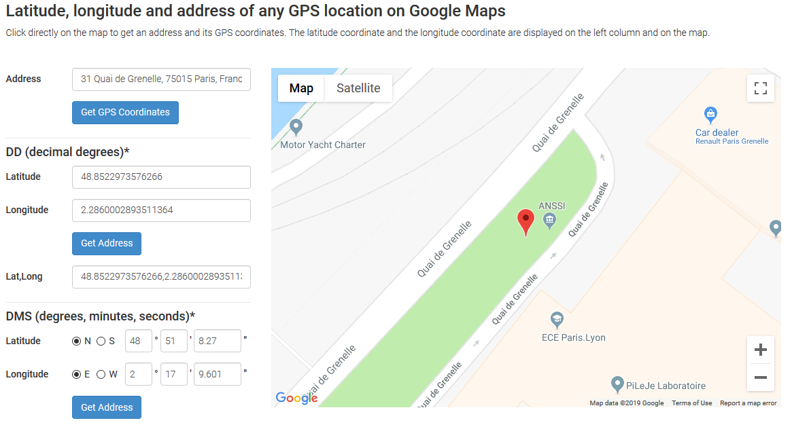

# Write-up  : Imageception #


Catégorie :

```
Un employé d'une entreprise que nous avons auditée a été renvoyé. Sur son bureau, nous avons trouvé une clef USB. Il s'avère que cet employé veut perpétrer une attaque de type deni de service (DOS) envers une entreprise. <p>
Trouvez le nom de l'entreprise ciblée par cet ancien employé. 
Le flag est insensible à la casse et au format suivant : MARS{**entreprise**}

usb.zip : md5 **29049006bc7917db3ae2ff162a47e548**<br>
password usb.zip : **marshack**<br>
```

Pièce jointe :

```
usb.zip
```

Serveur :

```
CTFD
```

Points attribués : 

```
60
```

Flag : 

```
MARS{ANSSI}   flag insensible à la casse
```

## Solution

Nous disposons d'un fichier ISO, l'énoncé et le nom du fichier nous indiquent que c'est l'image d'une clef usb.

Il est possible sur Linux de monter l'image de la clef usb dans notre système de fichiers comme suit :

```bash
sudo mkdir /mnt/temp
sudo mount usb.iso /mnt/temp
cd /mnt/temp
ls -al
```

Le contenu de la clef nous est donc affiché et nous pouvons vérifier le type du fichier to_do et afficher par la suite son contenu :

````bash
file to_do
cat to_do
````

Le message suivant nous indique que le programme que nous cherchons est présent sur la clef usb.

```text
To Do List
##################################
Acheter du papier WC
Acheter du pain
Nourrir le poisson

Envoyer le flag à spritseason via le logiciel de stéganographie qu'il m'a demandé présent sur la clef

Regarder des vidéos d'alderiate le valeureux

Penser au Zevent 2019

Insulter Chap sur League Of Legends
```

Vérifions donc avec l'outil testdisk pour voir si nous ne pouvons pas récupérer des fichiers supprimés de la clef :

````bash
testdisk usb.iso
````

Il faut selectionner le volume puis le type de table de partition. L'outil détecte le type en bas dans les hint et propose un type, ici il faut le suivre.

Il faut ensuite selectionner "Advanced / Filesystem Utils" puis selectionner la partition pour booter dessus.

Le logiciel affiche une erreur de boot_sector, il faut donc rebuild le Boot_Sector via l'option du logiciel en bas. Une fois le boot_sector restaurée, il suffit de choisir le cluster trouvé en validant avec 'Y'.

### Utilisation de TestDisk

```
TestDisk 7.0, Data Recovery Utility, April 2015
Christophe GRENIER <grenier@cgsecurity.org>
http://www.cgsecurity.org

  TestDisk is free software, and
comes with ABSOLUTELY NO WARRANTY.

Select a media (use Arrow keys, then press Enter):
>Disk usb.iso - 13 GB / 13 GiB


>[Proceed ]  [  Quit  ]

Note: Disk capacity must be correctly detected for a successful recovery.
If a disk listed above has incorrect size, check HD jumper settings, BIOS
detection, and install the latest OS patches and disk drivers.

```

Selectionnez :  >[Proceed ]


```
TestDisk 7.0, Data Recovery Utility, April 2015
Christophe GRENIER <grenier@cgsecurity.org>
http://www.cgsecurity.org


Disk usb.iso - 13 GB / 13 GiB

Please select the partition table type, press Enter when done.
 [Intel  ] Intel/PC partition
 [EFI GPT] EFI GPT partition map (Mac i386, some x86_64...)
 [Humax  ] Humax partition table
 [Mac    ] Apple partition map
>[None   ] Non partitioned media
 [Sun    ] Sun Solaris partition
 [XBox   ] XBox partition
 [Return ] Return to disk selection


Hint: None partition table type has been detected.
Note: Do NOT select 'None' for media with only a single partition. It's very
rare for a disk to be 'Non-partitioned'.

```

Selectionnez :  >[None   ]


```
TestDisk 7.0, Data Recovery Utility, April 2015
Christophe GRENIER <grenier@cgsecurity.org>
http://www.cgsecurity.org


Disk usb.iso - 13 GB / 13 GiB
     CHS 13325 64 32 - sector size=512

 [ Analyse  ] Analyse current partition structure and search for lost partitions
>[ Advanced ] Filesystem Utils
 [ Geometry ] Change disk geometry
 [ Options  ] Modify options
 [ Quit     ] Return to disk selection


Note: Correct disk geometry is required for a successful recovery. 'Analyse'
process may give some warnings if it thinks the logical geometry is mismatched.

```

Selectionnez :  >[ Advanced ]


```
>   P FAT32                    0   0  1 13324  26  8   27288392 [MARS@HACK]
>[  Boot  ]
```

Sélectionnez : >[ Boot ]


```
TestDisk 7.0, Data Recovery Utility, April 2015
Christophe GRENIER <grenier@cgsecurity.org>
http://www.cgsecurity.org

Disk usb.iso - 13 GB / 13 GiB - CHS 13325 64 32

     Partition                  Start        End    Size in sectors
>   P FAT32                    0   0  1 13324  26  8   27288392 [MARS@HACK]


 [  Type  ] >[  Boot  ]  [Undelete]  [Image Creation]  [  Quit  ]
                              Boot sector recovery

```

Sélectionnez : >[ Boot ]


```
TestDisk 7.0, Data Recovery Utility, April 2015
Christophe GRENIER <grenier@cgsecurity.org>
http://www.cgsecurity.org

Disk usb.iso - 13 GB / 13 GiB - CHS 13325 64 32
     Partition                  Start        End    Size in sectors
   P FAT32                    0   0  1 13324  26  8   27288392 [MARS@HACK]

>Boot sector                                                                    
 Error: size boot_sector 31244288 > partition 27288392
 Bad

 Backup boot sector
 Error: size boot_sector 31244288 > partition 27288392
 Bad

 First sectors (Boot code and partition information) are not identical.
 Second sectors (cluster information) are not identical.

 A valid FAT Boot sector must be present in order to access
    Next

 [  Quit  ] >[Rebuild BS]  [  Dump  ]
                            Return to Advanced menu

```


Le secteur de boot est corrompu, il faut le reconstruire

Selectionnez :  >[Rebuild BS]

```
TestDisk 7.0, Data Recovery Utility, April 2015
Christophe GRENIER <grenier@cgsecurity.org>
http://www.cgsecurity.org

   P FAT32                    0   0  1 13324  26  8   27288392 [MARS@HACK]
Cluster 2, Directory / found ?
Answer Y(es), N(o), Q(uit) or A(bort interactive mode). N or A if not sure.

>-rwxr-xr-x   0   0       317 17-Dec-2018 14:36 to_do


```

Répondre : Y(es)


```
TestDisk 7.0, Data Recovery Utility, April 2015
Christophe GRENIER <grenier@cgsecurity.org>
http://www.cgsecurity.org

Disk usb.iso - 13 GB / 13 GiB - CHS 13325 64 32
     Partition                  Start        End    Size in sectors
   P FAT32                    0   0  1 13324  26  8   27288392 [MARS@HACK]

FAT : 32
cluster_size 16 16
reserved     32 32
total_sect   27288392 31244288
fat32_length 15248 15248
root_cluster 2 2
free_count   uninitialised 1950858
next_free    uninitialised 5084
Extrapolated boot sector and current boot sector are different.


 [  Dump  ] >[  List  ]  [ Write  ]  [  Quit  ]
                           List directories and files

```

Selectionnez :  >[  List  ]

Il est donc possible d'accéder au filesystem de la clef et par conséquent de restaurer des fichiers anciennement présents sur la clef.
Il est donc possible de récupérer deux fichiers très interessants : 'in_too_deep_SUM41.wav' et 'deepsound-2-0-en-win.msi'.

Pour sélectionner les fichiers à copier : 


```
Fleche haut et bas pour naviguer
:   touche deux point pour sélectionner les fichiers

* : indique que le fichier est sélectionné
```


```
TestDisk 7.0, Data Recovery Utility, April 2015
Christophe GRENIER <grenier@cgsecurity.org>
http://www.cgsecurity.org
   P FAT32                    0   0  1 13324  26  8   27288392 [MARS@HACK]
Directory /

>-rwxr-xr-x     0     0       317 17-Dec-2018 14:36 to_do
*-rwxr-xr-x     0     0  39142894 17-Dec-2018 13:29 in_too_deep_SUM41.wav
*-rwxr-xr-x     0     0   2423012 14-Dec-2018 13:04 deepsound-2-0-en-win.msi
 drwxr-xr-x     0     0         0  7-Jan-2019 13:45 _RASH-~1


                                                   Next
Use Right to change directory, h to hide deleted files
    q to quit, : to select the current file, a to select all files
    C to copy the selected files, c to copy the current file
        

```


```
Fleche haut et bas : pour naviguer
C : Pour sélectionner le repertoire de sauvegarde
```


```
TestDisk 7.0, Data Recovery Utility, April 2015

Please select a destination where the marked files will be copied.
Keys: Arrow keys to select another directory
      C when the destination is correct
      Q to quit
Directory /root/Téléchargements/Forensic
>drwxr-xr-x     0     0      4096 29-Jan-2019 09:21 .
 drwxr-xr-x     0     0      4096 29-Jan-2019 09:16 ..
 -rw-r--r--     0     0 13971656704  8-Jan-2019 13:41 usb.iso
 -rwxrwxrwx     0     0 3594086299 22-Jan-2019 14:59 usb.zip

```


```
TestDisk 7.0, Data Recovery Utility, April 2015
Christophe GRENIER <grenier@cgsecurity.org>
http://www.cgsecurity.org
   P FAT32                    0   0  1 13324  26  8   27288392 [MARS@HACK]
Directory /
Copy done! 2 ok, 0 failed
 -rwxr-xr-x     0     0       317 17-Dec-2018 14:36 to_do
>-rwxr-xr-x     0     0  39142894 17-Dec-2018 13:29 in_too_deep_SUM41.wav
 -rwxr-xr-x     0     0   2423012 14-Dec-2018 13:04 deepsound-2-0-en-win.msi
 drwxr-xr-x     0     0         0  7-Jan-2019 13:45 _RASH-~1


                                                   Next
Use Right to change directory, h to hide deleted files
    q to quit, : to select the current file, a to select all files
    C to copy the selected files, c to copy the current file

```

C pour réaliser la sauvegarde


```
ls -l

-rw-r--r-- 1 root root     2423012 déc.  14 13:04 deepsound-2-0-en-win.msi  <==  le programme de stégano
-rw-r--r-- 1 root root    39142894 déc.  17 13:29 in_too_deep_SUM41.wav     <==  Le fichier in_too_deep_SUM41.wav a été extrait de                                                                                      l'iso
-rw-r--r-- 1 root root 13971656704 janv.  8 13:41 usb.iso
-rwxrwxrwx 1 root root  3594086299 janv. 22 14:59 usb.zip

```


Après une recherche sur Google, Deepsound est un logiciel Windows qui permet de cacher des fichiers ou de récupérer des fichiers dans des fichiers audio.

(Testé sur Windows 10)

Installez et exécutez DeepSound 2.0  


2. Localisation du fichier audio
3. Extraction des fichiers cachés
4. Obtention du fichier caché nommé Mars.jpg



Sous linux :

Il faut installer exiftools pour pouvoir analyser l'image trouvée et regarder si elle contient des informations.

Installation sous Linux de exiftool  : `apt install libimage-exiftool-perl`

Installation de exiftools sur une machine Linux avec noyau Unix basé sur Archlinux (Manjaro)
Téléchargement de l'archive du binaire sur http://owl.phy.queensu.ca/~phil/exiftool/

```bash
cd Téléchargements/
gunzip Image-ExifTool-11.21.tar.gz
tar xf Image-ExifTool-11.21.tar
cd Image-ExifTool-11.21
perl Makefile.PL
make test
sudo make install
```

Le binaire installé, on retourne vers le répertoire contenant l'image.
````bash
exiftool Mars.jpg

ExifTool Version Number         : 11.16
File Name                       : Mars.jpg
Directory                       : .
File Size                       : 1975 kB
File Modification Date/Time     : 2019:01:29 08:43:27+01:00
File Access Date/Time           : 2019:01:29 09:16:16+01:00
File Inode Change Date/Time     : 2019:01:29 09:16:16+01:00
File Permissions                : rwxrwxrwx
File Type                       : JPEG
File Type Extension             : jpg
MIME Type                       : image/jpeg
JFIF Version                    : 1.01
Exif Byte Order                 : Big-endian (Motorola, MM)
Photometric Interpretation      : RGB
Orientation                     : Horizontal (normal)
Samples Per Pixel               : 3
X Resolution                    : 72
Y Resolution                    : 72
Resolution Unit                 : inches
Software                        : Adobe Photoshop CS5 Windows
Modify Date                     : 2013:12:03 20:15:16
Exif Version                    : 0221
Color Space                     : Uncalibrated
Exif Image Width                : 1920
Exif Image Height               : 1080
Compression                     : JPEG (old-style)
Thumbnail Offset                : 406
Thumbnail Length                : 62042
Current IPTC Digest             : fdd977c412ea8fd8b9c9bd6dee269b3b
Coded Character Set             : UTF8
Application Record Version      : 51070
IPTC Digest                     : fdd977c412ea8fd8b9c9bd6dee269b3b
Displayed Units X               : inches
Displayed Units Y               : inches
Print Style                     : Centered
Print Position                  : 0 0
Print Scale                     : 1
Global Angle                    : 30
Global Altitude                 : 30
URL List                        : 
Slices Group Name               : Mars Attacks - 16
Num Slices                      : 1
Pixel Aspect Ratio              : 1
Photoshop Thumbnail             : (Binary data 8455 bytes, use -b option to extract)
Has Real Merged Data            : Yes
Writer Name                     : Adobe Photoshop
Reader Name                     : Adobe Photoshop CS5
Photoshop Quality               : 12
Photoshop Format                : Standard
Progressive Scans               : 3 Scans
Image Width                     : 1920
Image Height                    : 1080
Encoding Process                : Baseline DCT, Huffman coding
Bits Per Sample                 : 8
Color Components                : 3
Y Cb Cr Sub Sampling            : YCbCr4:4:4 (1 1)
Image Size                      : 1920x1080
Megapixels                      : 2.1
Thumbnail Image                 : (Binary data 62042 bytes, use -b option to extract) <======    Thumbnail
````

On peut remarquer la thumbnail présente en fin d'analyse. On peut tenter de l'extraire car il n'y a aucune information utile dans la première image (nous cherchons les coordonnées d'un endroit).


```bash
exiftool -b -ThumbnailImage Mars.jpg > thumbnail.jpg
exiftool thumbnail.jpg

ExifTool Version Number         : 11.16
File Name                       : thumbnail.jpg
Directory                       : .
File Size                       : 61 kB
File Modification Date/Time     : 2019:01:29 09:19:28+01:00
File Access Date/Time           : 2019:01:29 09:19:28+01:00
File Inode Change Date/Time     : 2019:01:29 09:19:28+01:00
File Permissions                : rw-r--r--
File Type                       : JPEG
File Type Extension             : jpg
MIME Type                       : image/jpeg
JFIF Version                    : 1.01
Exif Byte Order                 : Big-endian (Motorola, MM)
X Resolution                    : 1
Y Resolution                    : 1
Resolution Unit                 : None
Y Cb Cr Positioning             : Centered
Compression                     : JPEG (old-style)
Thumbnail Offset                : 202
Thumbnail Length                : 12744
Image Width                     : 480
Image Height                    : 360
Encoding Process                : Baseline DCT, Huffman coding
Bits Per Sample                 : 8
Color Components                : 3
Y Cb Cr Sub Sampling            : YCbCr4:2:0 (2 2)
Image Size                      : 480x360
Megapixels                      : 0.173
Thumbnail Image                 : (Binary data 12744 bytes, use -b option to extract)   <====   Thumbnail Image
```
Encore une fois aucune coordonnée ni information à part une nouvelle thumbnail.


````bash
exiftool -b -ThumbnailImage thumbnail.jpg > thumbnail2.jpg
exiftool thumbnail2.jpg

ExifTool Version Number         : 11.16
File Name                       : thumbnail2.jpg
Directory                       : .
File Size                       : 12 kB
File Modification Date/Time     : 2019:01:29 09:21:04+01:00
File Access Date/Time           : 2019:01:29 09:21:04+01:00
File Inode Change Date/Time     : 2019:01:29 09:21:04+01:00
File Permissions                : rw-r--r--
File Type                       : JPEG
File Type Extension             : jpg
MIME Type                       : image/jpeg
JFIF Version                    : 1.01
Exif Byte Order                 : Big-endian (Motorola, MM)
X Resolution                    : 1
Y Resolution                    : 1
Resolution Unit                 : None
Y Cb Cr Positioning             : Centered
GPS Version ID                  : 2.3.0.0
GPS Latitude Ref                : North
GPS Longitude Ref               : East
Image Width                     : 275
Image Height                    : 183
Encoding Process                : Baseline DCT, Huffman coding
Bits Per Sample                 : 8
Color Components                : 3
Y Cb Cr Sub Sampling            : YCbCr4:2:0 (2 2)
GPS Latitude                    : 48 deg 51' 8.31" N
GPS Longitude                   : 2 deg 17' 9.94" E
GPS Position                    : 48 deg 51' 8.31" N, 2 deg 17' 9.94" E    <===   Coordonnées GPS
Image Size                      : 275x183
Megapixels                      : 0.050
````
Cette fois on obtient des coordonnées géographiques insérées dans cette image.

`48 deg 51' 8.31" N, 2 deg 17' 9.94" E`

Une courte recherche sur Google nous permet de trouver un site qui permet d'obtenir une adresse en fonction de ses coordonnées géographiques :
 https://www.gps-coordinates.net/

L'adresse obtenue est la suivante : 31 Quai de Grenelle, 75015 Paris, France.

Un recherche nous permettra de découvrir que le lieu visé par l'attaque est l'ANSSI.




Résultat : MARS{ANSSI}.