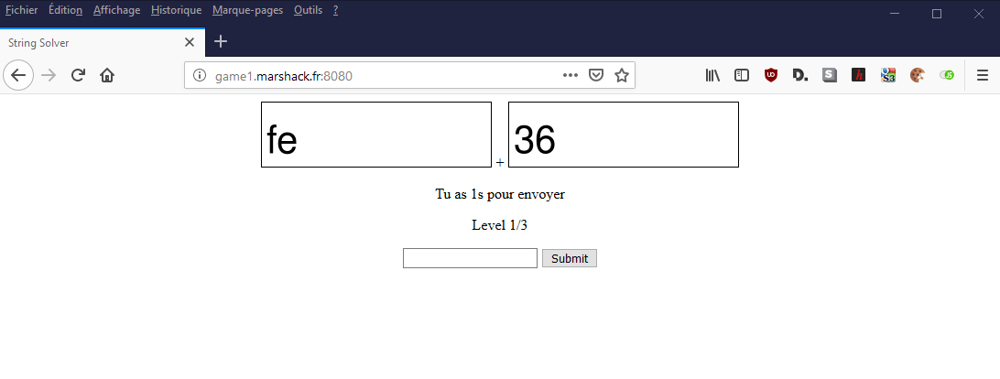

# Write-up : Strings solver #

Catégorie :

```
Concatener et renvoyer en moins de 2 secondes la chaîne de caractères au serveur.<p>
Le flag apparaîtra lorsque le level 3 sera réussi.<p>

<a href="http://game1.marshack.fr:8080">http://game1.marshack.fr:8080</a>
```

Pièce jointe :

```
Aucune
```

Serveur :

```
game1
```

Points attribués : 

```
50 points
```

Flag : 

```
MARS{Scr1pt7h1s0rl34v3}
```


Le but de l'épreuve est de renvoyer les caractères que le site affiche en les concaténant. Le point difficile est situé au niveau de la récupération des caractères puisque ce sont des images. Il est donc nécessaire d'utiliser des librairies de type OCR.



## Solution

La solution proposée développée en python nécessite d'installer **tesseract** avec **python pip** via le gestionnaire de paquets.

Installation proposée sous manjaro (Archlinux)
```bash
sudo pacman -S tesseract
sudo pip2 install pytesseract pillow requests
```

Installation sous kali, debian, ubuntu

```
apt-get install tesseract-ocr python-pytesseract python-requests  python-pil
```

string_solver.py (script à exécuter sous Python2)

````python
#!/usr/bin/python2.7

import requests, pytesseract
from PIL import Image
from base64 import b64decode
from io import BytesIO

#url = "http://localhost:8080"
url = "http://game1.marshack.fr:8080"
r = requests.get(url)

cookie = r.cookies

while (r.text.find('Level') > -1):
	lvl = r.text[r.text.find('Level '):]
	lvl = lvl[:lvl.find('</')]
	print lvl

	im1data = r.text[r.text.find('base64')+7:]
	im1data = im1data[:im1data.find('">')]
	im1data = b64decode(im1data)
	im1 = Image.open(BytesIO(im1data))

	im2data = r.text[r.text.rfind('base64')+7:]
	im2data = im2data[:im2data.find('">')]
	im2data = b64decode(im2data)
	im2 = Image.open(BytesIO(im2data))

	#im1.show()

	str1 = pytesseract.image_to_string(im1)
	print "    " + str1

	#im2.show()

	str2 = pytesseract.image_to_string(im2)
	print "    " + str2

	rtnstr = str1 + str2
	print "    " + rtnstr

	data = {"string": rtnstr}

	r = requests.post(url, cookies=cookie, data=data)

flag = r.text[r.text.find('h2>')+3:]
flag = flag[:flag.find('</h2')]
print flag
````

Résultat : MARS{Scr1pt7h1s0rl34v3}
