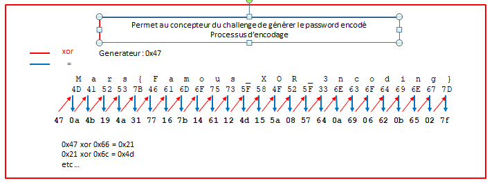
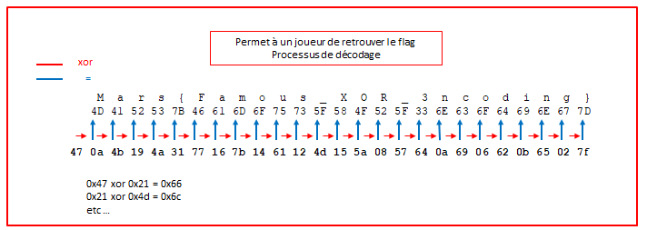
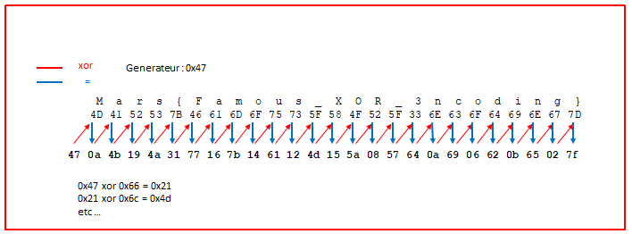

# Write up : Crackme02

Catégorie :

```
Reverse
```

Consigne : 

```
Retrouver le password.
```

Pièce jointe : 

```
crackme02
```

Serveur : 

```
CTFD
```

Points attribués : 

```
70
```

Flag : 

```
MARS{Famous_XOR_3ncoding}
```


Crackme02.asm

```assembly
; source : crackme02.asm    
; Assemble:  nasm -f elf64 -l crackme02.lst  crackme02.asm
; Link:      gcc -m64 -s -o crackme02  crackme02.o
; Run:       ./crackme02 <flag>

  
; fonctions de la libc qui doivent etre utilisées

extern strlen             ;
extern printf             ; the C function, to be called

section .rodata           ; Rodata section

section .data             ; Data section, variables initialisés

banner: db 10 
        db "   __  __                        _    _            _",10    
        db "  |  \/  |                 ____ | |  | |          | |",10   
        db "  | \  / | __ _ _ __ ___  / __ \| |__| | __ _  ___| | __",10
        db "  | |\/| |/ _` | '__/ __|/ / _` |  __  |/ _` |/ __| |/ /",10
        db "  | |  | | (_| | |  \__ \ | (_| | |  | | (_| | (__|   < ",10
        db "  |_|  |_|\__,_|_|  |___/\ \__,_|_|  |_|\__,_|\___|_|\_\",10
        db "                          \____/",10                         
        db 0

fmt3: db "%s", 10, 0           ; The printf format, "\n",'0'

help: db "Help :",10
      db "    crackme02 <password>",10,0 

msg1: db "   Congratulations !",10,0  ; C string needs 0

fmt1: db "%s", 10, 10, 0  ; The printf format, "\n",'0'


msg2: db "Failed", 0      ; C string needs 0
fmt2: db "%s", 10,10, 0        ; The printf format, "\n",'0'


default rel 
global main                    
section .text              ; Code section.
 
main:                      ; the standard gcc entry point
                           ; the program label for the entry point
push rbp                   ; set up stack frame, must be alligned
 

push rdi
push rsi
mov rsi,banner                 ; affiche la banner asciiart 
mov rdi,fmt3             
xor rax,rax                 
call [printf wrt ..got]        ; Appelle de la fonction C printf (syntaxe compatible PIE)


pop rsi
pop rdi

cmp rdi,$2                     ; rdi => argc ,  rsi : argv
je continu                

mov rsi,help                   ; affiche l aide 
mov rdi,fmt3                
xor rax,rax                 
call [printf wrt ..got]     ; Appel de la fonction C printf (syntaxe compatible PIE)
jmp fin

continu:

; -------------    verifie l'existence d'un paramêtre sur la ligne de commande    -------------

cmp rdi,$2                  ; rdi => argc ,  rsi : argv
jne fin       

mov rsi,qword[rsi+8]        ; [rsi+8] pointeur sur argument 1

; calcul taille argument 1                              

mov rdi, rsi                ; pointeur sur argument 1
call [strlen wrt ..got]
cmp rax, 0x19
jne badpassword             ; le password ne fait pas 25 caractères , on quitte 


xor rbx,rbx                 ;  index a 0

; mov rcx,codagexor
boucle :
mov rax,rsi                 ;    rsi pointeur sur chaine saisi  
add rax,rbx                 ;    rbx => index
movzx rax, byte[rax]        ;    rax  pointeur sur chaine saisi


mov rcx,codagexor               
add rcx,rbx
mov dil,byte[rcx]           ;    1er caractère du flag 
xor al,dil                  ;    caractère chaine saisi xor codage xor 
mov rdi,rcx
inc rdi
cmp al,byte[rdi]            
jne badpassword

mov rcx,rax                 ;    contient le caractère suivant
inc rbx                     ;    incrémente l'indes
cmp rbx,0x19                ;    compare l'indes a 25
jne boucle  

goodpassword:

mov rdi,fmt1
mov rsi,msg1
xor rax,rax 
call [printf wrt ..got]     ; Appel de la fonction C printf (syntaxe compatible PIE)
jmp fin

badpassword: 
 
mov rdi,fmt2
mov rsi,msg2
xor rax,rax                
call [printf wrt ..got]     ; Appel de la fonction C printf (syntaxe appelle compatible PIE)

fin:
pop rbp                     ; Restaure la pile
mov rax,0                   ; Normal, pas d'erreur
ret                         ; Fin du programme

codagexor: db 0x47,0x0a,0x4b,0x19,0x4a,0x31,0x77,0x16,0x7b,0x14,0x61,0x12,0x4d,0x15,0x5a,0x08,0x57,0x64,0x0a,0x69,0x06,0x62,0x0b,0x65,0x02,0x7f,0x00

```


Succés

```
./crackme02 'MARS{Famous_XOR_3ncoding}'

   __  __                        _    _            _
  |  \/  |                 ____ | |  | |          | |
  | \  / | __ _ _ __ ___  / __ \| |__| | __ _  ___| | __
  | |\/| |/ _` | '__/ __|/ / _` |  __  |/ _` |/ __| |/ /
  | |  | | (_| | |  \__ \ | (_| | |  | | (_| | (__|   < 
  |_|  |_|\__,_|_|  |___/\ \__,_|_|  |_|\__,_|\___|_|\_\
                          \____/

   Congratulations !
```


Echec

```

   __  __                        _    _            _
  |  \/  |                 ____ | |  | |          | |
  | \  / | __ _ _ __ ___  / __ \| |__| | __ _  ___| | __
  | |\/| |/ _` | '__/ __|/ / _` |  __  |/ _` |/ __| |/ /
  | |  | | (_| | |  \__ \ | (_| | |  | | (_| | (__|   < 
  |_|  |_|\__,_|_|  |___/\ \__,_|_|  |_|\__,_|\___|_|\_\
                          \____/

Failed

./crackme02 abcd
Failed
```


Help  (s'affiche si pas de paramètre saisi)

```

   __  __                        _    _            _
  |  \/  |                 ____ | |  | |          | |
  | \  / | __ _ _ __ ___  / __ \| |__| | __ _  ___| | __
  | |\/| |/ _` | '__/ __|/ / _` |  __  |/ _` |/ __| |/ /
  | |  | | (_| | |  \__ \ | (_| | |  | | (_| | (__|   < 
  |_|  |_|\__,_|_|  |___/\ \__,_|_|  |_|\__,_|\___|_|\_\
                          \____/

Help :
    crackme02 <password>

```


Options de compilation

```
Assemble:  nasm -f elf64 -l crackme02.lst  crackme02.asm
Link:      gcc -m64 -s -o crackme02  crackme02.o
```


Générateur de FLAG :

En entrée :

- le générateur : 0x47  

- le password :  "MARS{Famous_XOR_3ncoding}"
- la longueur du flag doit être égale à 25 caractères

En sortie :
codagexor : "codagexor:  db 0x47,0x21,0x4d ...... ..... ..... 0x31,0x75,0x08)

~~~python
#!/usr/bin/env python
# -*- coding: utf-8 -*-


# F5 paste/no paste (copier coller sans indentation)
# F6 pour executer le script python 2.7
# F7 pour executer le script python 3
# F8 highlighting on/off, and show current value.


#from random import randint

#res = randint(1,255)
generateur = 0x47
# le password doit avoir une taille de 25 caractères
#           1234567890123456789012345
password = "MARS{Famous_XOR_3ncoding}"
print password
import binascii
print "flag converti en hexa : " + binascii.hexlify(password)


res=""
res2 = ""
res = res + ("%x" % generateur).zfill(2)
res2 = res2 + "0x" + ("%x" % generateur).zfill(2)+","
for x in range(len(password)):
     res = res + ("%x" % (generateur ^ ord(password[x]))).zfill(2)
     res2 = res2 + "0x" + ("%x" % (generateur ^ ord(password[x]))).zfill(2) + ","

     generateur =  generateur ^ ord(password[x])
print "codagexor: db " + res2[0:-1]+",0x00"

~~~

Résultat :

```
MARS{Famous_XOR_3ncoding}
flag converti en hexa : 4d4152537b46616d6f75735f584f525f336e636f64696e677d
codagexor: db 0x47,0x0a,0x4b,0x19,0x4a,0x31,0x77,0x16,0x7b,0x14,0x61,0x12,0x4d,0x15,0x5a,0x08,0x57,0x64,0x0a,0x69,0x06,0x62,0x0b,0x65,0x02,0x7f,0x00
```


Pour un nouveau flag a déclarer, il faut modifier la ligne codagexor dans le source crackme02.asm.

Exemple :
le nouveau flag est : MARS{Famous_XOR_3ncoding}

On modifie la ligne 1
generateur = 0x48

On modifie la ligne 2
password = "MARS{1234567890123456789}"


Principe d'encodage :  




Principe de decodage :




### Résolution du challenge :

Utilisation de `objdump` pour editer les diverses sections

```
objdump -D -M intel32 -j .text crackme02
objdump -s -M intel32 -j .data crackme02
objdump -s -M intel32 -j .rodata crackme02
objdump -D -R -M intel32 -j .got  crackme02
```

adresse section .rodata et .data

```
readelf -S ./crackme02 | grep data
  [15] .rodata           PROGBITS         0000000000002000  00002000
  [23] .data             PROGBITS         0000000000004018  00003018
```


objdump -D -R -M intel32 -j .got  crackme02

```

0000000000003fc8 <.got>:
	3fd0: R_X86_64_GLOB_DAT	strlen@GLIBC_2.2.5
	3fd8: R_X86_64_GLOB_DAT	printf@GLIBC_2.2.5
```


objdump -D -M intel32 -j .text crackme02  (Extraction des premières lignes)

"Standard" C Runtime library

```assembly
0000000000001040 <.text>:
    1040:	31 ed                	xor    ebp,ebp
    1042:	49 89 d1             	mov    r9,rdx
    1045:	5e                   	pop    rsi
    1046:	48 89 e2             	mov    rdx,rsp
    1049:	48 83 e4 f0          	and    rsp,0xfffffffffffffff0
    104d:	50                   	push   rax
    104e:	54                   	push   rsp
    104f:	4c 8d 05 4a 02 00 00 	lea    r8,[rip+0x24a]          # 12a0 <__cxa_finalize@plt+0x270>
    1056:	48 8d 0d d3 01 00 00 	lea    rcx,[rip+0x1d3]         # 1230 <__cxa_finalize@plt+0x200>
    105d:	48 8d 3d cc 00 00 00 	lea    rdi,[rip+0xcc]          # 1130 <__cxa_finalize@plt+0x100>   <=====   adresse :  main
    1064:	ff 15 76 2f 00 00    	call   QWORD PTR [rip+0x2f76]  # 3fe0 <__cxa_finalize@plt+0x2fb0>
```

```assembly
    1130:	55                   	push   rbp
    1131:	57                   	push   rdi                              # rdi => argc 
    1132:	56                   	push   rsi                              # rsi => argv 
    
                      ; --------   affiche banner en asciiart  ---------
    
    1133:	48 be 28 40 00 00 00 	movabs rsi,0x4028                       # banner marshack
    113d:	48 bf 9a 41 00 00 00 	movabs rdi,0x419a                       # "%s"
    1147:	48 31 c0             	xor    rax,rax
    114a:	ff 15 88 2e 00 00    	call   QWORD PTR [rip+0x2e88]           # 3fd8   printf
    
                      ; ---------   vérifie que le password a été passé en argument -------    
    
    1150:	5e                   	pop    rsi                              # argv
    1151:	5f                   	pop    rdi                              # argc     
    1152:	48 83 ff 02          	cmp    rdi,0x2                          # argc = 2?     
    1156:	74 22                	je     117a                             # oui , le programme continu en 117a
    
                                                                              
    1158:	48 be 9e 41 00 00 00 	movabs rsi,0x419e                       # Help :
         	                     	                                        #   crackme02 <password>  
    1162:	48 bf 9a 41 00 00 00 	movabs rdi,0x419a                       # "%s" 
    116c:	48 31 c0             	xor    rax,rax
    116f:	ff 15 63 2e 00 00    	call   QWORD PTR [rip+0x2e63]           # 3fd8   printf
    1175:	e9 8f 00 00 00       	jmp    1209                             # fin du programme
    
    
    117a:	48 83 ff 02          	cmp    rdi,0x2                          # argc = 2 ?
    117e:	0f 85 85 00 00 00    	jne    1209                             # non , fin du programme
    
    1184:	48 8b 76 08          	mov    rsi,QWORD PTR [rsi+0x8]          # rsi - pointeur sur argv[1] - password saisi
    1188:	48 89 f7             	mov    rdi,rsi                          # rdi - pointeur sur argv[1] - passwors saisi
    118b:	ff 15 3f 2e 00 00    	call   QWORD PTR [rip+0x2e3f]           # 3fd0   strlen
    1191:	48 83 f8 19          	cmp    rax,0x19                         # taille password  = 25 octets ? 
    1195:	75 55                	jne    11ec                             # non, fin programme
    
                     ; ---------  traitement du paswword saisi   ----------
                     ;   voir l'image ci-dessous expliquant l'encodage ----
    
    1197:	48 31 db             	xor    rbx,rbx                          
    119a:	48 89 f0             	mov    rax,rsi                          
    119d:	48 01 d8             	add    rax,rbx                          
    11a0:	48 0f b6 00          	movzx  rax,BYTE PTR [rax]               
    11a4:	48 b9 10 12 00 00 00 	movabs rcx,0x1210                      
    11ae:	48 01 d9             	add    rcx,rbx                          
    11b1:	40 8a 39             	mov    dil,BYTE PTR [rcx]               
    11b4:	40 30 f8             	xor    al,dil                           
    11b7:	48 89 cf             	mov    rdi,rcx                          
    11ba:	48 ff c7             	inc    rdi
    11bd:	3a 07                	cmp    al,BYTE PTR [rdi]
    11bf:	75 2b                	jne    11ec 
    11c1:	48 89 c1             	mov    rcx,rax
    11c4:	48 ff c3             	inc    rbx
    11c7:	48 83 fb 19          	cmp    rbx,0x19
    11cb:	75 cd                	jne    119a 
    
    
      ; dump  0x1210
      ;Contenu de la section .text :
      ; 1210 470a4b19 4a317716 7b146112 4d155a08  G.K.J1w.{.a.M.Z.
      ; 1220 57640a69 06620b65 027f00             Wd.i.b.e...     
    
    
    
    

```




```assembly

    
    
                        ;-----------   affiche congratulations   -------------- 
    
    11cd:	48 bf d5 41 00 00 00 	movabs rdi,0x41d5                    # "%s"
    11d7:	48 be bf 41 00 00 00 	movabs rsi,0x41bf                    # "Congratulations !" 
    11e1:	48 31 c0             	xor    rax,rax
    11e4:	ff 15 ee 2d 00 00    	call   QWORD PTR [rip+0x2dee]        # 3fd8      printf
                        ;----------    quitte ---------------  
    11ea:	eb 1d                	jmp    1209 
    
                        ;----------------   affiche failed   -------------- 
    11ec:	48 bf e1 41 00 00 00 	movabs rdi,0x41e1                    #%s"
    11f6:	48 be da 41 00 00 00 	movabs rsi,0x41da                    # "Failed"
    1200:	48 31 c0             	xor    rax,rax
    1203:	ff 15 cf 2d 00 00    	call   QWORD PTR [rip+0x2dcf]        # 3fd8      printf
                                ;------   fin ----    
    1209:	5d                   	pop    rbp
    120a:	b8 00 00 00 00       	mov    eax,0x0
    120f:	c3                   	ret    
```


Dump hexa de la zone 0x1210

`objdump -s -M intel32 --start-address 0x11c7 --stop-address 0x11e7  -j .text   crackme02`

```
Contenu de la section .text :
 1210 470a4b19 4a317716 7b146112 4d155a08  G.K.J1w.{.a.M.Z.
 1220 57640a69 06620b65 027f00             Wd.i.b.e...    
```


Analyse du code :

Les symboles ont été supprimés à la compilation, cela rend plus difficile l'analyse du code.

Par exemple, les noms des fonctions n'apparaîssent pas clairement. Un moyen pour connaitre le nom des fonctions consiste à réaliser un `objdump` sur la section .got.

```
3fd0 => strlen
3fd8 => printf
```


Pour ceux qui veulent utiliser gdb :

Dans gdb, les informations de debug sont supprimées à la compilation, "break main" ne fonctionne pas.


Astuces pour trouver le main

gdb crackme02
starti 
run
info proc map

process 14959
Mapped address spaces:

```
      Start Addr           End Addr       Size     Offset objfile
  0x555555554000     0x555555557000     0x3000        0x0 /root/Documents/crackme02            <=====
  0x555555557000     0x555555559000     0x2000     0x2000 /root/Documents/crackme02
  0x7ffff7fd0000     0x7ffff7fd3000     0x3000        0x0 [vvar]
  0x7ffff7fd3000     0x7ffff7fd5000     0x2000        0x0 [vdso]
  0x7ffff7fd5000     0x7ffff7fd6000     0x1000        0x0 /lib/x86_64-linux-gnu/ld-2.27.so
  0x7ffff7fd6000     0x7ffff7ffc000    0x26000     0x1000 /lib/x86_64-linux-gnu/ld-2.27.so
  0x7ffff7ffc000     0x7ffff7ffe000     0x2000    0x26000 /lib/x86_64-linux-gnu/ld-2.27.so
  0x7ffff7ffe000     0x7ffff7fff000     0x1000        0x0 
  0x7ffffffde000     0x7ffffffff000    0x21000        0x0 [stack]
```


r2 nous donne l'adresse de la fonction "main" en adressage relatif.

```
0x00001130      55             push rbp
```

Pour trouver l'adresse réelle dans gdb , il suffit d'ajouter l'adresse de la section obtenue dans gdb.

adresse main = 0x555555554000 + 0x1130 = 0x555555555130


Un objetdump de la zone .text du binaire permet également de connaitre l'adresse relative de la fonction main.

```
0000000000001040 <.text>:
    1040:	31 ed                	xor    ebp,ebp
    1042:	49 89 d1             	mov    r9,rdx
    1045:	5e                   	pop    rsi
    1046:	48 89 e2             	mov    rdx,rsp
    1049:	48 83 e4 f0          	and    rsp,0xfffffffffffffff0
    104d:	50                   	push   rax
    104e:	54                   	push   rsp
    104f:	4c 8d 05 0a 02 00 00 	lea    r8,[rip+0x20a]            # 1260 <__cxa_finalize@plt+0x230>
    1056:	48 8d 0d 93 01 00 00 	lea    rcx,[rip+0x193]           # 11f0 <__cxa_finalize@plt+0x1c0>
    105d:	48 8d 3d cc 00 00 00 	lea    rdi,[rip+0xcc]            # 1130 <__cxa_finalize@plt+0x100>   <==   fonction main
    1064:	ff 15 76 2f 00 00    	call   QWORD PTR [rip+0x2f76]    # 3fe0 <__cxa_finalize@plt+0x2fb0>

```


