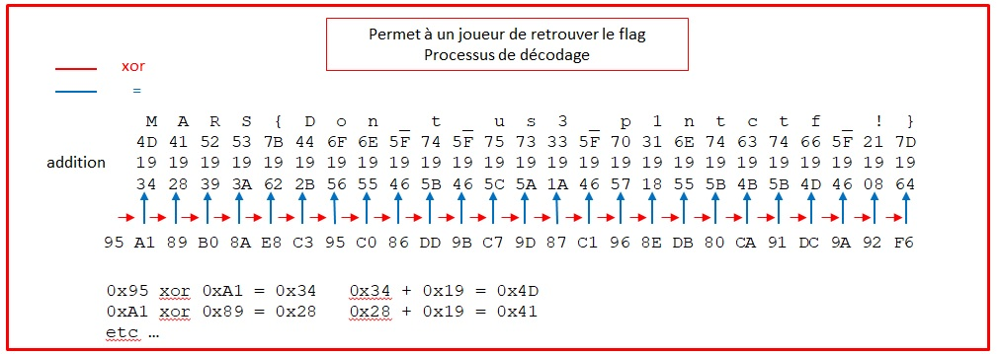
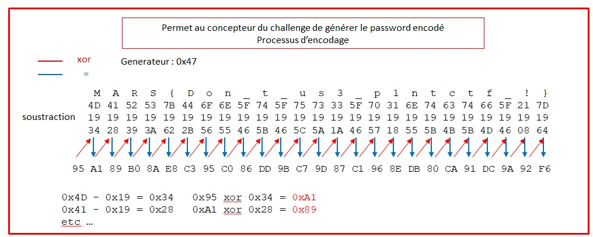

# Write up : Crackme03


Catégorie :

```
Reverse
```

Consigne :

```
Retrouver le password.
```

Pièce jointe :

```
Crackme03
```

Serveur :

```
CTFD
```

Points attribués :

```
100
```

Flag : 

```
MARS{Don_t_us3_p1ntctf_!}
```


source : reverse03.asm

```nasm
; source : reverse03.asm
; Assemble:  nasm -f elf64 -l crackme03.lst  crackme03.asm
; Link:  gcc -s   -m64  -o crackme03  crackme03.o
; Run:  ./crackme03 <flag>
   
; Declare needed C  functions


extern printf             ; the C function, to be called
extern signal
extern ptrace
extern fork
extern sleep
extern waitpid
extern exit

section .rodata    ; read only section

section .data      ; Data section, initialized variables

; flag = "MARS{Don_t_us3_p1ntctf_!}" 
flagencode: db 0x95,0xa1,0x89,0xb0,0x8a,0xe8,0xc3,0x95,0xc0,0x86,0xdd,0x9b,0xc7,0x9d,0x87,0xc1,0x96,0x8e,0xdb,0x80,0xca,0x91,0xdc,0x9a,0x92,0xf6
msg2: db "int3",0  ; C string needs 0
fmt2: db "%s", 10,10,0       ; The printf format, "\n",'0'


msg3: db "Le debug est interdit", 0  ; C string needs 0
fmt3: db "%s", 10,10, 0       ; The printf format, "\n",'0'

msg4: db "Congratulations", 0  ; C string needs 0
fmt4: db "%s", 10,10,0       ; The printf format, "\n",'0'

msg5: db "Failed", 0  ; C string needs 0
fmt5: db "%s", 10,10, 0       ; The printf format, "\n",'0'

;fmt6: db "%x",0           ; format hexadecimal 


align 8
var01: dq 0x0
var02: dq 0x0
var03: dq 0x0
var04: dq 0x0
var05: dq 0X0
var06: dq 0x0
var07: dq 0x0

default rel
global main                    
section .text             ; Code section.


handler:


mov rsi,qword [var01] 
xor rbx,rbx      ;  compteur
xor rdi,rdi      ;  rdi mis a 0

mov rcx,flagencode


boucle :
mov rax,rsi      ;    rsi pointeur sur chaine saisi  
add rax,rbx      ;    rbx => index

; obfuscation
jmp label01 + 2
label01:
db 0xc6,0x06

movzx rax, byte[rax]   ;    rax  pointeur sur chaine saisi
sub rax,0x19

mov rcx,flagencode
add rcx,rbx

; obfuscation
jmp label02 + 2
label02:
db 0xc6,0x06


mov dil,byte[rcx]
xor al,dil
inc rcx
mov dil,byte[rcx]

; obfuscation
jmp label03 + 2
label03:
db 0xc6,0x06

cmp al,dil
setnz [var06]
mov rdi,[var06]
add [var07],rdi

inc rbx
cmp rbx,0x19
jne boucle  


mov rax,[var07]
test rax,rax
jne bad

good:

mov rdi,fmt4    ; congratulations
mov rsi,msg4
mov rax,0                 ; or can be  xor  rax,rax
call [printf wrt ..got]
ret

bad: 
mov rdi,fmt5    ;  failed
mov rsi,msg5
mov rax,0                 ; or can be  xor  rax,rax
call [printf wrt ..got]
ret


main:                     ; the standard gcc entry point
                          ; the program label for the entry point
push rbp                  ; set up stack frame, must be alligned

cmp rdi,$2
jne fin


mov rbx,qword[rsi+8]       ; [rsi+8] pointeur sur arguement 1
mov qword [var01],rbx


call [fork wrt ..got]
mov qword [var05],rax
cmp eax,0x0
jne parent

mov ecx,0x0
mov edx,0x1
mov esi,0x0
mov edi,0x0
mov eax,0x0
call [ptrace wrt ..got]
test rax,rax
jne noptrace
mov ebx,0x2
noptrace:
mov ecx,0x0
mov edx,0x1
mov esi,0x0
mov edi,0x0
mov eax,0x0
call [ptrace wrt ..got]
cmp rax,-1
jne antiunptrace
add ebx,2
antiunptrace:
cmp ebx,4
jne fin 


db 0xcc
mov rsi,handler
mov rdi,0x5
call [signal wrt ..got]

db 0xcc

mov edi,0x0
call [exit wrt ..got]


fin:
pop rbp                   ; restore stack

mov rax,0                 ; normal, no error, return value
ret                       ; return

parent:
mov qword[var02],0x0      ; [rbp-0xc]
mov qword[var03],0x0      ; [rbp-0x10]

waitsignal:
mov rcx,var03             ; [rbp-0x10]
mov eax,[var05]           ; [rbp-0x8]
mov edx,0x2
mov rsi,rcx
mov edi,eax
call [waitpid wrt ..got]
mov qword[var02],rax
mov rax,qword[var03]
movzx eax,al
cmp eax,0x7f
jne testsignalexit
mov rax,qword[var03]      ; [rbp-0x10]
sar eax,0x8
movzx eax,al
cmp eax,0x5
jne testsignalexit


mov rax,qword[var05]
mov ecx,0x0
mov edx,0x0
mov esi,eax
mov edi,0x11
mov eax,0x0
call [ptrace wrt ..got]

testsignalexit:
mov rax,qword[var03]
and eax,0x7F
test eax,eax
je quittesignal
jmp waitsignal

quittesignal:

pop rbp
mov rax,0
ret

```


Pour durcir le reverse, on corrompt le header.

```
00000000  7f 45 4c 46 02 01 01 00   00 00  00 00   00 00  00 00          |.ELF............|
00000010  03 00 3e 00 01 00 00 00   40 10  00 00   00 00  00 00          |..>.....@.......|
00000020  40 00 00 00 00 00 00 00  [ff ff  ff ff   ff ff  ff ff]         |@........1......|
00000030  00 00 00 00 40 00 38 00   0b 00 [ff ff] [ff ff] 1a 00          |....@.8...@.....|


offset 0x28 à 0x2F : 0xffffffffffffffff  :  Début des en-têtes de section
offset 0x3a à 0x3b : 0xffff  : Taille des en-têtes de section
offset 0x3d à 0x3e : 0xffff  : Nombre d'en-têtes de section
```


Ce qui engendre les effets suivants :

- objdump ne fonctionne pas 

- objdump -D -m intel32 -j text ./crackme03
- objdump: ./crackme03: file format not recognized
- objdump: section « text » mentionnée dans une option -j n'a été trouvée dans aucun fichier d'entrée    

​    gdb ne fonctionne pas
​       gdb crackme03
​           crackme03": not in executable format: file format not recognized 

Le binaire continue à fonctionner :

​       ./crackme03 `MARS{Don_t_us3_p1ntctf_!}`
​        Congratulations 

Pour contrer la corruption du binaire, nous mettons des octets à 0x00 dans certaines zones du header

```
00000000  7f 45 4c 46 02 01 01 00   00 00  00 00   00 00   00 00          |.ELF............|
00000010  03 00 3e 00 01 00 00 00   40 10  00 00   00 00   00 00          |..>.....@.......|
00000020  40 00 00 00 00 00 00 00  [00 00  00 00   00 00   00 00]         |@........1......|
00000030  00 00 00 00 40 00 38 00   0b 00 [00 00] [00 00] [00 00]         |....@.8...@.....|


dans ce challenge :
offset 0x28 à 0x2F : 0x0000000000000000  :  Début des en-têtes de section
offset 0x3a à 0x3b : 0x0000  : Taille des en-têtes de section
offset 0x3c à 0x3d : 0x0000  : Nombre d'en-têtes de section
offset 0x3e à 0x3f : 0x0000  : Table d'indexes des chaînes d'en-tête de section
```


Generateur de flag

```python
#!/usr/bin/env python
# -*- coding: utf-8 -*-


# F5 paste/no paste (copier coller sans indentation)
# F6 pour executer le script python 2.7
# F7 pour executer le script python 3
# F8 highlighting on/off, and show current value.


from random import randint

res = randint(1,255)

generateur = 0x95
add = 0x19

#password 25 caractères
#           1234567890123456789012345
password = "MARS{Don_t_us3_p1ntctf_!}" 
print password

import binascii
print binascii.hexlify(password)


res=""
res2 = ""
res = res + ("%x" % generateur).zfill(2)
res2 = res2 + "0x" + ("%x" % generateur).zfill(2)+","
for x in range(len(password)):
     res = res + ("%x" % (generateur ^ (ord(password[x])-0x19))).zfill(2) 
     res2 = res2 + "0x" + ("%x" % (generateur ^ (ord(password[x])-0x19))).zfill(2) + ","
     
     generateur =  (generateur ^ (ord(password[x])-0x19))
print res
print res2[0:-1]

```


Résultat

```
MARS{Don_t_us3_p1ntctf_!}
4d4152537b446f6e5f745f7573335f70316e746374665f217d
95a189b08ae8c395c086dd9bc79d87c1968edb80ca91dc9a92f6
0x95,0xa1,0x89,0xb0,0x8a,0xe8,0xc3,0x95,0xc0,0x86,0xdd,0x9b,0xc7,0x9d,0x87,0xc1,0x96,0x8e,0xdb,0x80,0xca,0x91,0xdc,0x9a,0x92,0xf6
```


## Solution

Tester les commandes `ltrace` et `strace`

```
ltrace ./crackme03 password
   Couldn't determine base address of /proc/21400/exe
   failed to init breakpoints 21400
   failed to initialize process 21400: No such file or directory
   couldn't open program './crackme03': No such file or directory

strace ./crackme03 password
   execve("./crackme03", ["./crackme03", "password"], 0x7ffed79a83e8 /* 43 vars */) = -1 EINVAL (Invalid argument)
   --- SIGSEGV {si_signo=SIGSEGV, si_code=SI_KERNEL, si_addr=NULL} ---
   +++ killed by SIGSEGV +++
   Erreur de segmentation
```

Les commandes `ltrace` et `strace` ne fonctionnent pas, il y des protection antidebug.

`readelf -h crackme03`

```
En-tête ELF:
  Magique:   7f 45 4c 46 02 01 01 00 00 00 00 00 00 00 00 00 
  Classe:                            ELF64
  Données:                          complément à 2, système à octets de poids faible d'abord (little endian)
  Version:                           1 (current)
  OS/ABI:                            UNIX - System V
  Version ABI:                       0
  Type:                              DYN (fichier objet partagé)
  Machine:                           Advanced Micro Devices X86-64
  Version:                           0x1
  Adresse du point d'entrée:         0x1040
  Début des en-têtes de programme :  64 (octets dans le fichier)
  Début des en-têtes de section :    0 (octets dans le fichier)
  Fanions:                           0x0
  Taille de cet en-tête:             64 (octets)
  Taille de l'en-tête du programme:  56 (octets)
  Nombre d'en-tête du programme:     11
  Taille des en-têtes de section:    0 (octets)
  Nombre d'en-têtes de section:      0
  Table d'indexes des chaînes d'en-tête de section: 0
```

On voit que le format *elf* est corrompu.


`objdump` et `gdb` ne sont plus capables de fonctionner correctement.

Il est trés difficile de restaurer les valeurs d'origine du header.

Pour contrer la corruption du header,  il existe une technique simple qui consiste à mettre à 0x00 certains octets du header.


Dans un éditeur hexa, modifier les octets suivants :

```

00000000  7f 45 4c 46 02 01 01 00   00 00  00 00   00 00   00 00          |.ELF............|
00000010  03 00 3e 00 01 00 00 00   40 10  00 00   00 00   00 00          |..>.....@.......|
00000020  40 00 00 00 00 00 00 00  [00 00  00 00   00 00   00 00]         |@........1......|
00000030  00 00 00 00 40 00 38 00   0b 00 [00 00] [00 00] [00 00]         |....@.8...@.....|


Octets à mettre à 0x00:
  offset 0x28 à 0x2F : 0x0000000000000000  :  Début des en-têtes de section
  offset 0x3a à 0x3b : 0x0000  : Taille des en-têtes de section
  offset 0x3c à 0x3d : 0x0000  : Nombre d'en-têtes de section
  offset 0x3e à 0x3f : 0x0000  : Table d'indexes des chaînes d'en-tête de section
```


Faisons de nouveau un `readelf -h crackme03`

```
En-tête ELF:
  Magique:   7f 45 4c 46 02 01 01 00 00 00 00 00 00 00 00 00 
  Classe:                            ELF64
  Données:                          complément à 2, système à octets de poids faible d'abord (little endian)
  Version:                           1 (current)
  OS/ABI:                            UNIX - System V
  Version ABI:                       0
  Type:                              EXEC (fichier exécutable)
  Machine:                           Advanced Micro Devices X86-64
  Version:                           0x1
  Adresse du point d'entrée:         0x401020                          <=======   adresse de : start
  Début des en-têtes de programme :  64 (octets dans le fichier)
  Début des en-têtes de section :    0 (octets dans le fichier)
  Fanions:                           0x0
  Taille de cet en-tête:             64 (octets)
  Taille de l'en-tête du programme:  56 (octets)
  Nombre d'en-tête du programme:     11
  Taille des en-têtes de section:    0 (octets)
  Nombre d'en-têtes de section:      0
  Table d'indexes des chaînes d'en-tête de section: 0
```

`readelf` ne renvoie plus d'erreur lorsqu'il affiche le contenu du header.
`objdump` ne fonctionne toujours pas.
`gdb` fonctionne.


L'étape suivante consiste à touver le *main* du programme  avec `gdb` et `readelf`


Lancer `gdb`

Il faut déterminer l'adresse de début du programme.

Pour connaitre l'adresse du premier breakpoint on va utiliser `readelf -h`  et `gdb`

(breakpoint = adresse du mappage du code + offset relatif de l'entrypoint)


`readelf -h crackme03`

```
En-tête ELF:
  Extrait ...
  
  Adresse du point d'entrée:         0x1040     <== entry point


```


```assembly
gdb crackme03
starti  <==  commande qui exécute le binaire et l'arrête dés que possible
        <==  du coup on obtient le contrôle sur le programme
        
        
0x7ffff7fd6090 <_start>:	mov    rdi,rsp
0x7ffff7fd6093 <_start+3>:	call   0x7ffff7fd6e90 <_dl_start>        
        
        

info proc map

process 4078
Mapped address spaces:

          Start Addr           End Addr       Size     Offset objfile
      0x555555554000     0x555555557000     0x3000        0x0 /root/crackme/crackme03
      0x555555557000     0x555555558000     0x1000     0x2000 /root/crackme/crackme03
      0x555555558000     0x555555559000     0x1000     0x3000 /root/crackme/crackme03
      0x7ffff7dec000     0x7ffff7e0e000    0x22000        0x0 /lib/x86_64-linux-gnu/libc-2.28.so

```


Adresse du breakpoint :  0x555555554000 + 0x1040 = 0x555555555040


```assembly
root@kali:~/crackme# gdb -q

warning: ~/.gdbinit.local: Aucun fichier ou dossier de ce type

gdb-peda$ file crackme03
Reading symbols from crackme03...(no debugging symbols found)...done.

gdb-peda$ break *0x555555555040
Breakpoint 1 at 0x555555555040


gdb-peda$ run
Starting program: /root/crackme/crackme03 

=> 0x555555555040:	xor    ebp,ebp
   0x555555555042:	mov    r9,rdx
   0x555555555045:	pop    rsi
   0x555555555046:	mov    rdx,rsp
   0x555555555049:	and    rsp,0xfffffffffffffff0
   0x55555555504d:	push   rax
   0x55555555504e:	push   rsp
   0x55555555504f:	lea    r8,[rip+0x33a]           # 0x555555555390
   0x555555555056:	lea    rcx,[rip+0x2d3]          # 0x555555555330
   0x55555555505d:	lea    rdi,[rip+0x183]          # 0x5555555551e7     <====  adresse du main
   0x555555555064:	call   QWORD PTR [rip+0x2f4e]   # 0x555555557fb8


```


Nous obtenons l'adresse de l'entrypoint, maintenant il serait bien d'obtenir l'adresse réelle du programme  ("main").

En X64, la fonction `start` est normalisée, l'adresse du main se trouve dans rdi, juste avant le `call`.

Adresse de main : 0x5555555551e7.

Informations sur les fonctions appelées dans le programme

```
readelf  --relocs   --use-dynamic  ./crackme03


3fb0  printf
3fc0  signal
3fd0  ptrace
3fd8  waitpid
3fe0  exit
3ff8  fork
```

Aux vu des fonctions appelées, on peut penser que de nombreuses fonctionnalités antidebug ont été implémentées.


Nota :

un autre moyen pour obtenir l'adresse relative du main et les nom des fonctions est d'utiliser `radare2`

```assembly
r2 -AA ./crackme03

                                     #   extrait -  début du main


pdf @main
┌ (fcn) main 286
│   main (int argc, char **argv, char **envp);
│           ; arg int argc @ rdi
│           ; arg char **argv @ rsi
│           ; DATA XREF from entry0 (0x105d)
│           0x000011e7      55             push rbp                    ;                        ===> adresse  main relative
│           0x000011e8      4883ff02       cmp rdi, 2                  ; argc                   
│       ┌─< 0x000011ec      0f8595000000   jne 0x1287
│       │   0x000011f2      488b5e08       mov rbx, qword [rsi + 8]    ; [0x8:8]=0 ; argv
│       │   0x000011f6      48891d8b2e00.  mov qword [0x00004088], rbx ; [0x4088:8]=0
│       │   0x000011fd      ff15f52d0000   call qword [reloc.fork]     ; [0x3ff8:8]=0           ===> fonction fork
```


Maintenant que l'on connait les diverses fonction de la libc appelée et l'adresse du main utilisé par `gdb`, on peut procéder au désassemblage du code avec `ndisasm`.


Comme le programme semble être protégé par des fonctions antidebug, on opte pour un désassemblage statique.


```assembly
ndisasm -b 64 -o 0x5555555551e7 -e 0x11e7 crackme03 | head -n 20


                            # -------------- main --------------  

5555555551E7  55                push rbp
5555555551E8  4883FF02          cmp rdi,byte +0x2                      #  rdi contient le nombre d'argument
5555555551EC  0F8595000000      jnz near 0x555555555287
5555555551F2  488B5E08          mov rbx,[rsi+0x8]                      #  pointeur sur chaine flag saisi
5555555551F6  48891D8B2E0000    mov [rel 0x555555558088],rbx           #  le pointeur est sauvegardé dans [0x555555558088]
5555555551FD  FF15F52D0000      call [rel 0x555555557ff8]              #  appelle de la fonction fork
555555555203  4889059E2E0000    mov [rel 0x5555555580a8],rax               
55555555520A  83F800            cmp eax,byte +0x0                      #  suis-je le fils
55555555520D  757F              jnz 0x55555555528e                     #  non, je suis le père saute en 0x55555555528e 


                            # -------------- fils --------------                    


55555555520F  B900000000        mov ecx,0x0                                
555555555214  BA01000000        mov edx,0x1
555555555219  BE00000000        mov esi,0x0
55555555521E  BF00000000        mov edi,0x0
555555555223  B800000000        mov eax,0x0
555555555228  FF15A22D0000      call [rel 0x555555557fd0]             # appelle de la fonction ptrace 
55555555522E  4885C0            test rax,rax                          # le programme est-il tracé
555555555231  7505              jnz 0x555555555238                    # le programme est tracé on saute 0x555555555238
555555555233  BB02000000        mov ebx,0x2                           # ebx = 2 si le programme n'est pas tracé
555555555238  B900000000        mov ecx,0x0                             
55555555523D  BA01000000        mov edx,0x1
555555555242  BE00000000        mov esi,0x0
555555555247  BF00000000        mov edi,0x0
55555555524C  B800000000        mov eax,0x0
555555555251  FF15792D0000      call [rel 0x555555557fd0]             # appel une seconde fois de la fonction ptrace 
555555555257  4883F8FF          cmp rax,byte -0x1                     # le programme est-il tracé
55555555525B  7503              jnz 0x555555555260                    # non on saute en 0x555555555260
55555555525D  83C302            add ebx,byte +0x2                     # ebx = ebx + 2 => ebx = 4 
555555555260  83FB04            cmp ebx,byte +0x4                     # ebx est-il égale à 4 
555555555263  7522              jnz 0x555555555287                    # non on saute en 0x555555555287 pour quitter le fils
555555555265  CC                int3                                  # int3. le programme est tracé par le père,                                                                                             # l'interruption est donc gérée par le père

555555555266  48BE301100000000  mov rsi,0x1130                        # !! bug , lire movabs rcx,0x555555555130 
555555555270  BF05000000        mov edi,0x5                           # 0x05 = SIGTRAP  type de signal a detourné
555555555275  FF15452D0000      call [rel 0x555555557fc0]             # détournement du signal SIGTRAP (int 3 - cc)
55555555527B  CC                int3                                  # à l'exécution de int3 , le programme est détourné                                                                                     # en 0x555555555130 

55555555527C  BF00000000        mov edi,0x0
555555555281  FF15592D0000      call [rel 0x555555557fe0]
555555555287  5D                pop rbp
555555555288  B800000000        mov eax,0x0
55555555528D  C3                ret


                            # -------------- pere --------------


55555555528E  48C705F72D000000  mov qword [rel 0x555555558090],0x0    # initialise  0x555555558090 à 0 
555555555299  48C705F42D000000  mov qword [rel 0x555555558098],0x0    # initialise  0x555555558098 à 0
5555555552A4  48B9984000000000  mov rcx,0x4098                        # !! bug , lire movabs rcx,0x555555558098 
5555555552AE  8B05F42D0000      mov eax,[rel 0x5555555580a8]          # contient l'id du process du fils

5555555552B4  BA02000000        mov edx,0x2                           # edx : option WSTOPPED , attend un signal du fils                                                                                     # (comme int3)
5555555552B9  4889CE            mov rsi,rcx                           # rsi : adresse status
5555555552BC  89C7              mov edi,eax                           # edi : id process fils
5555555552BE  FF15142D0000      call [rel 0x555555557fd8]             # appel la fonction waitpid (attend un interruption                                                                                     # du fils)         

5555555552C4  488905C52D0000    mov [rel 0x555555558090],rax          # le père determine la nature du signal recu du fils 
5555555552CB  488B05C62D0000    mov rax,[rel 0x555555558098]
5555555552D2  0FB6C0            movzx eax,al
5555555552D5  83F87F            cmp eax,byte +0x7f
5555555552D8  7535              jnz 0x55555555530f
5555555552DA  488B05B72D0000    mov rax,[rel 0x555555558098]
5555555552E1  C1F808            sar eax,byte 0x8
5555555552E4  0FB6C0            movzx eax,al
5555555552E7  83F805            cmp eax,byte +0x5                     # s'agit-il d'un signal de type int3 (cc) 
5555555552EA  7523              jnz 0x55555555530f                   


                                        # si le type de signal est de type int3 (cc) exécute un ptrace 
                                        # pour signaler au fils qu'il n'est plus tracé


5555555552EC  488B05B52D0000    mov rax,[rel 0x5555555580a8]         
5555555552F3  B900000000        mov ecx,0x0                           # inutilisé - fixé à 0
5555555552F8  BA00000000        mov edx,0x0                           # inutilisé - fixé à 0
5555555552FD  89C6              mov esi,eax                           # Id processus fils
5555555552FF  BF11000000        mov edi,0x11                          # PTRACE DETACH 
555555555304  B800000000        mov eax,0x0
555555555309  FF15C12C0000      call [rel 0x555555557fd0]             # appel de la fonction ptrace

55555555530F  488B05822D0000    mov rax,[rel 0x555555558098]          # teste si le processus fils est terminé 
555555555316  83E07F            and eax,byte +0x7f
555555555319  85C0              test eax,eax
55555555531B  7402              jz 0x55555555531f                     # oui le processus fils est terminé, alors le                                                                                           # processus père quitte

55555555531D  EB85              jmp short 0x5555555552a4              # boucle - attends que le processus fils se termine 

55555555531F  5D                pop rbp
555555555320  B800000000        mov eax,0x0
555555555325  C3                ret

```


```assembly


ndisasm -b 64 -o 0x555555555130 -e 0x1130 reverse03 | head -n 50


                     # --------------  fils -  traitement du signal int 3 (cc)  ----------------   


start adresse section .text : 0x555555554000

555555555130  488B35512F0000    mov rsi,[rel 0x555555558088]      #  pointeur sur le flag saisi
555555555137  4831DB            xor rbx,rbx                       #  initialize rbx à 0
55555555513A  4831FF            xor rdi,rdi                       #  initialize rdi à 0
55555555513D  48B9284000000000  mov rcx,0x4028                    #  !! bug  lire 0x555555558028

; possiblité de faire un dump avec gdb
dump 0x555555558028


0x0000555555558028 : 95 a1 89 b0 8a e8 c3 95 c0 86 dd 9b c7 9d 87 c1   ................
0x0000555555558038 : 96 8e db 80 ca 91 dc 9a 92 f6 69 6e 74 33 00 25   ..........int3.%
0x0000555555558048 : 73 0a 0a 00 4c 65 20 64 65 62 75 67 20 65 73 74   s...Le debug est
0x0000555555558058 : 20 69 6e 74 65 72 64 69 74 00 25 73 0a 0a 00 43    interdit.%s...C
0x0000555555558068 : 6f 6e 67 72 61 74 75 6c 61 74 69 6f 6e 73 00 25   ongratulations.%
0x0000555555558078 : 73 0a 0a 00 46 61 69 6c 65 64 00 25 73 0a 0a 00   s...Failed.%s...


                     # -------------    gestion du flag -----------------
                     # -------------    anti pintools -------------------


555555555147  4889F0            mov rax,rsi                      #  pointeur sur le flag saisi
55555555514A  4801D8            add rax,rbx                      #  rbx = 0
55555555514D  EB02              jmp short 0x555555555151         #  obfuscation, le jmp pointe sur 0x555555555151
55555555514F  C60648            mov byte [rsi],0x48              #  desassemblage incorrect
555555555152  0FB600            movzx eax,byte [rax]             #  desassemblage incorrect 

ndisasm -b 64 -o 0x555555555152 -e 0x1152 reverse03 | head -n 50

555555555152  0FB600            movzx eax,byte [rax]             #  extraction du premier octet du flag saisi              
555555555155  4883E819          sub rax,byte + 0x19              #  retranche 0x25 au premier caractère du flag saisi
555555555159  48B9284000000000  mov rcx,0x4028                   #  !! bug  lire 0x555555558028 - rcx = 0x555555558028 -                                                                                #  zone dumpé ci-dessus
555555555163  4801D9            add rcx,rbx                      #  rbx = 0
555555555166  EB02              jmp short 0x55555555516a         #  obfuscation, le jmp pointe sur 0x55555555516a

ndisasm -b 64 -o 0x55555555516a -e 0x116a reverse03 | head -n 50

55555555516A  408A39            mov dil,[rcx]                    # dil contient le premier octet du dump ci-dessus
55555555516D  4030F8            xor al,dil                       # xor entre le 1er caractère du flag saisi et le premier                                                                                # caractère du dump
555555555170  48FFC1            inc rcx                          # rcx pointe sur le 2ième caractère du dump
555555555173  408A39            mov dil,[rcx]                    # dil contient le 2ième caractère du dump  
555555555176  EB02              jmp short 0x55555555517a         # obfuscation, le jmp pointe sur 0x55555555517a

ndisasm -b 64 -o 0x55555555517a -e 0x117a reverse03 | head -n 50

                                     

55555555517A  4038F8            cmp al,dil                       # comparaison entre le résultat du xor précédent et le                                                                                  # 2ieme caractères du dump
55555555517D  0F95052C2F0000    setnz [rel 0x5555555580b0]       # si différent, copie du flag zero dans 0x5555555580b0
555555555184  488B3D252F0000    mov rdi,[rel 0x5555555580b0]      
55555555518B  48013D262F0000    add [rel 0x5555555580b8],rdi     # ajout du bit de flag 
555555555192  48FFC3            inc rbx                          # increment rbx (index) 
555555555195  4883FB19          cmp rbx,byte +0x19               # rbx est t'il égale à 25
555555555199  75AC              jnz 0x555555555147               # non , alors on boucle 
55555555519B  488B05162F0000    mov rax,[rel 0x5555555580b8]    
5555555551A2  4885C0            test rax,rax
5555555551A5  7520              jnz 0x5555555551c7

dump avec gdb :
  0x555555558078 : %s..
  0x555555558067 : congratulations

5555555551A7  48BF784000000000  mov rdi,0x4078                   # 0x555555558078
5555555551B1  48BE674000000000  mov rsi,0x4067                   # 0x555555558067
5555555551BB  B800000000        mov eax,0x0
5555555551C0  FF15EA2D0000      call [rel 0x555555557fb0]        # appelle de la fonction printf
5555555551C6  C3                ret


                                                # retour en 0x55555555527C 


dump avec gdb :
  0x555555558084 : %s..
  0x55555555807c : failed

5555555551C7  48BF844000000000  mov rdi,0x4084                   # 0x555555558084
5555555551D1  48BE7C4000000000  mov rsi,0x407c                   # 0x55555555807c
5555555551DB  B800000000        mov eax,0x0
5555555551E0  FF15CA2D0000      call [rel 0x555555557fb0]        # appelle de la fonction printf
5555555551E6  C3                ret


                                                 # retour en 0x55555555527C 


```








Validation du challenge :

./crackme03 'MARS{Don_t_us3_p1ntctf_!}'

attention : il faut entourer de quote le flag a cause du  '!' qui est interprété par le shell


