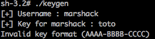
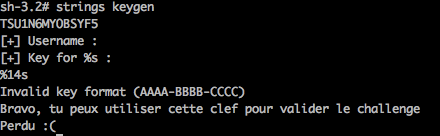
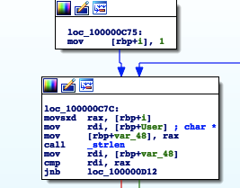
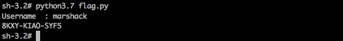
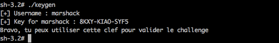

# Write up : Keygen Me

Catégorie :

```
Reverse
```

Conigne :

```
Le but ici est de retrouver la clef pour l'utilisateur <strong>"marshack"</strong>.<br>

Le flag de validation doit avoir la forme suivante : <br>
MARS{CLEF}

```

Pièce jointe :

```
keygen
```

Serveur :

```
CTFD
```

Points attribués

```
70

```

Flag : 

```
 MARS{8KXY-KIA0-SYF5}
```


Attention :
Le binaire est au format  : Mach-O 64-bit x86_64

Voici ce que retourne le binaire lors de l'exécution sur un Linux :

```
./keygen : impossible d'exécuter le fichier binaire : Erreur de format pour exec()
 
file keygen
    keygen: Mach-O 64-bit x86_64 executable, flags:<NOUNDEFS|DYLDLINK|TWOLEVEL|PIE>

```

Il est donc imposible sur un Linux (ou un Windows) d'exécuter le binaire.

Le détenteur d'un Mac sera avantagé puisqu'il pourra exécuter le code dans un débugger.

Seul un détenteur de Mac peut tester la validation du challenge


Ce challenge de reverse a pour objectif de créer un générateur de clef pour l'utilisateur "marshack".

## Première analyse (uniquement sur Mac)

Dans un premier temps nous pouvons faire tourner le programme afin de prévisualiser ce qui nous attend :





Le programme attend donc un pseudo puis une clef au format AAAA-BBBB-CCCC. Avant de commencer le reverse, nous pouvons regarder les chaînes de charactères présentes dans le programme : 




On repère une chaîne faisant référence au "Good boy" et une chaine faisant référence au "Bad boy".
Ici, pas d'information supplémentaire, la clef validant le challenge ne semble pas initialisée dans le binaire, donc impossible de valider le challenge sans passer par une analyse du code.

## Reverse avec IDA

Le challenge nécessite donc un déssassembleur. J'ai utilisé IDA mais ce n'est qu'un choix personnel.

```
mov     [rbp+var_8], rcx
mov     [rbp+var_34], 0
mov     [rbp+var_38], edi
mov     [rbp+var_40], rsi
mov     rdi, rax        ; char *
mov     al, 0
call    _printf
lea     rdi, aS         ; "%s"
lea     rsi, [rbp+User]
mov     [rbp+var_44], eax
mov     al, 0			; Recupère l'username
call    _scanf
lea     rdi, aKeyForS   ; "[+] Key for %s : "
lea     rsi, [rbp+User]
mov     [rbp+var_48], eax
mov     al, 0
call    _printf
lea     rdi, a14s       ; "%14s"
lea     rsi, [rbp+Key]
mov     [rbp+var_4C], eax
mov     al, 0			; Recupère la clef
call    _scanf
movsx   edx, [rbp+var_2B]
cmp     edx, 2Dh
mov     [rbp+var_50], eax
jnz     loc_100000E14
```
La première partie s'occupe de récupérer l'username et la clef pour faire les vérifications qui sont :

```
cmp     rax, 14
jz      loc_100000E31
```

La longueur de la clef : 14 caractères.

```
cmp     eax, 2Dh
jnz     loc_100000E14
```
Les '-' au 4ème et 9ème octet.

```
lea     rsi, [rbp+Key]
lea     rdi, [rbp+User]
call    _auth
cmp     eax, 0
```

Puis la fonction place la clef et l'username dans les registres de travail pour appeller la fonction auth.
En fonction du retour de la fonction auth, on aura soit le "Good Boy" soit le "Bad boy"

## La fonction Auth

Analysons la fonction "auth" :

```
call    _strlen
mov     r8b, al
mov     [rbp+len], r8b
movsx   ecx, [rbp+len]
add     ecx, 30h
mov     r8b, cl
mov     [rbp+chaine], r8b
```
Tout d'abord la fonction initialise une chaine de caractères : "TSU1N6MYOBSYF5", elle fait 14 charactères, tout commmes la clef attendue. Puis la longueur de l'username entré par l'utilisateur est mis a la place du premier charactère :
Donc pour "marshack" notre chaîne commencera par "8".

```
mov     rdi, [rbp+User] ; char *
call    _strlen
cmp     rax, 0Ah
jbe     loc_100000C75
```
La première condition est la comparaison de la longueur de l'username avec 10, si il est plus grand, on saute sur le Bad Boy. Donc l'username est forcément plus petit que 10 ce qui est bien le cas pour "marshack".



Ici on peut voir que le programme réalise une boucle pour chaque charactère de l'user, nous allons donc itérer sur les charactères de user.

```
mov     rax, [rbp+User]
movsxd  rcx, [rbp+i]
movsx   edx, byte ptr [rax+rcx] ; Récupèration de chaque lettre une a une 
xor     edx, 42                 ; Xor de la lettre avec 42
mov     sil, dl
movsxd  rax, [rbp+i]
mov     [rbp+rax+chaine], sil   ; Changement de la chaine par la valeure obtenue
movsxd  rax, [rbp+i]
movsx   edx, [rbp+rax+chaine]
cmp     edx, 41h				; Comparaison de cette lettre a 0x41 'A'
jl      loc_100000CD9
```
Suite à cela s'ensuit une autre comparaison de la valeur obtenue :

```
movsxd  rax, [rbp+i]
movsx   ecx, [rbp+rax+chaine]
cmp     ecx, 5Ah     ; Si le caractère est plus grand que 0x41, on le compare a 0x5A 'Z'
jle     loc_100000CE7
```

Ces deux conditions servent à vérifier que la lettre est comprise dans l'alphabet majuscule.

```
movsxd  rax, [rbp+i]
mov     [rbp+rax+chaine], 'Y'
jmp     loc_100000CFF
```

Si ce n'est pas le cas, on met 'Y' à la place de la lettre présente dans la chaîne.

```
movsxd  rax, [rbp+i]
movsx   edi, [rbp+rax+chaine] ; c
call    _toupper
mov     cl, al
movsxd  rdx, [rbp+i]
mov     [rbp+rdx+chaine], cl
```

Sinon on met la lettre en question en majuscule dans la chaîne.
Suite à cela on compare la clef utilisée par l'utilisateur et la chaîne obtenue puis on donne ou non le flag.

Nous sommes donc en mesure de créer un keygen en python :


```python
#Python keygen for Reverse challenge

user = list(input('Username  : '))
chaine = list("TSU1N6MYOBSYF5")
chaine[0] = str(len(user))
for j in range(1,len(user)):
	a = ord(user[j]) ^ 42
	if a < 45 or a > 90:
		a = 'Y'
	else:
		a = chr(a)
	chaine[j] = a
chaine[4] = "-"
chaine[9] = '-'
print("".join(chaine))
```
On le fait tourner avec notre user "marshack" :



On teste si la clef est la bonne :




Le flag  est : MARS{8KXY-KIA0-SYF5}

Bingo ! Challenge validé 


