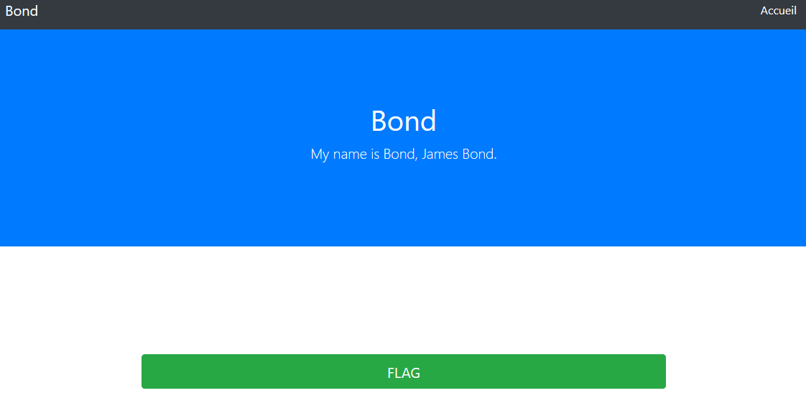

# Write up : Agent

Catégorie :

```
Web
```

Consigne :

```
Trouver le flag de validation dans cette application web.

<FONT COLOR="#ff0000">Accès au site :<br>   <a href="http://game2.marshack.fr:8085" target="new">http://game2.marshack.fr:8085</a></FONT> <p>
```

Pièce jointe :

```
Aucune
```

Serveur : 

```
game2
```

Points attribués :

```
20
```

Flag :

```
MARS{Us3r4g3nt}
```





## Solution

Bond est un indice pour trouver "agent" et donc *user-agent.*


La solution consiste à modifier l'user-agent par "admin" pour obtenir le flag :

```
pwner@ubuntu:~$ curl -s -A "admin" http://game2.marshack.fr:8085/?check=1 | grep MARS{
            MARS{Us3r4g3nt}
```


Résultat : MARS{Us3r4g3nt}