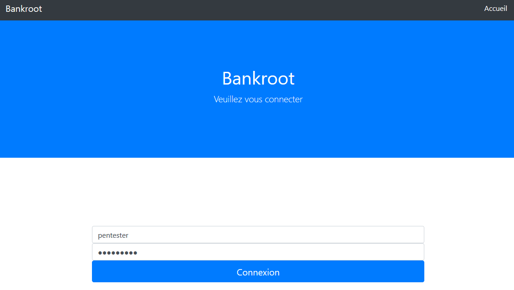
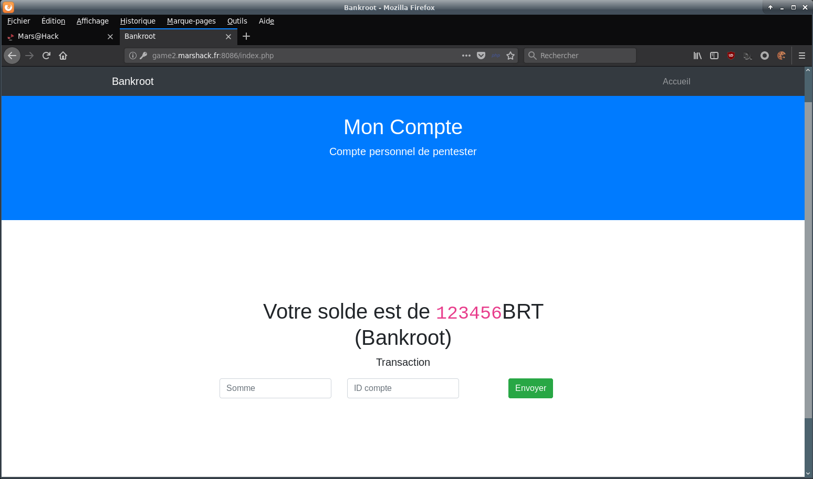
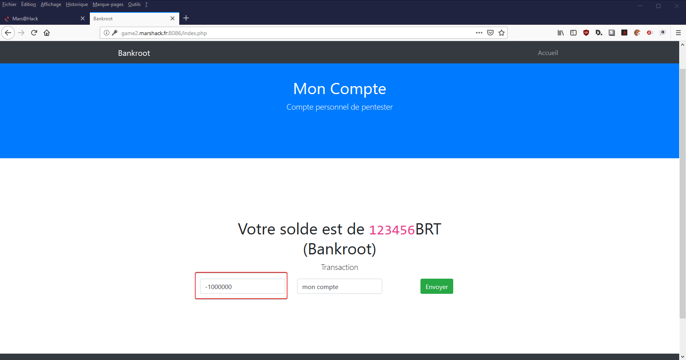
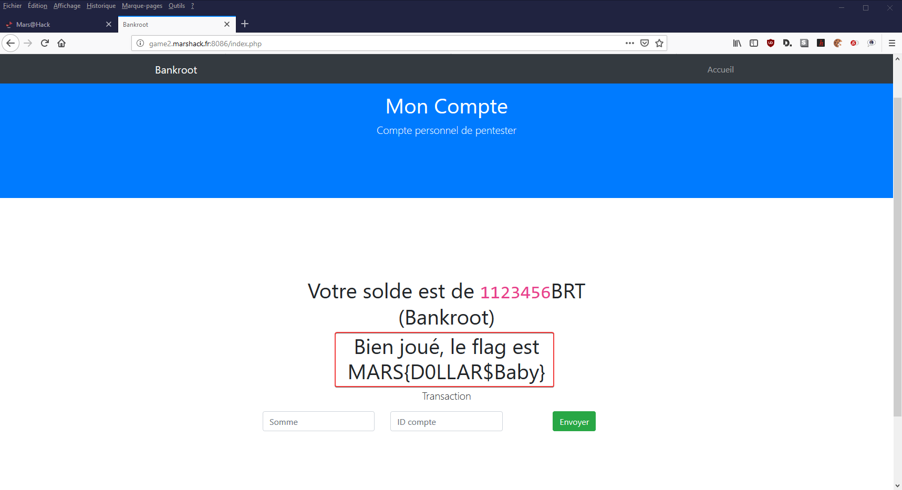

# Write up : Bankroot

Catégorie :

```
Web
```

Consigne :

```
Une banque a des soupçons sur sa sécurité, elle vous a donc embauché dans le but de trouver une vulnérabilité.

Un compte a été créé pour vous : 
 
login : pentester <br>
password : pentester 

Pour obtenir le flag, il faudra être millionnaire sur l'application.

<FONT COLOR="#ff0000">Accès au site :<br>   <a href="http://game2.marshack.fr:8086" target="new">http://game2.marshack.fr:8086</a></FONT> <p>
```

Pièce jointe :

```
Aucune
```

Serveur :

```
game2
```

Points attribués :

```
40
```

Flag : 

```
MARS{D0LLAR$Baby}
```


## Solution

Pour ce challenge un compte a été créé spécialement pour le pentester :

```
login: pentester
password: pentester
```





Aprés identification :




Si on saisit une valeur positive, on voit le compteur diminuer. Or la consigne nous demande d'être millionnaire.

En inspectant le code source, on s'aperçoit que la saisie d'une valeur négative est controlée par un script javascript dont le but est de mettre à zéro cette valeur.

```
 <!-- Custom JavaScript for this theme -->
    <script src="js/scrolling-nav.js"></script>
     <script>
      $( "#somme" ).change(function() {
        if($("#somme").val() < 0){
          alert("La somme ne peut être négative !");
          $("#somme").val(0);
      }
      });
    </script>
```


On désactive le script javascript (on peut utiliser l'addon firefox : Disable Javascript (David Pacassi Torrico)).

Réaliser une transaction négative afin d'obtenir un compteur supérieur à 1 000 000 BRT.







Solution : MARS{D0LLAR$Baby}


Information : voici l'extrait du fichier `index.php` qui contrôle le solde du compte.

On voit que le flag apparait dès que la somme est supérieure ou égale à 1 000 000 BRT

```
 <?php
 if($_SESSION['argent'] >= 1000000){
 echo '<h1> Bien joué, le flag est MARS{D0LLAR$Baby}</h1>';
 }
 ?>
```


Résultat : MARS{D0LLAR$Baby}