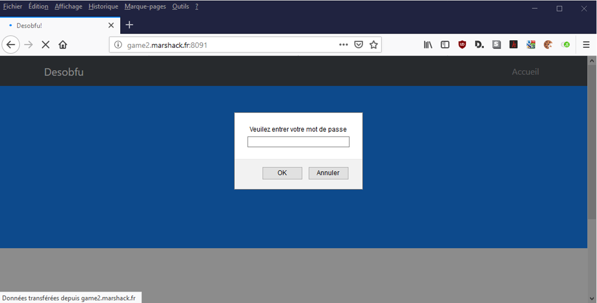
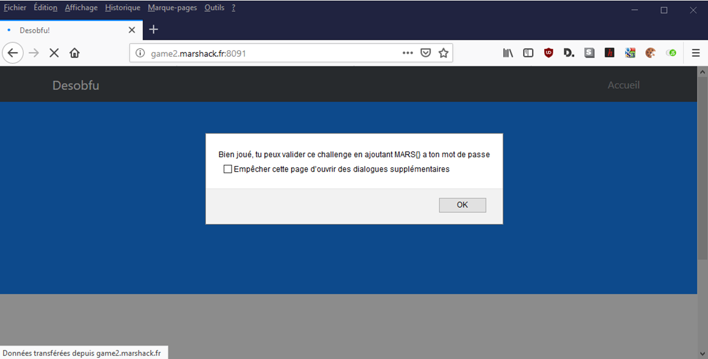

# Write up : Desobfu

Catégorie :

```
Web
```

Consigne :

```
Retrouver le mot de passe permettant d'accéder à la page. <p>

<FONT COLOR="#ff0000">Accès au site :<br>   <a href="http://game2.marshack.fr:8091" target="new">http://game2.marshack.fr:8091</a></FONT> <p>

Flag au format MARS{Password}
```

Pièce jointe :

```
Aucune
```

Serveur :

```
game2
```

Points attribués :

```
20
```

Flag :

```
MARS{!#0xdead./}
```


## Solution



On se rend rapidement compte que nous avons a faire a un script javascript qui nous demande un mot de passe. Il faut récupérer ce script pour l'analyser.

```java
var _0x32bf=['Bien\x20joué,\x20tu\x20peux\x20valider\x20ce\x20challenge\x20en\x20ajoutant\x20MARS{}\x20a\x20ton\x20mot\x20de\x20passe','Raté\x20...'];(function(_0x43f837,_0xdad923){var _0x170dd4=function(_0x4ac79c){while(--_0x4ac79c){_0x43f837['push'](_0x43f837['shift']());}};_0x170dd4(++_0xdad923);}(_0x32bf,0x110));var _0x2f48=function(_0xb67384,_0x27295a){_0xb67384=_0xb67384-0x0;var _0x156d7c=_0x32bf[_0xb67384];return _0x156d7c;};var password=prompt('Veuilez\x20entrer\x20votre\x20mot\x20de\x20passe');if(password=='!#0xdead./'){alert(_0x2f48('0x0'));}else{alert(_0x2f48('0x1'));}
```

En regardant mieux on se rend compte qu'il y'a beaucoup de junk, mais la partie intéressante reste parfaitement lisible :

```java
var password=prompt('Veuilez\x20entrer\x20votre\x20mot\x20de\x20passe');if(password=='!#0xdead./'){alert(_0x2f48('0x0'));}else{alert(_0x2f48('0x1'));}
```

Le password est comparé a "!#0xdead./", il s'agit donc de la solution.




Résultat : MARS{!#0xdead./}
