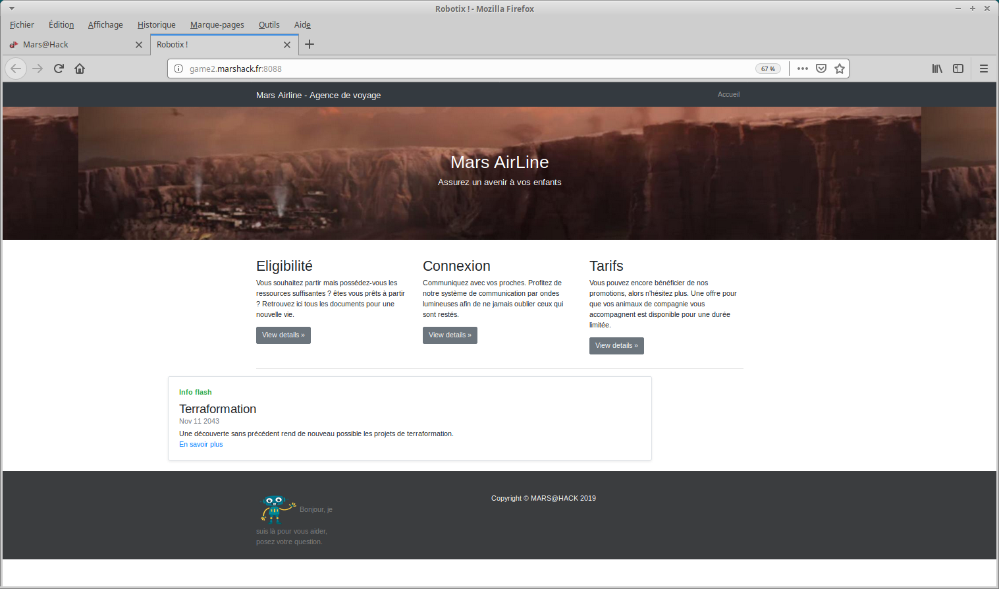

# Write up : Robotic

Catégorie :

```
Web
```

Consigne  :

```
Retrouver le flag de validation caché dans le site.<p>
<FONT COLOR="#ff0000">Accès au site :<br>   <a href="http://game2.marshack.fr:8088" target="new">http://game2.marshack.fr:8088</a></FONT> <p>
```

Pièce jointe :

```
Aucune
```

Serveur :

```
game2
```

Points attribués :

```
15
```

Flag :

```
MARS{R0b0tsIsB4s1cs}
```





Le challenge est très simple et très guidé, il suffit de lire la page web pour comprendre le principe du challenge.
On récupère donc le fichier robots.txt

```
pwner@ubuntu:~$ curl -s http://game2.marshack.fr:8088/robots.txt
User-agent: *
Disallow: /admin-3a5y/
pwner@ubuntu:~$ 
```

On va donc dans le dossier :

```
pwner@ubuntu:~$ curl -s http://game2.marshack.fr:8088/admin-3a5y/ | grep MARS{
    <center><h1>MARS{R0b0tsIsB4s1cs}</h1></center>
```


Le flag est :  MARS{R0b0tsIsB4s1cs}

