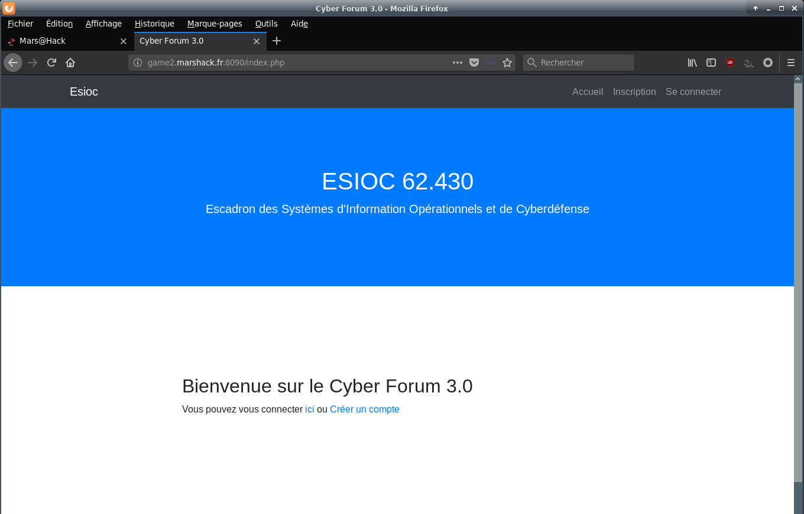
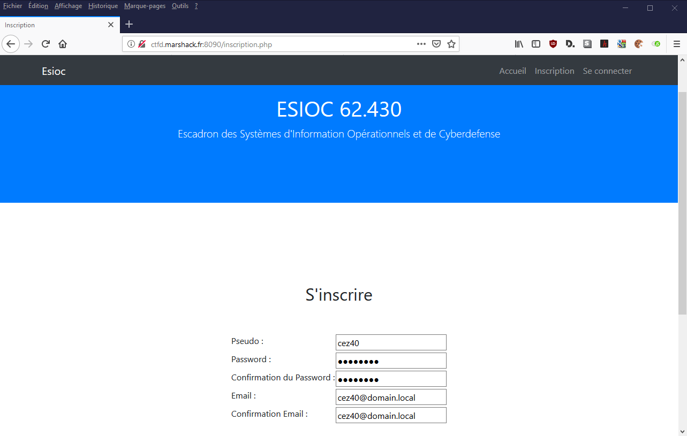
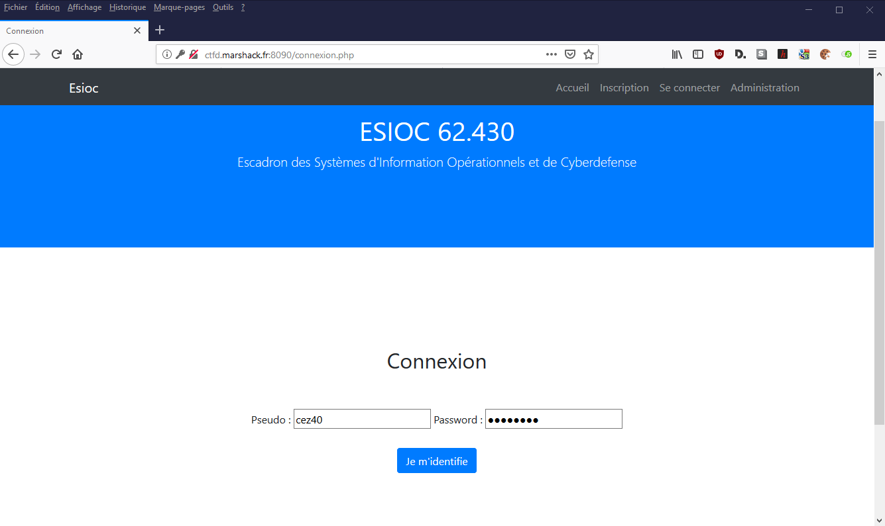
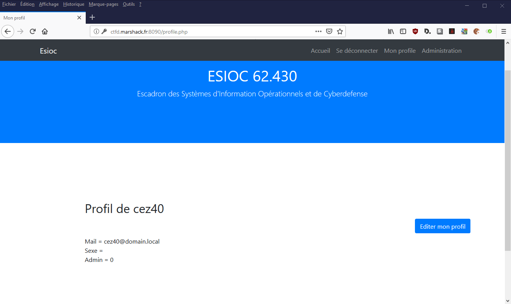
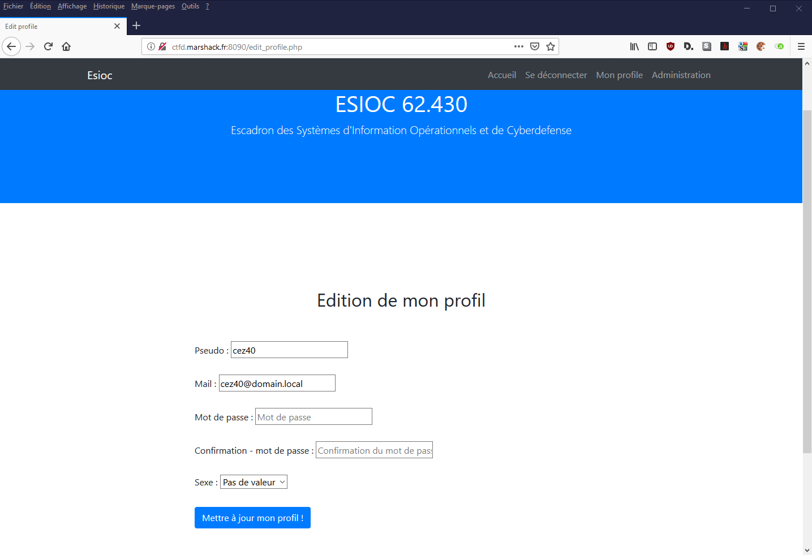
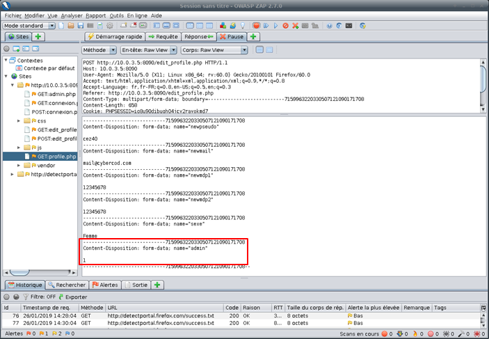
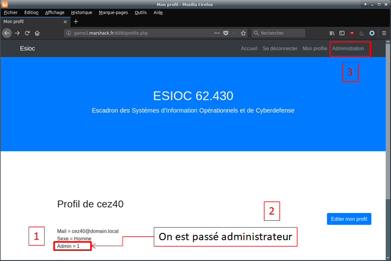
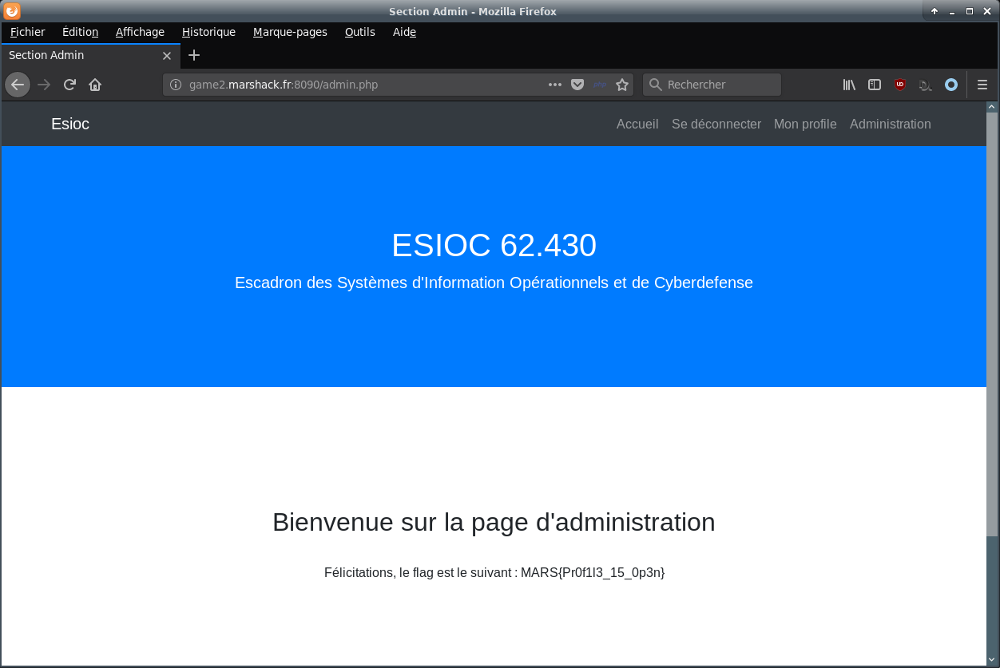

# Write Up : Open profile


Catégorie :

```
Web
```

Consigne : 

```
Accédez à la section d'administration.<p>

<FONT COLOR="#ff0000">Accès au site :<br>   <a href="http://game2.marshack.fr:8090" target="new">http://game2.marshack.fr:8090</a></FONT> <p>
```

Pièce jointe :

```
Aucune
```

Serveur : 

```
game2
```

Points attribués :

```
40
```

Flag :

```
MARS{Pr0f1l3_15_0p3n}
```


## Solution

En arrivant sur le site, on voit que c'est un forum *from scratch*.

Pour obtenir le flag il faut aller sur la page d'administration. 
Or, il est nécessaire de se créer un compte et de se connecter pour pouvoir y accéder.

Page d'accueil :




Inscription :




Après avoir créé son compte, il faut tenter d'obtenir les droits admin.

Pour ce faire, nous avons accès à une page d'édition de profil.
Cette page nous permet de modifier notre pseudo, notre mot de passe ou notre sexe.
Après ces modifications, nous sommes redirigés vers notre page de profil et on peut voir que le champ admin est égal à 0.
Or, dans le formulaire d'édition de profil, la variable admin n'est pas présente.

Le développeur de la page a sûrement laissé la modification de la variable ouverte, il suffit donc de modifier le sexe et de lancer burp pour modifier la requête comme suit :


Après avoir créé son compte, il faut tenter d'obtenir  le droit admin.

Connexion




Profil




Visualisation de notre profil, une caractéritisque de profil admin est égale à 0.

Edition du profil :



Cette page nous permet de modifier nos informations.
Après validation nous sommes redirigés sur notre page de profil, la caractéritisque de profil admin est toujours égale à 0.
Dans le formulaire d'édition de profil, la variable admin n'est pas présente.

Le développeur de la page à surement laissé la modification de la variable ouverte.

Déclarer l'adresse du proxy **Burp Suite** ou **ZAP OWASP** sur firefox : 

  - Protocole : http
  - 127.0.0.1
  - 8080

Ou utiliser un addon firefox :

  - Proxy SwitchOmega 2.5.20

Intercepter la requête avec **Burp Suite** ou **ZAP OWASP** 

Ajouter la section suivante :

```
-----------------------------7159963220330507121090171708        <==    attention la chaîne doit être en cohérence avec la requête
Content-Disposition: form-data; name="admin"

1
```

Nota : 
Un peu de "guessing", car dans la page "mon profil", *Admin* apparaît avec un "A" majuscule alors que la variable est "admin" en minuscules.







Nous obtenons donc le droit d'administrateur et pouvons accéder à la page d'administration pour récupérer le flag.




Flag : MARS{Pr0f1l3_15_0p3n}

